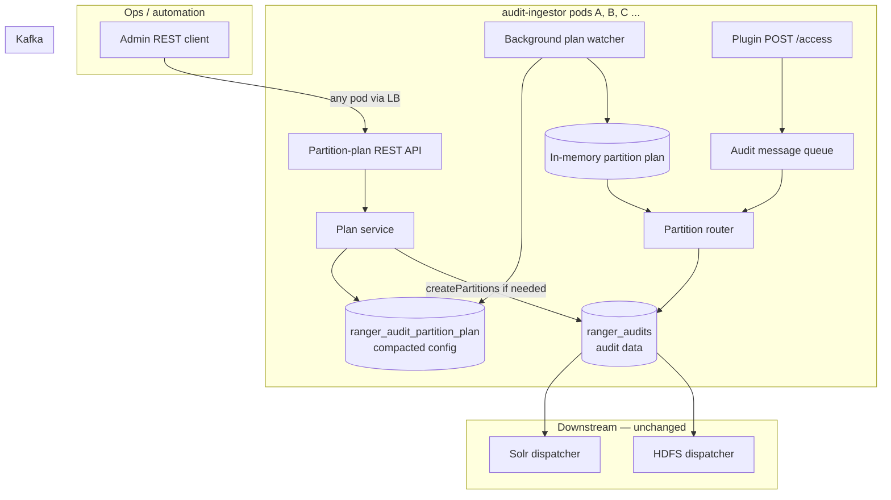
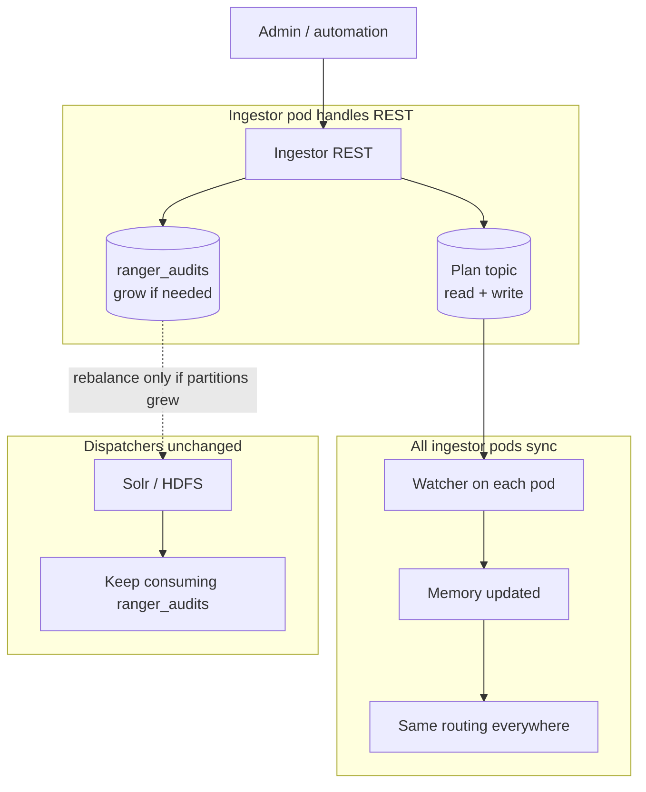
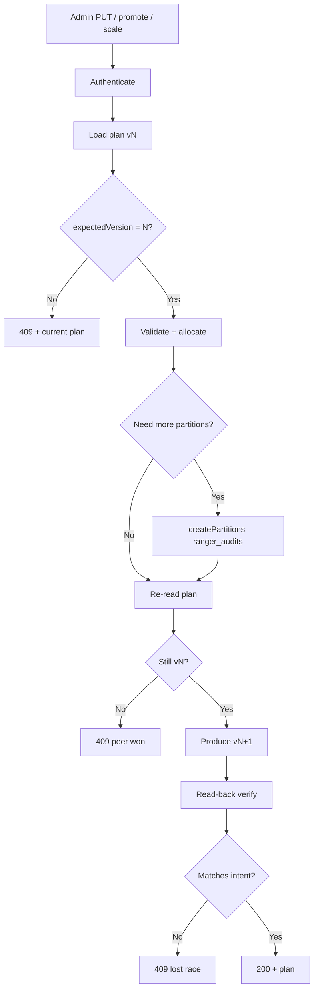
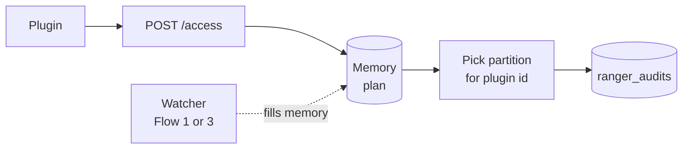
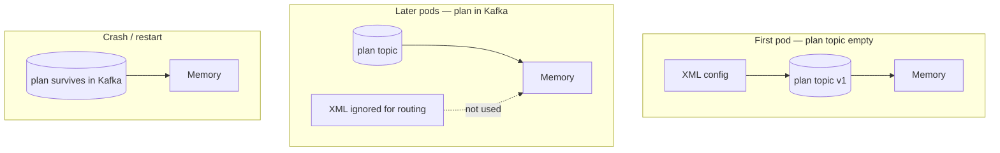
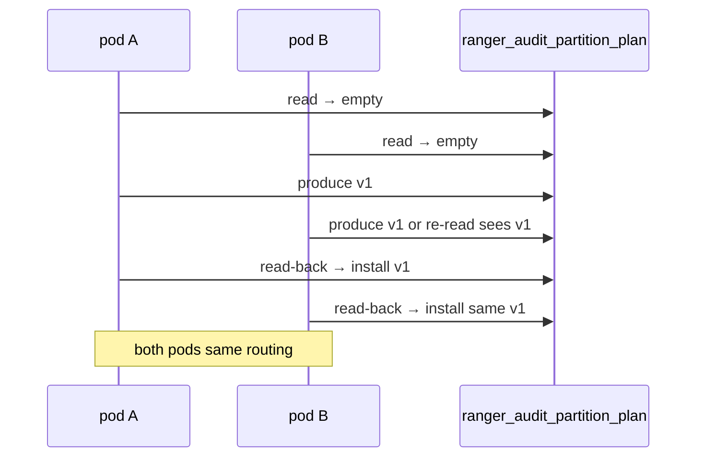
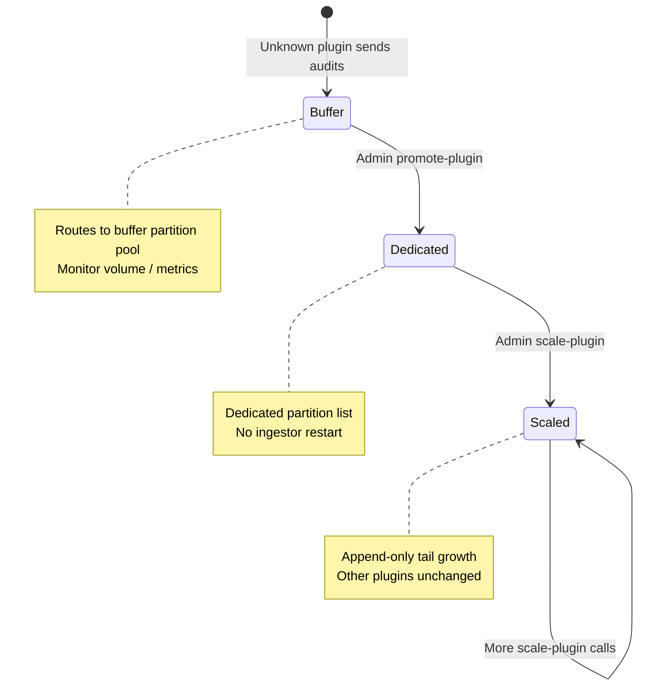
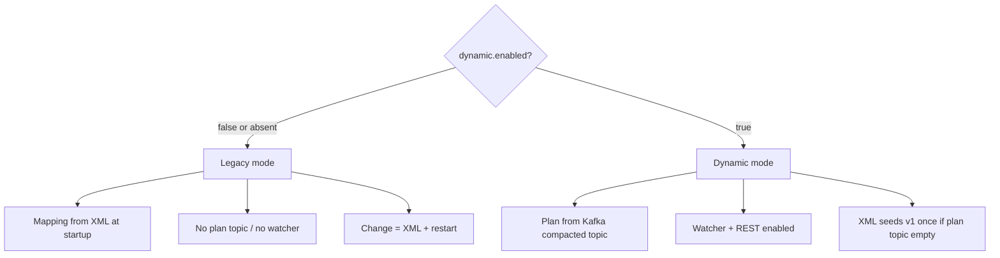
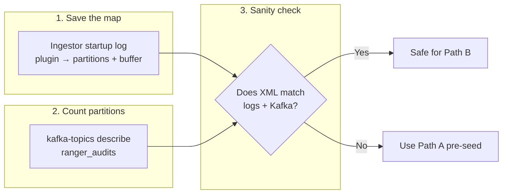
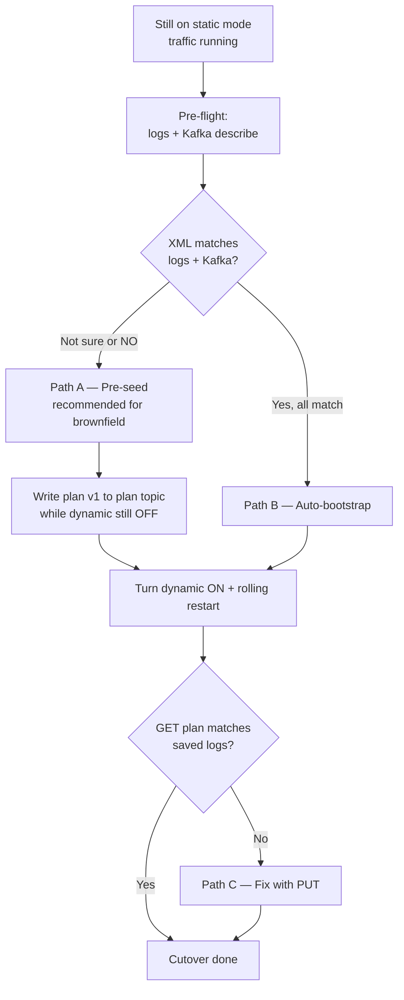

<!--
Licensed to the Apache Software Foundation (ASF) under one
or more contributor license agreements.  See the NOTICE file
distributed with this work for additional information
regarding copyright ownership.  The ASF licenses this file
to you under the Apache License, Version 2.0 (the
"License"); you may not use this file except in compliance
with the License.  You may obtain a copy of the License at

  http://www.apache.org/licenses/LICENSE-2.0

Unless required by applicable law or agreed to in writing,
software distributed under the License is distributed on an
"AS IS" BASIS, WITHOUT WARRANTIES OR CONDITIONS OF ANY
KIND, either express or implied.  See the License for the
specific language governing permissions and limitations
under the License.
-->

# Dynamic Kafka partitioning for Ranger audit plugins — design document

**Purpose:** Single consolidated design for runtime dynamic plugin onboarding and partition scaling in the Ranger audit ingestor.

**Audience:** Operators, architects, and reviewers who need a shared mental model of *what* the system does and *how* it behaves — without implementation detail.

**Related deep dives (superseded for day-to-day review by this document):**

| Source doc | Content absorbed here |
|------------|----------------------|
| [README-KAFKA-PLUGIN-PARTITIONING-DYNAMIC-DESIGN.md](README-KAFKA-PLUGIN-PARTITIONING-DYNAMIC-DESIGN.md) | Goals, architecture, append-only rules |
| [README-KAFKA-PARTITION-PLAN-REGISTRY-REST.md](README-KAFKA-PARTITION-PLAN-REGISTRY-REST.md) | Control plane, flows, REST semantics |
| [README-KAFKA-PARTITION-PLAN-IMPLEMENTATION.md](README-KAFKA-PARTITION-PLAN-IMPLEMENTATION.md) | Phased rollout concept (high level only) |
| [README-KAFKA-PARTITION-PLAN-OPS-RUNBOOK.md](README-KAFKA-PARTITION-PLAN-OPS-RUNBOOK.md) | Operator workflows |
| [README-KAFKA-PARTITION-PLAN-BROWNFIELD-MIGRATION.md](README-KAFKA-PARTITION-PLAN-BROWNFIELD-MIGRATION.md) | Migration paths |

**Related (orthogonal proposal):** [README-DYNAMIC-SERVICE-ALLOWLIST-DESIGN.md §3](README-DYNAMIC-SERVICE-ALLOWLIST-DESIGN.md#3-why-dynamic-partition-mapping-does-not-remove-allowedusers) — why dynamic partition mapping does **not** remove `service.<repo>.allowed.users` on `POST /access` (403 authz); separate from partition plan.

**Baseline (static mode today):** [README-KAFKA-PLUGIN-PARTITIONING.md](README-KAFKA-PLUGIN-PARTITIONING.md)

---

## 1. Executive summary

Ranger plugins (HDFS, Hive, Trino, etc.) send audit events to **audit-ingestor**, which writes them to Kafka topic **`ranger_audits`**. To isolate hot plugins, ingestor can route each plugin to dedicated Kafka partitions; unknown plugins share a **buffer** pool.

**Today (static mode):** Plugin → partition mapping is computed once at startup from XML. Changing assignments requires config edits, topic partition growth, and **ingestor restart**. Early-plugin changes can **reshuffle** later plugins because allocation uses contiguous ranges.

**Proposed (dynamic mode):** A durable **partition plan** stored in a Kafka compacted config topic drives routing at runtime. Operators change the plan via **REST** (no restart). New capacity is added only at the **tail** of the topic (append-only), so existing plugin assignments stay stable.

No new infrastructure (Postgres, ZooKeeper) is required — Kafka and AdminClient are already part of the audit stack.

---

## 2. Problem statement

| Limitation (static mode) | Impact |
|--------------------------|--------|
| Mapping fixed at startup | Onboard or scale a plugin → downtime (restart) |
| Contiguous-range allocation | Changing one plugin’s size can move others’ partitions |
| No durable shared plan | Multi-replica ingestors cannot safely update routing via pod-local config |
| No control-plane API | Automation and ops lack a single, auditable change path |

---

## 3. Goals and non-goals

### Goals

| ID | Goal |
|----|------|
| **G1** | **Stable allocations** — onboarding or scaling one plugin must not unnecessarily move traffic for others |
| **G2** | **Runtime updates** — change mapping without restarting audit-ingestor |
| **G3** | **Append-only growth** — allocate only from newly added tail partitions (Kafka cannot shrink topics) |
| **G4** | **Backward compatibility** — dynamic mode is opt-in; default behavior remains static XML at startup |

### Non-goals

- Decreasing Kafka partition count (not supported by Kafka)
- Strict global ordering of audits across all plugins (never guaranteed with multi-partition plugins)
- Shared cross-replica audit retry / recovery redesign (per-pod spool unchanged)

---

## 4. Core concepts

### 4.1 Two Kafka topics, two jobs

| Topic | Role | Volume | Who reads/writes |
|-------|------|--------|------------------|
| **`ranger_audits`** | Audit **data** | Very high | Plugins → ingestor produces; Solr/HDFS dispatchers consume **all** partitions |
| **`ranger_audit_partition_plan`** | Partition **config** | Very low (ops events) | Ingestor only — REST writes, background watcher reads |

The plan topic is a **compacted** topic (one partition, `cleanup.policy=compact`): each write appends a record; compaction retains the **latest value per key** (audit topic name, e.g. `ranger_audits`).

### 4.2 Partition plan

A partition plan is a versioned JSON document that answers:

- Which partition IDs does each **known plugin** use?
- Which partition IDs form the **buffer** for unknown / unconfigured plugins?
- What is the current **`topicPartitionCount`** (must match Kafka)?

**Example (conceptual):**

```json
{
  "topic": "ranger_audits",
  "version": 5,
  "topicPartitionCount": 28,
  "plugins": {
    "hdfs":        { "partitions": [0, 1, 2, 3] },
    "hiveServer2": { "partitions": [4, 5, 6, 7, 8, 9] },
    "trino":       { "partitions": [10, 11, 12, 13, 14, 15, 16, 17, 18] }
  },
  "buffer": { "partitions": [19, 20, 21, 22, 23, 24, 25, 26, 27] }
}
```

Every partition ID from `0` through `N-1` appears **exactly once** across plugins and buffer.

### 4.3 Routing rules (audit hot path)

When a plugin sends an audit (identified by **plugin id** / agent id):

1. If plugin id is in the plan → pick a partition from that plugin’s list (**round-robin** within the list).
2. If not in the plan → hash into the **buffer** partition list.
3. Write the event to **`ranger_audits`**.

The hot path reads the plan from **memory only** — never the plan topic per audit.

### 4.4 Append-only allocation

To avoid reshuffling existing plugins:

- **Never** recompute everyone’s ranges from plugin list order.
- **Promote** a new plugin → take partitions from the front of buffer, or grow the topic tail if buffer is insufficient.
- **Scale** a hot plugin → append new partition IDs from the **tail** only; other plugins’ lists stay unchanged.

**Example:** `hdfs` has `[0,1,2]`; scale to 4 partitions → add partition `3` from tail after topic growth. `hiveServer2` and `trino` lists are **unchanged**.

---

## 5. Architecture

### 5.1 Control plane vs data plane



**Takeaway:** Plan topic = slow, rare **configuration**. Audit topic = high-volume **data**. Only REST + watcher touch the plan topic.

### 5.2 Who talks to what

| Actor | Plan topic | Audit topic |
|-------|------------|-------------|
| Plugin audit POST | No | Produce |
| Background watcher | Read | No |
| REST GET / PUT / promote / scale | Read + write (mutations) | Grow partitions only (AdminClient) |
| Solr / HDFS dispatcher | No | Consume **all** partitions |

---

## 6. Operational flows

### 6.1 Flow 1 — Admin changes the plan

**When:** Onboard a plugin (e.g. Trino) or scale a hot plugin (e.g. Hive).  
**How often:** Rare — human or automation, not per audit.

| Step | What happens |
|------|----------------|
| 1 | Admin calls REST on **any** ingestor pod (behind load balancer). |
| 2 | Pod reads current plan from **`ranger_audit_partition_plan`** (e.g. version 4). |
| 3 | If more partitions needed → grow **`ranger_audits`** via Kafka AdminClient (**before** publishing plan that references new IDs). |
| 4 | Pod writes new plan (version 5) to compacted topic. |
| 5 | Returns **200 OK** (or **409 Conflict** if another writer won — client retries with new version). |
| 6 | Every ingestor pod’s watcher loads version 5 into memory (~30s default, or on Kafka message). |
| 7 | Solr / HDFS dispatchers — no config change; rebalance only if audit topic partition count grew. |



#### REST mutations (summary)

| Method | Purpose |
|--------|---------|
| `GET /api/audit/partition-plan` | Read current plan |
| `PUT /api/audit/partition-plan` | Full plan replace (`expectedVersion` required) |
| `POST .../promote` | Move plugin from buffer → dedicated partitions |
| `POST .../scale` | Append tail partitions to existing plugin |

Mutations use **optimistic concurrency**: client sends `expectedVersion`; stale requests get **409** with current plan in the body. Client refreshes and retries.



### 6.2 Flow 2 — Plugin sends an audit (hot path)

**When:** Every access audit from a Ranger plugin.  
**How often:** High volume.

| Step | What happens |
|------|----------------|
| 1 | Plugin sends POST to ingestor (any pod via LB). |
| 2 | Ingestor reads plan **already in memory** (not from Kafka). |
| 3 | Resolves partition list for plugin id. |
| 4 | Round-robin within that list (or hash into buffer if unknown). |
| 5 | Produces to **`ranger_audits`**. |



### 6.3 Flow 3 — Pod startup and restart

**Prerequisite:** `ranger.audit.ingestor.kafka.partition.plan.dynamic.enabled=true`. If `false` or absent → legacy static XML mode; plan topic unused.

| Situation | Pod behavior |
|-----------|--------------|
| **First pod ever** — plan topic empty | Read XML → build plan **v1** → **publish to plan topic** → load into memory |
| **Later pods** — plan already in Kafka | Read plan from Kafka only; **XML not used for routing** |
| **Any pod restart** | Same as later pods — plan survives in Kafka |



**Rule:** After v1 exists in Kafka, **Kafka is the source of truth** — not XML on the pod filesystem.

#### Multi-pod startup races (handled automatically)

| Race | Scenario | Resolution |
|------|----------|------------|
| **A** | Several pods create plan topic at once | Idempotent topic create; “already exists” = success |
| **B** | Several pods publish v1 when topic is empty | Re-read before/after produce; mandatory read-back; all pods adopt same v1 |



### 6.4 Plugin onboarding lifecycle



| Stage | Behavior |
|-------|----------|
| **0 — Unknown** | Plugin id not in plan → buffer partitions |
| **1 — Promote** | REST assigns dedicated partitions from buffer (or tail growth) |
| **2 — Scale** | REST appends more tail partitions to that plugin only |

---

## 7. Worked example

**Initial plan (v1)** — bootstrap or first REST:

| Plugin | Partitions |
|--------|------------|
| hdfs | [0, 1, 2] |
| hiveServer2 | [3, 4, 5] |
| buffer | [6 … 14] |

Topic: **15** partitions.

1. Unknown plugin **trino** sends audits → routes to buffer (hash among 6–14).
2. **Promote trino** (3 partitions) → trino gets [6,7,8]; buffer shrinks to [9…14]; plan **v2**; no restart.
3. **Scale hiveServer2** (+3 partitions) → topic grows 15→18; hive gets [3,4,5,15,16,17] append-only; hdfs and trino **unchanged**; plan **v3**.

This fixes the static-mode problem where changing an early plugin’s override reshuffles everyone downstream.

---

## 8. Feature flag and backward compatibility



| Area | Static (default) | Dynamic (`dynamic.enabled=true`) |
|------|------------------|----------------------------------|
| Partition mapping | XML at startup | Runtime plan from Kafka |
| Changes | Edit XML + restart | REST → plan topic; watcher syncs all pods |
| Plan topic | Not used | Source of truth after v1 |
| REST partition-plan | Disabled (503) | Enabled (authenticated) |

**Configuration (bootstrap):**

| Property | Default | Role |
|----------|---------|------|
| `kafka.partition.plan.dynamic.enabled` | `false` | Feature flag |
| `kafka.partition.plan.topic` | `ranger_audit_partition_plan` | Compacted registry topic |
| `kafka.partition.plan.refresh.interval.ms` | `30000` | Watcher poll interval |

XML properties (`configured.plugins`, overrides, buffer size) seed **v1 only** when plan topic is empty. **Do not** edit XML expecting live routing changes when dynamic mode is on.

---

## 9. Brownfield migration (static → dynamic)

### Goal (one sentence)

Turn on dynamic mode so **each plugin keeps sending audits to the same Kafka partitions** it uses today — no surprise rerouting on cutover day.

---

### Pre-flight — know your real layout *before* you flip the switch

You have three places that *might* describe routing. Only two of them tell the truth in production.

| Source | What it is | Trust it? |
|--------|------------|-----------|
| **XML config** | What you *think* you configured | Maybe — good starting point only |
| **Ingestor logs** | What each pod *actually* uses at startup | **Yes** — ground truth |
| **Kafka topic** | How many partitions exist on `ranger_audits` | **Yes** — ground truth |

**Simple rule:** If XML disagrees with logs or Kafka, **believe logs + Kafka**, not XML.

#### Three checks (do these while still on static mode)



| Step | What to do | What you get |
|------|------------|--------------|
| **1. Save the map** | After ingestor restart, copy the **AuditPartitioner Configuration** block from logs on **each** replica | A table: `hdfs → 0–2`, `hiveServer2 → 3–5`, `buffer → 6–14`, etc. |
| **2. Count partitions** | `kafka-topics --describe --topic ranger_audits` | Total partition count (e.g. **15** → IDs `0` … `14`) |
| **3. Sanity check** | Compare step 1 + 2 with your XML | If all three agree → simpler cutover. If not → pre-seed (Path A) |

**Example worksheet** (fill from logs, not from memory):

| Plugin / pool | Partition IDs | Count |
|---------------|---------------|-------|
| hdfs | 0, 1, 2 | 3 |
| hiveServer2 | 3, 4, 5 | 3 |
| buffer | 6 … 14 | 9 |
| **Topic total** | **0 … 14** | **15** |

#### When XML is wrong (common drift)

If `kafka.topic.partitions` is set to a **fixed total**, the running system may use a different buffer size than XML suggests. In that case, **do not** rely on auto-bootstrap from XML — **pre-seed the plan** (Path A) using your log worksheet.

---

### Pick a migration path



| Path | When | What you do (plain English) |
|------|------|-------------------------------|
| **A — Pre-seed** | XML might be stale, topic was grown manually, or you are not 100% sure | Build plan v1 from your **log worksheet** → publish to `ranger_audit_partition_plan` **before** enabling dynamic → enable dynamic → rolling restart |
| **B — Auto-bootstrap** | Pre-flight proved XML = logs = Kafka | Enable dynamic → first pod creates v1 from XML → rolling restart → verify |
| **C — Fix plan** | Dynamic is on but routing looks wrong | `GET` current plan → `PUT` corrected lists with `expectedVersion` → pause rollout until all pods match |

**Path A in four steps:**

1. Complete pre-flight worksheet from logs.
2. Publish plan v1 JSON to the plan topic (key = `ranger_audits`).
3. Set `dynamic.enabled=true` on all ingestor replicas.
4. Rolling restart → each pod reads your seeded plan (no guesswork from XML).

**After cutover — quick verify:**

- Same `version` on every pod (`GET /api/audit/partition-plan`).
- Plugin lists match your saved log worksheet.
- Spot-check: test audit per major plugin still lands on expected partition.

---

### Rollback (if needed)

1. Export current plan with `GET` (save the JSON).
2. Set `dynamic.enabled=false`.
3. Rolling restart — routing returns to static XML at startup.
4. Align XML with the saved plan if you want the same layout after rollback.

The plan topic can stay in Kafka; it is ignored when dynamic mode is off.

---

## 10. Impact on other components

### Solr / HDFS dispatchers

- **Do not** read the partition plan.
- Subscribe to **all** partitions of `ranger_audits`.
- When audit topic grows → consumer groups **rebalance** → more parallelism (up to partition count).
- No dispatcher config change for plugin onboarding; may need capacity tuning if partition count grows significantly.

### Audit recovery / spool

- Per-pod retry behavior **unchanged**.
- Retries use same plugin id key; partition may differ if plan changed since original send — acceptable for audit pipelines.

---

## 11. Failure modes

| Failure | Behavior |
|---------|----------|
| Plan topic unreadable at runtime | Keep **last known good** plan in memory; log error |
| Invalid plan JSON on write | Reject at REST; do not apply on read |
| AdminClient partition increase fails | Do **not** publish new plan; return 503; caller retries |
| Concurrent REST mutations | `expectedVersion` + re-read + read-back → one 200, one 409; client retries |
| Plan swap during audit POST | Atomic in-memory swap; brief mix of old/new routing acceptable |
| Kafka unreachable at startup (dynamic on) | **Fail startup** — do not silently fall back to XML (would split routing across pods) |

---

## 12. Design rationale

### Why this design fits Ranger

| Principle | How delivered |
|-----------|---------------|
| No new infra | Kafka compacted topic + existing AdminClient |
| Hot path stays fast | Memory-only plan on every audit POST |
| Multi-replica consistency | All pods read same compacted plan |
| Safe rollout | `dynamic.enabled` defaults to `false` |
| Append-only lists | Avoids static contiguous-range reshuffle |
| Clean consumer boundary | Dispatchers unaware of producer-side routing |

### Acceptable tradeoffs

| Concern | Mitigation |
|---------|------------|
| Kafka required at startup when dynamic on | Fail fast with clear error |
| Watcher lag (~30s default) | Acceptable for infrequent ops; tunable interval |
| Ops editing XML expecting live effect | Runbook: use REST when dynamic on |
| `createPartitions` succeeds but plan write fails | Grow topic **before** plan publish; retry PUT idempotently |

### When dynamic mode is a poor fit

- Plan changes every few seconds (watcher lag + rebalance churn)
- Kafka not part of the stack
- Requirement for strict ordering across plan migrations without operational care

### Alternatives considered

| Option | Tradeoff |
|--------|----------|
| XML + restart only (today) | Simple; requires downtime for changes |
| Postgres / ZooKeeper registry | Strong CRUD; extra infra deliberately avoided |
| K8s ConfigMap + watch | K8s-centric; weak for multi-cluster REST automation |
| Pod-local XML writes | Breaks with multiple replicas — rejected |

---

## 13. Operator golden rules

1. **Runtime routing changes → REST only** when dynamic mode is on.
2. **No ingestor restart** for promote/scale — watcher refreshes all pods.
3. **Grow `ranger_audits` before** publishing a plan that references new partition IDs (REST does this automatically).
4. **Never shrink** Kafka partition count.
5. **Solr/HDFS dispatchers** — no config change for plan updates.

### Enable checklist (production)

- [ ] XML bootstrap layout reviewed (for first v1 only)
- [ ] Kafka ACLs: WRITE on plan topic; ALTER on `ranger_audits`
- [ ] Ops trained on REST promote/scale and **409 retry**
- [ ] Brownfield: pre-flight audit + correct migration path chosen
- [ ] Dispatcher capacity reviewed if scaling hot plugins

---

## 14. Questions and answers (Q&A)

### Concepts and motivation

**Q: Why do we need plugin-based partitioning at all?**  
A: Hot plugins (Hive, Trino, HDFS) can dominate a shared topic. Dedicated partitions isolate throughput and let you scale one plugin without starving others.

**Q: What is the difference between static and dynamic mode?**  
A: Static mode computes plugin → partition mapping once from XML at startup; changes need restart. Dynamic mode stores the mapping in a Kafka compacted topic and updates it at runtime via REST without restart.

**Q: Why can’t we just edit XML on the ingestor pod?**  
A: Each replica has its own filesystem. A local XML edit is invisible to other pods, lost on reschedule, and may be overwritten by ConfigMap rollouts. Runtime changes must use **durable shared storage** (the plan topic).

**Q: Do we need Postgres or ZooKeeper for the partition plan?**  
A: **No.** Kafka compacted topic + AdminClient is the recommended registry — both are already required for audit-ingestor.

**Q: Can we decrease Kafka partition count?**  
A: **No.** Kafka only supports increasing partitions. The design is append-only.

---

### Architecture and data flow

**Q: What are the two Kafka topics and why separate them?**  
A: `ranger_audits` carries high-volume audit events. `ranger_audit_partition_plan` carries low-volume configuration. Separating config from data keeps the audit hot path off Kafka reads and matches Kafka’s compacted-config pattern.

**Q: Does every audit POST read the plan topic?**  
A: **No.** Each audit uses the plan held **in memory**. Only the background watcher and REST handlers read/write the plan topic.

**Q: How do all ingestor pods stay in sync?**  
A: Each pod runs a background watcher that polls or consumes the compacted plan topic (default ~30s). On new version → validate → swap in-memory plan. No restart required.

**Q: What happens when a pod crashes?**  
A: In-memory plan is lost, but the plan in Kafka survives. On restart, the pod reads the latest compacted plan and resumes the same routing as peers.

**Q: Do Solr and HDFS dispatchers need the partition plan?**  
A: **No.** They consume **all** partitions of `ranger_audits`. They rebalance when partition count grows but do not need plan API access.

---

### Partition plan and allocation

**Q: What is in a partition plan?**  
A: Audit topic name, monotonic `version`, `topicPartitionCount`, a map of plugin id → partition ID list, and a buffer partition list for unknown plugins.

**Q: What is the buffer?**  
A: A pool of partition IDs shared by plugins not yet promoted into the plan. New or trial plugins land here until ops assign dedicated partitions.

**Q: What does “append-only” mean?**  
A: Existing plugin partition lists are never reshuffled or shrunk. New capacity comes only from the **tail** of the topic (new partition IDs). Scaling hdfs from 3→4 partitions adds one new ID at the end of hdfs’s list without moving hive or trino.

**Q: Why did static mode reshuffle plugins when one override changed?**  
A: Static mode used **contiguous ranges** based on plugin order in XML. Changing an early plugin’s size shifted range boundaries for all following plugins. Dynamic mode uses **explicit partition lists** and append-only tail growth.

**Q: How is a partition chosen within a plugin’s list?**  
A: **Round-robin** across that plugin’s assigned partition IDs for throughput. Strict per-plugin ordering across partitions is not guaranteed (same as static multi-partition plugins).

---

### REST API and concurrency

**Q: Which REST endpoints exist?**  
A: `GET` and `PUT` on `/api/audit/partition-plan`, plus `POST` promote and scale convenience endpoints. All require authentication; admin allow-list is planned for a follow-up phase.

**Q: What is `expectedVersion`?**  
A: Optimistic locking. The client declares which plan version its change is based on. If another writer already published a newer version, the server returns **409 Conflict** with the current plan so the client can retry.

**Q: What should I do on HTTP 409?**  
A: Read the current plan (from 409 body or `GET`), note the new `version`, recompute your change against the latest lists, and retry with updated `expectedVersion`. Do not retry with the stale version.

**Q: Can two admins update the plan at the same time on different pods?**  
A: Yes. Kafka’s single-partition plan topic orders writes. One mutation wins; the other gets 409 and must retry. No silent overwrite.

**Q: Why grow `ranger_audits` before publishing the plan?**  
A: The plan must not reference partition IDs that do not exist yet. AdminClient increases the topic first; then the new plan is written.

**Q: Can I change routing by editing XML while dynamic mode is on?**  
A: **No** for live effect. XML only seeds v1 when the plan topic is empty. Runtime changes go through REST.

---

### Bootstrap and migration

**Q: When does XML populate the plan topic?**  
A: Only when `dynamic.enabled=true` **and** the plan topic has **no** message for the audit topic key. The first pod builds v1 from XML and publishes it. Later pods and restarts read Kafka only.

**Q: What is the simplest pre-flight checklist?**  
A: (1) Copy plugin → partition ranges from ingestor startup logs. (2) Note partition count from `kafka-topics --describe`. (3) If XML matches both → Path B; if not (or unsure) → **Path A pre-seed** from the log worksheet.

**Q: Which migration path should brownfield clusters use?**  
A: **When in doubt, Path A.** Use Path B only when XML, logs, and Kafka describe all agree. Use Path C if you enabled dynamic and routing does not match your saved logs.

**Q: Can I seed the plan before enabling dynamic mode?**  
A: **Yes** — recommended for brownfield. Publish v1 to `ranger_audit_partition_plan` with key = audit topic name while dynamic is still off, then enable and rolling restart.

**Q: How do I verify cutover succeeded?**  
A: `GET /api/audit/partition-plan` on every pod (same `version`); compare lists to saved static logs; confirm `topicPartitionCount` matches Kafka describe; spot-check audit routing per major plugin.

**Q: How do I roll back to static mode?**  
A: Export current plan via `GET`, align XML to that layout, set `dynamic.enabled=false`, rolling restart. The plan topic remains but is ignored.

---

### Operations and troubleshooting

**Q: Do I need to restart ingestor after promote or scale?**  
A: **No.** Watcher propagates the new plan to all pods within the refresh interval.

**Q: Do dispatchers need reconfiguration after scale?**  
A: **No.** They automatically rebalance when `ranger_audits` partition count increases. Tune consumer threads/replicas if sustained lag appears.

**Q: Ingestor fails startup after enabling dynamic — what now?**  
A: Usually Kafka unreachable or ACL denied on plan topic create/write. Fix connectivity/ACLs; keep dynamic off until Kafka is healthy. Dynamic mode must not silently fall back to per-pod XML.

**Q: Pods show different plan versions — what now?**  
A: Check watcher logs and plan topic with `kafka-console-consumer`. Wait one refresh interval after a mutation. If persistent, investigate Kafka read failures on the lagging pod.

**Q: `PUT` returns 400 — what now?**  
A: Usually invalid plan: overlapping partition IDs, missing IDs, or append-only violation (attempt to reshuffle existing assignments). Compare proposed body to current `GET`.

**Q: Does audit recovery/spool behavior change?**  
A: **No.** Per-pod spool and retry are unchanged. Retried audits may land on a different partition if the plan changed — acceptable for audit use cases.

---

### Security and permissions

**Q: What Kafka ACLs does ingestor need for dynamic mode?**  
A: **WRITE** on `ranger_audit_partition_plan` (in addition to existing produce on `ranger_audits`); **ALTER** / create-partitions on `ranger_audits` (same as today for topic growth at startup).

**Q: Who can call partition-plan REST?**  
A: Authenticated principals per ingestor security config. A dedicated admin allow-list (separate from plugin `/access` users) is planned; until then, restrict ingestor admin credentials at the network/ops layer.

---

### Design decisions summary

| Question | Answer |
|----------|--------|
| Postgres/ZK needed? | **No** — Kafka compacted topic + AdminClient |
| Update XML in pod for runtime? | **No** — XML is bootstrap only |
| REST control plane? | **Yes** — writes plan + grows audit topic |
| Pod crash/restart? | Re-read plan from Kafka |
| Other pods notified? | All pods watch same plan topic |
| Dispatchers affected? | Rebalance only when partition count grows |
| Default behavior? | **Unchanged** — dynamic is opt-in (`dynamic.enabled=false`) |

---

## 15. Document map (supplementary detail)

For implementation phases, E2E test scripts, producer tuning, and static-mode baseline, see:

- [README-KAFKA-PARTITION-PLAN-IMPLEMENTATION.md](README-KAFKA-PARTITION-PLAN-IMPLEMENTATION.md) — engineering phases
- [README-KAFKA-PARTITION-PLAN-OPS-RUNBOOK.md](README-KAFKA-PARTITION-PLAN-OPS-RUNBOOK.md) — operator commands and examples
- [README-KAFKA-PARTITION-PLAN-BROWNFIELD-MIGRATION.md](README-KAFKA-PARTITION-PLAN-BROWNFIELD-MIGRATION.md) — cutover worksheets
- [README-KAFKA-DYNAMIC-PARTITIONING-GUIDE.md](README-KAFKA-DYNAMIC-PARTITIONING-GUIDE.md) — shorter plain-language guide
- [README-KAFKA-DISPATCHERS.md](README-KAFKA-DISPATCHERS.md) — Solr/HDFS consumer tuning
