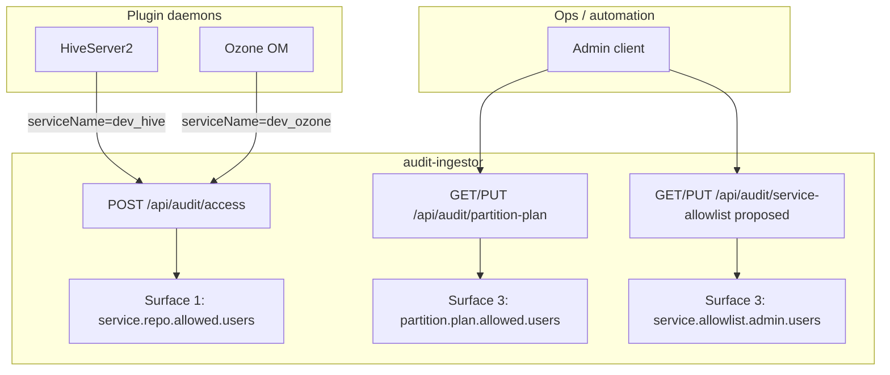
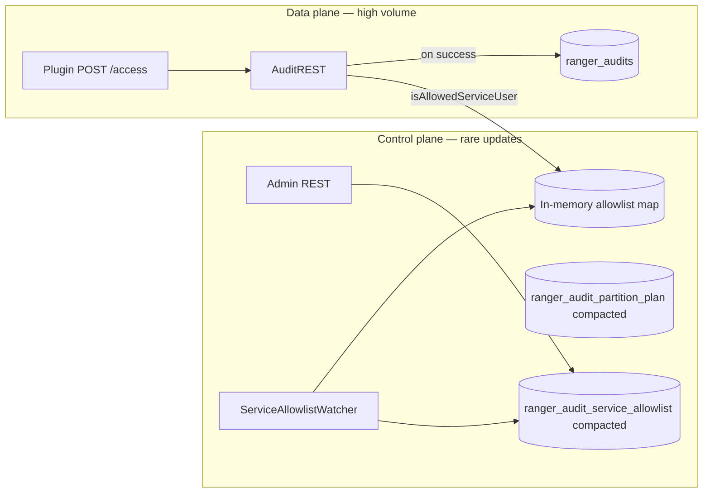

<!--
Licensed to the Apache Software Foundation (ASF) under one
or more contributor license agreements.  See the NOTICE file
distributed with this work for additional information
regarding copyright ownership.  The ASF licenses this file
to you under the Apache License, Version 2.0 (the
"License"); you may not use this file except in compliance
with the License.  You may obtain a copy of the License at

  http://www.apache.org/licenses/LICENSE-2.0

Unless required by applicable law or agreed to in writing,
software distributed under the License is distributed on an
"AS IS" BASIS, WITHOUT WARRANTIES OR CONDITIONS OF ANY
KIND, either express or implied.  See the License for the
specific language governing permissions and limitations
under the License.
-->

# Dynamic service allowlist for audit-ingestor — design proposal

**Status:** Proposal (not implemented). Complements dynamic partition plan work; does **not** replace authorization on `POST /api/audit/access`.

**Audience:** Architects, operators, and reviewers planning runtime plugin onboarding without ingestor restart.

**Operator guide (everyone):** [README-DYNAMIC-SERVICE-ALLOWLIST-GUIDE.md](README-DYNAMIC-SERVICE-ALLOWLIST-GUIDE.md) — plain-language companion to this design doc (mirrors [partition plan guide](README-KAFKA-DYNAMIC-PARTITIONING-GUIDE.md)).

**Related docs:**

| Doc | Relationship |
|-----|----------------|
| [README-KAFKA-DYNAMIC-PARTITIONING-GUIDE.md](README-KAFKA-DYNAMIC-PARTITIONING-GUIDE.md) | Dynamic **Kafka routing** (partition plan) — orthogonal; companion operator guide |
| [DESIGN-KAFKA-DYNAMIC-PARTITIONING.md](DESIGN-KAFKA-DYNAMIC-PARTITIONING.md) | Partition plan architecture |
| [README-KAFKA-PARTITION-PLAN-REGISTRY-REST.md](README-KAFKA-PARTITION-PLAN-REGISTRY-REST.md) | Partition-plan Kafka topic + REST |
| [README-KAFKA-PARTITION-PLAN-IMPLEMENTATION.md](README-KAFKA-PARTITION-PLAN-IMPLEMENTATION.md) | Phase 6: **partition-plan admin** allowlist (separate surface) |
| [DESIGN-KAFKA-AUDIT-SERVER.md](DESIGN-KAFKA-AUDIT-SERVER.md) | End-to-end audit pipeline |
| Apache Ranger PR [#1017](https://github.com/apache/ranger/pull/1017) (RANGER-5645) | Static Docker `service.<repo>.allowed.users` fix |

---

## 1. Executive summary

Plugins POST audits to **`POST /api/audit/access?serviceName=<repo>&appId=<agent>`**. After Kerberos/JWT/basic **authentication** (401 on failure), ingestor performs **authorization**: the authenticated short username must appear in **`ranger.audit.ingestor.service.<repo>.allowed.users`**.

Today that map is loaded **once at JVM startup** from `ranger-audit-ingestor-site.xml`. Adding a new Ranger service repo (e.g. `dev_trino`) requires XML edits and **ingestor restart** — even when partition routing is already dynamic via the partition-plan topic.

**Proposal:** Mirror the partition-plan control plane: durable registry + in-memory cache + admin REST + optional seed from Policy Manager `policy.download.auth.users`. Optionally bundle with partition-plan changes in a single **onboard plugin** API.

**Important:** Dynamic partition mapping answers *“which Kafka partition?”* Dynamic service allowlist answers *“may this Kerberos principal claim audits for this repo?”* Both checks remain required; only the **update path** becomes runtime-friendly. See [§3](#3-why-dynamic-partition-mapping-does-not-remove-allowedusers) for the full rationale.

---

## 2. Problem statement

### Current behavior

```java
// AuditREST.java — loaded in static {} block at class init
private static final Map<String, Set<String>> allowedServiceUsers;
static {
    allowedServiceUsers = initializeAllowedUsers();  // scans site XML once
}
```

| Limitation | Impact |
|------------|--------|
| Allowlist fixed at startup | New repo → edit XML → rolling restart all ingestor pods |
| No shared durable store | Multi-replica ingestors cannot update allowlist via one pod-local file |
| Decoupled from Policy Manager | `dev_trino` in Admin UI does not auto-create ingestor allowlist entry |
| Partition plan is dynamic; allowlist is not | Ops must do **two** onboarding steps (plan + XML) |

### What dynamic partition plan does **not** fix

The compacted topic **`ranger_audit_partition_plan`** stores plugin → partition ranges. It is read **after** `/access` accepts a batch and ingestor publishes to Kafka. A 403 on `/access` happens **before** any partition logic runs. Making partition routing dynamic does **not** relax or remove the plugin allowlist — see [§3](#3-why-dynamic-partition-mapping-does-not-remove-allowedusers).

---

## 3. Why dynamic partition mapping does not remove `allowed.users`

**Correct:** dynamic partition mapping does **not** remove the `allowed.users` check, and that is **intentional**. [PR #1017](https://github.com/apache/ranger/pull/1017) (RANGER-5645) and the partition-plan work solve **different problems**. They share the same ingestor process but operate on **different request paths** at **different times**.

### Two problems, two fixes

| Work | Tracker | Question it answers | What it changes |
|------|---------|---------------------|-----------------|
| **Service allowlist** ([#1017](https://github.com/apache/ranger/pull/1017) / RANGER-5645) | Static XML today; dynamic Kafka/REST in this doc | *May this Kerberos principal POST audits claiming to be repo `R`?* | `ranger.audit.ingestor.service.<repo>.allowed.users` |
| **Partition plan** (dynamic partitioning design) | Partition-plan phases | *After accept, which Kafka partition should repo `R` use?* | `ranger_audit_partition_plan` topic + `AuditPartitioner` |

Partition plan being dynamic only means ops can change **routing** without restart. It does **not** mean plugins are trusted to pick any `serviceName` or that Kerberos alone is enough.

### Surface 1: `ranger.audit.ingestor.service.<repo>.allowed.users`

This is the authorization gate on **`POST /api/audit/access`** — the high-volume path every plugin uses.

| Item | Detail |
|------|--------|
| **Property** | `ranger.audit.ingestor.service.<repo>.allowed.users` (comma-separated short names) |
| **Example** | `ranger.audit.ingestor.service.dev_hive.allowed.users` = `hive` |
| **Caller** | Service daemons (`hive`, `hdfs`, `om`, `trino`, …) |
| **When checked** | On **every** audit POST, **before** Kafka produce |
| **Code path** | `AuditREST.isAllowedServiceUser(serviceName, authenticatedUser)` |
| **Failure** | **403** (authentication already succeeded) |
| **Aligns with Admin** | Values should be ⊆ `policy.download.auth.users` for that repo (ops discipline; Option C Phase 1) |

**What it prevents:** any principal with a valid Kerberos ticket from forging audits for a repo it does not own. Without this check, a compromised `kafka` daemon could POST events as `serviceName=dev_hive` and pollute Hive’s audit stream.

**What #1017 fixed:** Docker E2E hit **403** because ingestor XML lacked entries (e.g. `dev_ozone` needed `om` in addition to `ozone`). That is **Surface 1** configuration — unrelated to partition assignment.

### Surface 2: partition plan (orthogonal)

| Item | Detail |
|------|--------|
| **Store** | Kafka compacted topic `ranger_audit_partition_plan` |
| **Question** | *Which partition range in `ranger_audits` should plugin type / repo use?* |
| **When applied** | **After** `/access` returns 200/202 and ingestor publishes to Kafka |
| **Code path** | `AuditPartitioner` reads `PartitionPlanService` cache |
| **Admin API** | `GET/PUT /api/audit/partition-plan` (ops only; Phase 6 admin allowlist) |

A plugin can have a valid partition range and still get **403** on `/access` if its short name is not in Surface 1. Conversely, Surface 1 can allow `hive` for `dev_hive` while partition plan still controls **where** those events land in Kafka.

### Surface 3: admin APIs (do not merge with Surface 1)

| Surface | Endpoint | Who | Allowlist property |
|---------|----------|-----|-------------------|
| **Service allowlist admin** (proposed) | `GET/PUT /api/audit/service-allowlist` | Ops | `service.allowlist.admin.users` |
| **Partition plan admin** | `GET/PUT /api/audit/partition-plan` | Ops | `partition.plan.allowed.users` (Phase 6) |

Plugins must **not** call these. One combined “admin” list would let a daemon change routing or impersonate other repos.

### Request order (why Surface 1 is mandatory)

```text
Plugin POST /api/audit/access?serviceName=dev_hive&appId=hiveServer2
        │
        ├─ 401  Authentication failed (Kerberos / JWT / basic)
        │
        ├─ 403  Surface 1: auth_to_local(principal) → "hive"
        │         "hive" ∉ allowed set for dev_hive  → STOP (partition plan never consulted)
        │
        └─ 200/202  Surface 1 passed → AuditDestinationMgr → Kafka producer
                          │
                          └─ Surface 2: AuditPartitioner picks partition from plan
```



Dynamic partition plan changes only the **bottom** branch (Surface 2). Surface 1 stays in force whether allowlist is static XML, dynamic Kafka, or both.

### Principal matrix (intended separation)

| Principal | `POST /access?serviceName=dev_hive` | `PUT /partition-plan` | `PUT /service-allowlist` |
|-----------|--------------------------------------|------------------------|---------------------------|
| `hive` (plugin) | **200** if in `dev_hive.allowed.users` | **403** | **403** |
| `admin` (ops) | **403** (not a plugin user) | **200** when Phase 6 live | **200** |

### Practical summary

| If you see… | Layer | Fix |
|-------------|-------|-----|
| **401** on `/access` | Authentication | Plugin / ingestor Kerberos, keytabs, SPNEGO |
| **403** on `/access` | **Surface 1** — `allowed.users` | Add short name to `service.<repo>.allowed.users` (XML, REST, or Kafka allowlist topic) |
| Audits accepted but wrong/missing Kafka partition | **Surface 2** — partition plan | Update partition plan registry / onboard plugin range |
| **403** on `PUT /partition-plan` | **Surface 3** | Add principal to `partition.plan.allowed.users` |
| New repo in Admin UI, audits still 403 | **Surface 1 not onboarded** | Partition plan alone is insufficient — add allowlist entry for that repo |
| New repo, allowlist OK, audits in buffer partition | **Surface 2 not onboarded** | Allowlist alone is insufficient — add partition plan entry |

**Takeaways:**

1. **Dynamic partition mapping ≠ dynamic trust.** Routing can change at runtime; **who may claim a repo** still requires Surface 1.
2. **#1017 and partition plan are complementary**, not substitutes — ship both for full plugin onboarding.
3. **Onboard two things per repo:** allowlist (Surface 1) + partition range (Surface 2). Option C Phase 1: ops maintain both via XML seed + dynamic REST/Kafka; no Ranger Admin sync.
4. **Consistency rule:** `allowedUsers(R) ⊆ shortNames(policy.download.auth.users for R)`.

---

## 4. Authentication vs authorization (403 vs 401)

Kerberos (or JWT/basic) success does **not** imply authorization. Surface 1 (`allowed.users`) runs after authentication and before Kafka produce — see [§3](#3-why-dynamic-partition-mapping-does-not-remove-allowedusers) for the full pipeline.

| HTTP | Layer | Meaning |
|------|-------|---------|
| **401** | Authentication | Who are you? — failed before Surface 1 |
| **403** | Authorization (Surface 1) | Known user, not allowed for this `serviceName` |
| **200/202** | Accepted | Surface 1 passed → then Surface 2 (partition plan) applies on publish |

---

## 5. Proposed architecture

### 5.1 High-level (mirror partition plan)

| Component | Partition plan (exists / planned) | Service allowlist (proposed) |
|-----------|-----------------------------------|------------------------------|
| **Durable store** | Kafka compacted `ranger_audit_partition_plan` | Kafka compacted `ranger_audit_service_allowlist` (name TBD) |
| **In-memory cache** | `PartitionPlanService` + watcher | `ServiceAllowlistService` + watcher |
| **Bootstrap** | Seed v1 from site XML if topic empty | Seed from site XML `service.*.allowed.users` if topic empty |
| **Admin REST** | `GET/PUT /api/audit/partition-plan` | `GET/PUT /api/audit/service-allowlist` |
| **Request path** | `AuditPartitioner` reads cache | `AuditREST.isAllowedServiceUser()` reads cache |
| **AuthZ on REST** | `partition.plan.allowed.users` (Phase 6) | `service.allowlist.admin.users` (proposed) |

### 5.2 Control plane vs data plane



**Takeaway:** Allowlist topic = small, rare config (like partition plan). Audit events still flow through `ranger_audits`; dispatchers unchanged.

### 5.3 Registry document shape (proposed JSON)

Key: audit topic name or fixed key `default` (single global allowlist document).

```json
{
  "version": 3,
  "updatedAt": "2026-06-15T12:00:00Z",
  "updatedBy": "admin",
  "services": {
    "dev_hive": {
      "allowedUsers": ["hive"],
      "source": "policy-manager",
      "notes": "synced from dev_hive policy.download.auth.users"
    },
    "dev_trino": {
      "allowedUsers": ["trino"],
      "source": "rest",
      "notes": "onboarded via PUT /service-allowlist"
    },
    "dev_ozone": {
      "allowedUsers": ["om", "ozone"],
      "source": "rest"
    }
  }
}
```

**Rules:**

- `version` monotonic; `PUT` uses optimistic concurrency (`expectedVersion`) like partition plan.
- `allowedUsers` = short names **after** `auth_to_local` (same semantics as today’s XML values).
- Empty or missing repo entry → **403** for that `serviceName` (fail closed).

---

## 6. Reload path (replace static map)

### Today

```text
site XML → initializeAllowedUsers() → static Map (never refreshed)
```

### Proposed

```text
site XML (bootstrap only)
    ↓ first pod / empty topic
Kafka allowlist topic
    ↓ watcher (background thread, same pattern as PartitionPlanWatcher)
In-memory ConcurrentHashMap<repo, Set<shortName>>
    ↓ per request
AuditREST.isAllowedServiceUser(serviceName, authenticatedUser)
```

**Implementation notes:**

- Remove `static final allowedServiceUsers`; inject `ServiceAllowlistService` (same pattern as `PartitionPlanService`).
- Watcher polls or consumes compacted topic; on change, swap in-memory map atomically.
- **Read path:** O(1) map lookup; no Kafka read per audit POST.
- **Fallback:** If dynamic mode disabled (`service.allowlist.dynamic.enabled=false`), keep current static XML behavior.

---

## 7. Admin REST API (proposed)

### Endpoints

| Method | Path | Auth | Description |
|--------|------|------|-------------|
| `GET` | `/api/audit/service-allowlist` | Admin allowlist | Return current document + version |
| `PUT` | `/api/audit/service-allowlist` | Admin allowlist | Replace or merge; write to Kafka topic |
| `PUT` | `/api/audit/service-allowlist/services/{repo}` | Admin allowlist | Upsert one repo (convenience) |
| `DELETE` | `/api/audit/service-allowlist/services/{repo}` | Admin allowlist | Remove repo (optional; fail-closed for plugins) |

**PUT body (full replace example):**

```json
{
  "expectedVersion": 2,
  "services": {
    "dev_trino": {
      "allowedUsers": ["trino"]
    }
  }
}
```

**Responses:** Same patterns as partition plan — `200` OK, `409` version conflict, `401` unauthenticated, `403` not admin.

### Unified **onboard plugin** API (optional Phase 2)

Single operation for ops when adding `dev_trino`:

```http
POST /api/audit/onboard-plugin
```

```json
{
  "repo": "dev_trino",
  "appIds": ["trino"],
  "allowedUsers": ["trino"],
  "partitionCount": 3,
  "expectedPlanVersion": 5,
  "expectedAllowlistVersion": 2
}
```

**Atomic intent (best-effort across two topics):**

1. Upsert `dev_trino` in service allowlist registry.
2. Append/allocate partition range for `trino` in partition plan.
3. Optionally grow `ranger_audits` partition count.

If step 2 succeeds and step 1 fails, return `207 Multi-Status` with rollback guidance (ops retry allowlist). True distributed transaction is **not** required for v1; document ordering: **allowlist first, then plan** (fail closed: no audits accepted until allowlist exists).

---

## 8. Seeding from Policy Manager (optional integration)

**Goal:** When an operator creates service `dev_trino` in Ranger Admin, ingestor allowlist stays aligned with **`policy.download.auth.users`**.

### Option A — Push from Ranger Admin (recommended long term)

On service create/update REST handler in `security-admin`:

1. Read `policy.download.auth.users` for the service.
2. Map Kerberos principals → short names (same rules as ingestor `auth_to_local`, or store short names only in service def).
3. Call ingestor `PUT /api/audit/service-allowlist/services/{repo}` (internal HTTP, service account).

**Pros:** Single source of truth in Policy Manager.  
**Cons:** Requires Admin → ingestor coupling and credentials.

### Option B — Pull from Ranger Admin (ingestor poll)

Ingestor periodically fetches service definitions from Admin REST and refreshes allowlist cache.

**Pros:** No Admin code change.  
**Cons:** Lag, credentials, harder to reason about conflicts with manual REST edits.

### Option C — Bootstrap from XML only (Phase 1)

Dynamic REST/Kafka for ops; no Admin sync. Matches partition plan Phase 1 rollout.

**Consistency rule (all options):**

```text
allowedUsers for repo R ⊆ { short names derived from policy.download.auth.users for R }
```

Ingestor may **reject** PUT that adds users not present on the service definition (strict mode) or **warn** (permissive mode).

---

## 9. `auth_to_local` consistency

Allowlist stores **short names** (`hive`, `om`, `trino`). Ingestor maps Kerberos principal → short name via `ranger.audit.ingestor.auth.to.local` before `isAllowedServiceUser()`.

**Onboard checklist (manual or automated):**

| Check | Example |
|-------|---------|
| RULE exists for plugin principal | `RULE:[2:$1/$2@$0](trino/.*@.*)s/.*/trino/` |
| Short name in allowlist | `dev_trino.allowed.users` contains `trino` |
| Plugin uses matching keytab principal | `trino/ranger-trino@REALM` |
| `serviceName` query param matches Admin repo name | `dev_trino` |

Proposed **onboard-plugin** API may validate RULE presence (warn if `DEFAULT` already covers the case).

---

## 10. Configuration properties (proposed)

```xml
<!-- Enable dynamic service allowlist (default false for backward compatibility) -->
<property>
  <name>ranger.audit.ingestor.service.allowlist.dynamic.enabled</name>
  <value>false</value>
</property>

<property>
  <name>ranger.audit.ingestor.service.allowlist.topic</name>
  <value>ranger_audit_service_allowlist</value>
  <description>Compacted Kafka topic; single partition recommended</description>
</property>

<property>
  <name>ranger.audit.ingestor.service.allowlist.refresh.interval.ms</name>
  <value>30000</value>
</property>

<!-- Who may call GET/PUT service-allowlist REST (NOT plugin users) -->
<property>
  <name>ranger.audit.ingestor.service.allowlist.admin.users</name>
  <value>admin,ops</value>
</property>

<!-- Static bootstrap entries remain valid when dynamic.enabled=false -->
<property>
  <name>ranger.audit.ingestor.service.dev_hive.allowed.users</name>
  <value>hive</value>
</property>
```

When `dynamic.enabled=true`:

- Static `service.*.allowed.users` used only to **seed** empty Kafka topic on first startup.
- Runtime changes via REST only (same ops discipline as partition plan).

---

## 11. Phased implementation plan

| Phase | Deliverable | Depends on |
|-------|-------------|------------|
| **0** | Static XML allowlist (today) + [#1017](https://github.com/apache/ranger/pull/1017) Docker entries | — |
| **1** | `ServiceAllowlistService` + Kafka topic + watcher; `AuditREST` reads cache; bootstrap from XML | Kafka, existing ingestor |
| **2** | `GET/PUT /api/audit/service-allowlist` + admin allowlist authZ | Phase 6 pattern from partition plan |
| **3** | Ops runbook + brownfield migration (export XML → seed topic) | Phase 1–2 |
| **4** | `POST /api/audit/onboard-plugin` (bundle allowlist + partition plan) | Dynamic partition plan stable |
| **5** | Ranger Admin push sync from `policy.download.auth.users` | Admin REST + credentials |

**Explicit non-goals for Phase 1–3:**

- Removing authorization check on `/access`
- Merging plugin allowlist with partition-plan admin allowlist
- Storing allowlist in Postgres (Kafka-first to match partition plan)

---

## 12. Migration and brownfield

### Pre-flight

1. Export effective allowlist from running ingestor config or `GET /service-allowlist` (after Phase 2).
2. Document `auth_to_local` rules for each repo.
3. Ensure compacted topic created with `cleanup.policy=compact`, **1 partition**.

### Cutover steps

1. Seed `ranger_audit_service_allowlist` with JSON v1 (all current `service.*.allowed.users`).
2. Set `service.allowlist.dynamic.enabled=true`.
3. Rolling restart ingestor pods (loads watcher; picks up topic).
4. Verify: plugin POST still **200**; remove a user via REST → **403**; restore via REST → **200** (no second restart).

### Rollback

Set `dynamic.enabled=false` and restart; static XML values apply again. Kafka topic can remain (ignored).

---

## 13. Security considerations

| Topic | Guidance |
|-------|----------|
| **Fail closed** | Unknown repo or empty allowlist → 403 |
| **Separate admin list** | Plugins must not mutate allowlist or partition plan |
| **Audit admin actions** | Log all PUT/POST to allowlist REST (who changed which repo) |
| **Kafka ACLs** | Restrict produce on allowlist topic to ingestor service account |
| **No wildcard allow** | Avoid `*` for `allowed.users`; explicit short names per repo |
| **Tag / non-resource services** | Do not add allowlist for repos that never POST resource audits (e.g. tag services per RANGER-2481) |

---

## 14. Comparison: static vs dynamic allowlist

| Aspect | Static (today) | Dynamic (proposed) |
|--------|----------------|---------------------|
| New repo `dev_trino` | Edit site XML + restart | REST or Admin sync; no restart |
| Multi-replica consistency | Same XML on all pods | Kafka compacted topic |
| Relation to partition plan | Independent step | Can bundle in onboard-plugin API |
| Authorization on `/access` | Required | **Still required** |
| Plugin access to admin API | Denied | Denied |

---

## 15. Open questions for review

1. **Topic naming:** `ranger_audit_service_allowlist` vs single document key in an existing config topic?
2. **Strict vs permissive Admin sync:** Reject allowlist users not in `policy.download.auth.users`?
3. **Delete repo:** Should DELETE remove partition plan entry too (onboard-plugin rollback)?
4. **JWT/basic auth:** Allowlist still keyed by short username; document that JWT subjects must match allowlist entries.
5. **Phase ordering:** Ship dynamic allowlist before or after partition plan Phase 6 admin authZ?

---

## 16. References (code)

| Item | Location |
|------|----------|
| `/access` authorization | `audit-ingestor/.../AuditREST.java` — `isAllowedServiceUser()` |
| Static allowlist load | `AuditREST.initializeAllowedUsers()` |
| Shipped XML entries | `audit-ingestor/.../ranger-audit-ingestor-site.xml` |
| Partition plan pattern | `PartitionPlanService`, `KafkaPartitionPlanRegistry`, `PartitionPlanWatcher` |
| `auth_to_local` | `ranger.audit.ingestor.auth.to.local` in same site XML |

---

*Proposal document. Implementation tracked separately from dynamic partition plan phases.*
