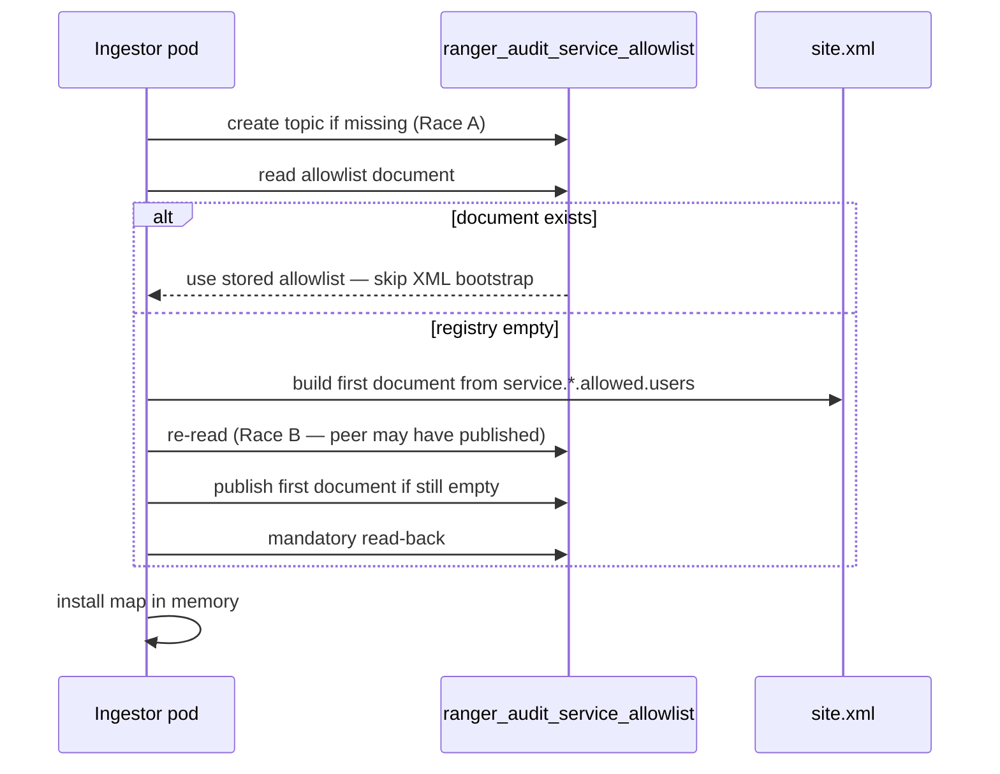
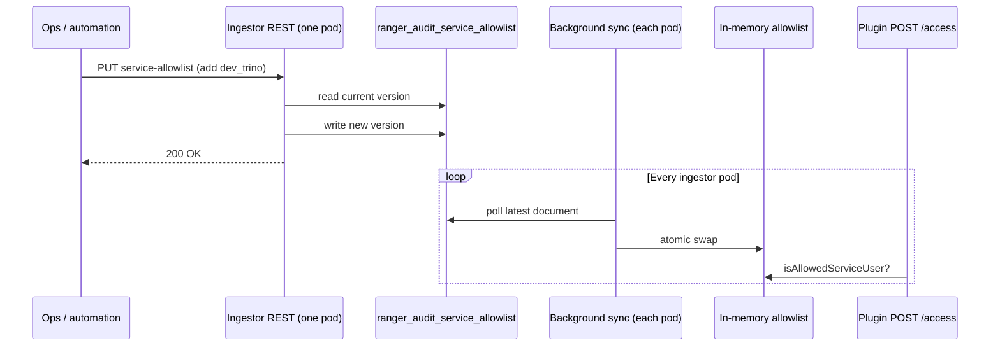

<!--
Licensed to the Apache Software Foundation (ASF) under one
or more contributor license agreements.  See the NOTICE file
distributed with this work for additional information
regarding copyright ownership.  The ASF licenses this file
to you under the Apache License, Version 2.0 (the
"License"); you may not use this file except in compliance
with the License.  You may obtain a copy of the License at

  http://www.apache.org/licenses/LICENSE-2.0

Unless required by applicable law or agreed to in writing,
software distributed under the License is distributed on an
"AS IS" BASIS, WITHOUT WARRANTIES OR CONDITIONS OF ANY
KIND, either express or implied.  See the License for the
specific language governing permissions and limitations
under the License.
-->

# Dynamic service allowlist for Ranger audit-ingestor — guide for everyone

This guide explains **why** and **how** Ranger can move from a **static** per-repo allowlist (loaded once at ingestor startup) to a **dynamic** allowlist (change at runtime without restarting the audit ingestor).

It is written for operators, architects, and reviewers who need a shared mental model — **without reading the codebase**.

**Confluence:** [Dynamic Service Allowlist Guide (Ranger Audit Ingestor)](https://cloudera.atlassian.net/wiki/spaces/ENG/pages/12055576591/Dynamic+Service+Allowlist+Guide+Ranger+Audit+Ingestor) (child of [Ranger Engineering](https://cloudera.atlassian.net/wiki/spaces/ENG/pages/759726545/Ranger+Engineering))

**Status:** Proposal (not fully implemented). Complements [Dynamic Kafka Partitioning Guide](README-KAFKA-DYNAMIC-PARTITIONING-GUIDE.md) ([Confluence](https://cloudera.atlassian.net/wiki/spaces/ENG/pages/12043681813/Dynamic+Kafka+Partitioning+Guide+Ranger+Audit+Plugins)); does **not** replace authorization on `POST /api/audit/access`.

**Related design doc:** [README-DYNAMIC-SERVICE-ALLOWLIST-DESIGN.md](README-DYNAMIC-SERVICE-ALLOWLIST-DESIGN.md)

---

## 1. What problem are we solving?

Ranger plugins (HDFS, Hive, Ozone OM, Trino, etc.) POST audit events to **audit-ingestor**:

```http
POST /api/audit/access?serviceName=<repo>&appId=<agent>
```

After Kerberos/JWT/basic **authentication** (401 on failure), ingestor performs **authorization**: the authenticated short username must appear in the allowlist for that repo.

**Today (static mode):**

- Who may POST audits for repo `dev_hive` is defined in **XML** at startup:
  - `ranger.audit.ingestor.service.dev_hive.allowed.users` = `hive`
- Adding a new Ranger service repo (e.g. `dev_trino`) means: edit `ranger-audit-ingestor-site.xml` → **restart ingestor** on every pod.
- [PR #1017](https://github.com/apache/ranger/pull/1017) (RANGER-5645) added missing static entries for Docker E2E (e.g. `dev_ozone` needed `om`).

**Goal (dynamic mode):**

- Change **who may claim audits for a repo** while ingestor is running.
- Onboard a new repo without rolling restart.
- Keep all ingestor replicas consistent via a shared durable registry (same pattern as the partition plan).

**What this does *not* solve:** Kafka partition routing. That is the [partition plan guide](README-KAFKA-DYNAMIC-PARTITIONING-GUIDE.md) ([Confluence](https://cloudera.atlassian.net/wiki/spaces/ENG/pages/12043681813/Dynamic+Kafka+Partitioning+Guide+Ranger+Audit+Plugins)). Dynamic partition mapping does **not** remove the allowlist check — and that is **intentional**.

---

## 2. Core ideas (plain language)

### Service repo name (`serviceName`)

The `serviceName` query parameter on `/access` is the **Ranger Policy Manager service name** — e.g. `dev_hive`, `dev_ozone`, `dev_trino`. It must match the repo name in Ranger Admin, not the service *type* (`hive`, `ozone`).

### Short username (after `auth_to_local`)

Ingestor maps the Kerberos principal to a **short name** before checking the allowlist — e.g. `hive/ranger-hive.rangernw@EXAMPLE.COM` → `hive`.

Allowlist values are **short names**, not full principals.

### Service allowlist: `ranger.audit.ingestor.service.<repo>.allowed.users`

This is the authorization gate on every plugin audit POST.

| Item | Detail |
|------|--------|
| **Property** | `ranger.audit.ingestor.service.<repo>.allowed.users` |
| **Example** | `ranger.audit.ingestor.service.dev_hive.allowed.users` = `hive` |
| **Caller** | Service daemons (`hive`, `hdfs`, `om`, `trino`, …) |
| **When checked** | On **every** audit POST, **before** Kafka produce |
| **Failure** | **403** (authentication already succeeded) |

**What it prevents:** any principal with a valid Kerberos ticket from forging audits for a repo it does not own. Without this check, a compromised `kafka` daemon could POST events as `serviceName=dev_hive`.

### Partition plan (orthogonal — different guide)

After the service allowlist check passes, ingestor publishes to Kafka and the **partition plan** decides *which partition*. See [README-KAFKA-DYNAMIC-PARTITIONING-GUIDE.md](README-KAFKA-DYNAMIC-PARTITIONING-GUIDE.md).

A plugin can have a valid partition range and still get **403** on `/access` if its short name is not in the service allowlist.

### Service allowlist registry (proposed source of truth)

The live allowlist lives in **durable shared storage** that all ingestor replicas read — a Kafka **compacted** topic (`ranger_audit_service_allowlist`).

- No new database dependency.
- Survives pod restarts.
- All replicas see the same latest allowlist document.

### Consistency rule (ops discipline — Phase 1)

```text
allowedUsers for repo R ⊆ { short names from policy.download.auth.users for R in Ranger Admin }
```

Ranger Admin does **not** sync this automatically in Phase 1 (Option C). Operators copy the right short names when onboarding. Ingestor may **reject** REST writes that violate the subset rule (strict mode).

### Three layers — do not merge

| Layer | Who | Purpose |
|---------|-----|---------|
| **Service allowlist** (plugin POST) | Daemons (`hive`, `om`, …) | May this principal POST audits for repo `R`? |
| **Partition plan** (Kafka routing) | Ingestor internal | Which Kafka partition after accept? |
| **Admin REST APIs** | Ops (`admin`, `ops`, …) | Who may change allowlist or partition plan via REST? |

Plugins must **not** call allowlist-admin or partition-plan REST. One combined list would let a daemon rewire routing or impersonate other repos.

---

## 3. Today vs proposed (at a glance)

| | Static (today) | Dynamic (proposed) |
|---|----------------|---------------------|
| **Where allowlist lives** | XML on each pod at startup | Shared document in Kafka compacted topic |
| **Change allowlist** | Edit XML + restart | REST API; no restart |
| **Add new repo `dev_trino`** | New XML property + restart all pods | `PUT /service-allowlist` or seed topic |
| **Multi-replica ingestor** | Same XML if synced via ConfigMap | All pods watch same Kafka topic |
| **Relation to partition plan** | Separate manual step | Still separate; optional `onboard-plugin` bundles both later |
| **Authorization on `/access`** | Required | **Still required** |
| **Feature flag** | Default behavior | `ranger.audit.ingestor.service.allowlist.dynamic.enabled=true` |

---

## 4. Request path — why partition plan does not replace allowlist

```text
Plugin POST /api/audit/access?serviceName=dev_hive&appId=hiveServer2
        │
        ├─ 401  Authentication failed (Kerberos / JWT / basic)
        │
        ├─ 403  Service allowlist: auth_to_local(principal) → "hive"
        │         "hive" ∉ allowed set for dev_hive  → STOP
        │         (partition plan is never consulted)
        │
        └─ 200/202  Allowlist passed → Kafka producer
                          │
                          └─ Partition plan: router picks partition
```

| If you see… | Layer | Fix |
|-------------|-------|-----|
| **401** on `/access` | Authentication | Plugin / ingestor Kerberos, keytabs, SPNEGO |
| **403** on `/access` | **Service allowlist** | Add short name to `service.<repo>.allowed.users` |
| Audits accepted but wrong Kafka partition | **Partition plan** | Update partition plan ([partition guide](README-KAFKA-DYNAMIC-PARTITIONING-GUIDE.md)) |
| New repo in Admin, audits still **403** | Service allowlist not onboarded | Partition plan alone is **not** enough |
| Allowlist OK, audits in buffer partition | Partition plan not onboarded | Allowlist alone is **not** enough |

**Takeaway:** Onboard **two things** per repo — **service allowlist** and **partition range**.

---

## 5. Static → dynamic cutover — direct answers

**Goal:** Turn on dynamic mode so every plugin keeps the **same** authorization behavior it has today — no surprise 403s on cutover day.

### When dynamic mode is off

| Question | Answer |
|----------|--------|
| Is `ranger_audit_service_allowlist` created? | **No** — the allowlist topic is not created or used. |
| How is authz decided? | From XML at startup (`initializeAllowedUsers()`), same as today. |
| Is there a background allowlist sync? | **No**. |

### When dynamic mode is on

| Question | Answer |
|----------|--------|
| Is the allowlist topic created? | **Yes** — on first startup that needs the registry. |
| Where does every ingestor get the allowlist? | From `ranger_audit_service_allowlist` (compacted topic), kept in memory on each pod. |
| Can XML edits change live authz? | **No** (once a document exists in Kafka). Runtime changes go through REST. |

### How “same allowed users per repo” is achieved on cutover

Preservation works because the **first published document** is built from the **same XML properties** used today:

| Piece | Static today | Dynamic (first document from XML) |
|-------|--------------|-------------------------------------|
| Repo key | `service.<repo>.allowed.users` property name | Same repo name in JSON `services` map |
| User values | Comma-separated short names in XML | Same names in `allowedUsers` array |
| Unknown repo | No XML entry → **403** | No registry entry → **403** (fail closed) |
| Per-request check | `isAllowedServiceUser()` | Same method; reads in-memory cache |

**Brownfield:** Export current `service.*.allowed.users` from `ranger-audit-ingestor-site.xml`, seed JSON v1 into the allowlist topic **before** or during cutover, then enable dynamic mode and verify plugin POSTs still return **200**.

### Allowlist already in Kafka vs empty registry



| Situation | What each pod does |
|-----------|-------------------|
| Document **already** in `ranger_audit_service_allowlist` | Read and use it; **do not** publish a new document from XML |
| Topic exists but **no message** yet | One pod publishes the first document; others re-read and adopt (**Race B**) |
| Several pods create the topic at once | Idempotent create — **Race A** |

After the first document is stored in Kafka, **Kafka is the source of truth** for the allowlist.

---

## 6. How dynamic mode works (end-to-end)

| Plane | Kafka topic | Traffic | Who reads/writes |
|-------|-------------|---------|------------------|
| **Data** | `ranger_audits` | High — every audit event | Plugins → ingestor → dispatchers |
| **Control (allowlist)** | `ranger_audit_service_allowlist` (compacted) | Low — rare allowlist changes | Admin REST + background sync on ingestor pods |
| **Control (partition plan)** | `ranger_audit_partition_plan` (compacted) | Low — rare routing changes | Separate admin REST ([partition guide](README-KAFKA-DYNAMIC-PARTITIONING-GUIDE.md)) |

The service allowlist is **configuration**, not audit data. Ingestor keeps the current map **in memory**; only the background sync thread and REST handlers touch the allowlist topic.

### Architecture (control plane vs data plane)

```mermaid
flowchart TB
  subgraph plugins [Ranger plugins]
    HS2[HiveServer2]
    OM[Ozone OM]
  end

  subgraph ops [Ops or automation]
    Admin[Admin REST client]
  end

  subgraph ingestor [Each audit-ingestor pod]
    Access["POST /api/audit/access"]
    AllowREST["GET/PUT /api/audit/service-allowlist"]
    Svc[Allowlist update service]
    Watcher[Background allowlist sync]
    Mem[(In-memory allowlist map)]
    Part[Partition router]
    KafkaProd[Kafka producer]

    AllowREST --> Svc
    Svc --> AllowTopic
    Watcher -->|poll / consume| AllowTopic
    Watcher -->|atomic swap| Mem
    HS2 -->|serviceName=dev_hive| Access
    OM -->|serviceName=dev_ozone| Access
    Access -->|isAllowedServiceUser| Mem
    Access -->|on 200/202| KafkaProd
    KafkaProd --> Part
    Part --> AuditTopic
  end

  subgraph kafka [Kafka]
    AllowTopic[(ranger_audit_service_allowlist<br/>compacted, low volume)]
    AuditTopic[(ranger_audits<br/>high volume)]
  end

  Admin -->|GET / PUT via load balancer| AllowREST
```



### First startup — seeding the allowlist (once per cluster)

When dynamic mode starts and the allowlist registry is **empty**:

1. Ingestor enables dynamic allowlist mode.
2. Background sync finds no document in `ranger_audit_service_allowlist`.
3. Ingestor scans XML for `ranger.audit.ingestor.service.*.allowed.users` properties.
4. Ingestor builds and publishes the **first document** to the compacted topic.
5. Ingestor loads that map into memory and begins enforcing authz on `/access`.

**After that:** additional pods and restarts **read Kafka only** — they do not re-build from XML.

### Every audit — the hot path

The allowlist topic is **not** read on this path.

1. Plugin POSTs audit to ingestor (Kerberos/JWT/basic auth).
2. Ingestor maps principal → short name (`auth_to_local`).
3. `isAllowedServiceUser(serviceName, shortName)` reads the **in-memory** map.
4. If allowed → accept → Kafka produce → partition router.
5. If denied → **403**.

### Changing the allowlist — admin or automation

**On the pod that receives the REST call:**

1. Read current document from Kafka.
2. Validate change (subset rule if strict mode enabled).
3. Write new document **version** to compacted topic.
4. Return **200 OK** or **409 Conflict** (stale `expectedVersion`).

**On every ingestor pod (~30s sync interval):**

1. Background sync picks up new document version.
2. Swaps map in memory — **no restart**.



### Rules to remember

- **Allowlist topic = who may POST**; audit topic = audit data.
- **Memory on the hot path** — no per-audit read of the allowlist topic.
- **Kafka is the source of truth** after the first document is published.
- **Fail closed** — unknown repo or empty allowlist → **403**.
- **All pods must agree** — every ingestor syncs from the same compacted topic.
- **Partition plan is separate** — changing routing does not change who may POST.

---

## 7. Admin REST API (control plane)

When dynamic mode is on, operators change the allowlist through the **ingestor admin API** on **any** pod (usually via load balancer). Mutations are written to `ranger_audit_service_allowlist`; every pod picks up changes through background sync (~30s).

**Auth:** Kerberos or JWT. Caller must be in **`service.allowlist.admin.users`** — **not** the same list as plugin users. Dynamic mode off → allowlist REST returns **503**.

### Endpoints (proposed)

| Method | Path | Use when |
|--------|------|----------|
| `GET` | `/api/audit/service-allowlist` | Read current document + version |
| `PUT` | `/api/audit/service-allowlist` | Replace or merge full document |
| `PUT` | `/api/audit/service-allowlist/services/{repo}` | Upsert one repo (convenience) |
| `DELETE` | `/api/audit/service-allowlist/services/{repo}` | Remove repo (plugins get **403** for that repo) |

Base URL example: `https://<ingestor-host>:7081/api/audit/service-allowlist`

### Registry document shape

```json
{
  "version": 3,
  "updatedAt": "2026-06-15T12:00:00Z",
  "updatedBy": "admin",
  "services": {
    "dev_hive": {
      "allowedUsers": ["hive"]
    },
    "dev_ozone": {
      "allowedUsers": ["om", "ozone"]
    },
    "dev_trino": {
      "allowedUsers": ["trino"]
    }
  }
}
```

### `expectedVersion` (all writes)

Every `PUT` must include the **version** you read from the last `GET`. If another admin changed the allowlist first, the server returns **409 Conflict** with the current document — refresh and retry.

### Common operations

**Read allowlist**

```http
GET /api/audit/service-allowlist
→ 200 + JSON document (note the "version" field)
```

**Onboard repo** — e.g. allow `trino` for `dev_trino`:

```json
PUT /api/audit/service-allowlist
{
  "expectedVersion": 2,
  "services": {
    "dev_trino": {
      "allowedUsers": ["trino"]
    }
  }
}
```

Or upsert one repo:

```http
PUT /api/audit/service-allowlist/services/dev_trino
{
  "expectedVersion": 2,
  "allowedUsers": ["trino"]
}
```

Success → **200** + updated document (version incremented).  
Stale version → **409** + current document in body.  
Strict subset violation → **400**.

### What happens inside one REST call

| Step | What the ingestor does |
|------|------------------------|
| 1 | Authenticate caller; check `service.allowlist.admin.users` |
| 2 | Read current document from `ranger_audit_service_allowlist` |
| 3 | Reject if `expectedVersion` does not match |
| 4 | Validate `allowedUsers` ⊆ `policy.download.auth.users` (strict mode, optional) |
| 5 | Publish new document version to Kafka |
| 6 | Return updated JSON |

**GET** is cheap (memory). **PUT** always goes through Kafka so all pods converge on the same allowlist.

---

## 8. Operator workflow: onboarding a new repo

Use this **in addition to** the [partition plan onboarding workflow](README-KAFKA-DYNAMIC-PARTITIONING-GUIDE.md#7-operator-workflow-onboarding-a-plugin).

### Stage 0 — Create service in Ranger Admin

1. Create service `dev_trino` in Policy Manager.
2. Set `policy.download.auth.users` = `trino` (comma-separated short names).
3. Configure plugin audit destination → ingestor URL (`:7081`).

Ranger Admin does **not** push to ingestor in Phase 1. You must onboard the allowlist separately.

### Stage 1 — Add allowlist entry

**Static mode (today):**

```xml
<property>
  <name>ranger.audit.ingestor.service.dev_trino.allowed.users</name>
  <value>trino</value>
</property>
```

Restart all ingestor pods.

**Dynamic mode (proposed):**

```http
PUT /api/audit/service-allowlist/services/dev_trino
{ "expectedVersion": N, "allowedUsers": ["trino"] }
```

All ingestors apply within ~30s. **No restart** required.

### Stage 2 — Verify plugin POST

```bash
# From plugin host (after kinit as trino)
curl --negotiate -u : -X POST \
  "http://<ingestor>:7081/api/audit/access?serviceName=dev_trino&appId=trino" \
  -H "Content-Type: application/json" \
  -d '[...]'
```

Expect **200/202**, not **403**.

### Stage 3 — Partition plan

Promote or scale in the partition plan if dedicated partitions are needed. See [partition plan onboarding workflow](README-KAFKA-DYNAMIC-PARTITIONING-GUIDE.md#7-operator-workflow-onboarding-a-plugin) ([Confluence](https://cloudera.atlassian.net/wiki/spaces/ENG/pages/12043681813/Dynamic+Kafka+Partitioning+Guide+Ranger+Audit+Plugins)).

### Onboard checklist

| Check | Example |
|-------|---------|
| Admin `policy.download.auth.users` | `trino` |
| Ingestor allowlist ⊆ Admin download users | `dev_trino` → `{trino}` |
| `auth_to_local` maps plugin principal | `trino/host@REALM` → `trino` |
| Plugin `serviceName` query param | `dev_trino` (Admin repo name) |
| Partition plan entry (if needed) | `trino` promoted from buffer |

**Do not** edit `ranger-audit-ingestor-site.xml` on one pod for runtime changes when dynamic mode is on. XML is only for **initial bootstrap** when the allowlist registry is empty.

---

## 9. Configuration (dynamic mode)

| Property | Purpose | Example |
|----------|---------|---------|
| `ranger.audit.ingestor.service.allowlist.dynamic.enabled` | Turn dynamic allowlist on/off | `false` (default) = static XML |
| `ranger.audit.ingestor.service.allowlist.topic` | Compacted allowlist topic name | `ranger_audit_service_allowlist` |
| `ranger.audit.ingestor.service.allowlist.refresh.interval.ms` | How often pods reload allowlist | `30000` |
| `ranger.audit.ingestor.service.allowlist.admin.users` | Who may call allowlist REST | `admin,ops` |
| `ranger.audit.ingestor.service.<repo>.allowed.users` | Static bootstrap per repo | `hive`, `om,ozone`, … |
| `ranger.audit.ingestor.auth.to.local` | Principal → short name rules | Same as Hadoop `hadoop.security.auth_to_local` |

When dynamic is **off**, authz is fixed from XML at startup and the allowlist topic is not used.

When dynamic is **on** and the registry is **empty**, the first ingestor pod seeds the document from XML. Later pods and restarts read **Kafka only**.

---

## 10. FAQ

### Basics

**Why do we need an allowlist if Kerberos already authenticates the plugin?**  
Authentication proves *who* connected. Authorization proves they may **claim audits for this repo**. Kerberos success alone would let any daemon POST as any `serviceName`.

**What is the difference between static and dynamic allowlist?**  
Static: map loaded once from XML at startup; changes need restart. Dynamic: map lives in Kafka; ops change it via REST while ingestor keeps running.

**Does dynamic partition plan remove the allowlist check?**  
**No.** Partition routing runs **after** `/access` accepts the batch. **403** on `/access` is always a **service allowlist** failure.

**How does this relate to PR #1017 (RANGER-5645)?**  
#1017 added missing **static** XML entries for Docker (service allowlist). Partition plan work is orthogonal.

**Why not store the allowlist in Ranger Admin or Postgres?**  
Phase 1 (Option C): no Admin → ingestor coupling. Kafka compacted topic matches the partition-plan pattern ingestor already uses.

**Why not edit XML on a running pod?**  
Each pod has its own copy; edits are not shared, not durable, and are lost on restart. Runtime changes belong in the allowlist topic via REST.

### Two topics and sync

**What are the Kafka topics involved?**  
`ranger_audits` = audit data (high volume). `ranger_audit_service_allowlist` = allowlist config (low volume, compacted). Partition plan uses a third topic — see partition guide.

**Does every audit POST read the allowlist topic?**  
No. Each audit uses the map already in **memory** on that pod. Only background sync and REST mutations touch the allowlist topic.

**How do all ingestor pods stay in sync?**  
Every pod watches the same compacted allowlist topic (default every 30s) and swaps the new map into memory.

**What happens when a pod restarts?**  
It reads the latest document from Kafka (if dynamic is on). The allowlist survives in Kafka across crashes.

### Allowlist content

**What goes in `allowedUsers`?**  
Short names after `auth_to_local` — same values as `policy.download.auth.users` on the Ranger service (or a subset).

**What if a repo is missing from the allowlist?**  
**403** for that `serviceName`. Fail closed.

**Can I use `*` as a wildcard?**  
Not recommended. Use explicit short names per repo.

**Should tag services get an allowlist entry?**  
No for repos that never POST resource audits (e.g. tag services per RANGER-2481).

### REST and concurrency

**Do I need to restart ingestor after PUT allowlist?**  
No. Background sync applies the new map within about one refresh interval (~30s).

**What is `expectedVersion`?**  
The document `version` you believe is current when you write. Stale version → **409**.

**What should I do on HTTP 409?**  
Another writer published a newer document. Use the body from the 409 response (or `GET` again), note the new `version`, and retry.

**Who can call service-allowlist REST?**  
Ops principals in `service.allowlist.admin.users` (Kerberos/JWT). Plugin users (`hive`, `om`) send audits via `/access` — they must **not** mutate the allowlist.

**Who can call `POST /access`?**  
Only principals in `service.<repo>.allowed.users` for the given `serviceName`.

### Cutover and bootstrap

**When is `ranger_audit_service_allowlist` created?**  
Only when dynamic allowlist mode is enabled.

**Can I publish the allowlist to Kafka before enabling dynamic mode?**  
Yes — recommended for brownfield. Ingestor will read your pre-loaded document and will not replace it with a fresh XML bootstrap.

**How do I verify cutover succeeded?**  
`GET /api/audit/service-allowlist` on every pod (same `version`); plugin POSTs still **200**; remove a user via REST → plugin gets **403** → restore → **200** without restart.

**How do I roll back to static mode?**  
Export current document via `GET`, align XML to that layout, set `dynamic.enabled=false`, rolling restart. Allowlist topic remains but is ignored.

### Troubleshooting

**Plugin gets 401 on `/access`**  
Authentication problem — keytabs, SPNEGO, ingestor Kerberos config. Not an allowlist issue.

**Plugin gets 403 on `/access` but Kerberos works**  
Service allowlist: short name not in `service.<repo>.allowed.users`, or wrong `serviceName`, or `auth_to_local` mismatch.

**New repo in Admin UI, still 403**  
Service allowlist not onboarded. Creating the service in Admin does not auto-update ingestor (Phase 1).

**Audits accepted but not in expected Solr partition**  
Partition plan issue, not allowlist. See [partition guide](README-KAFKA-DYNAMIC-PARTITIONING-GUIDE.md).

**Pods show different allowlist versions**  
Wait one refresh interval. If still mismatched, check allowlist topic readability and watcher logs on the lagging pod.

**Does Ranger Admin need the audit-ingestor URL?**  
No. Admin reads audits from Solr (or DB/ES). Plugins point at ingestor; allowlist is ingestor-local config.

### Relation to partition plan

**Do I need both allowlist and partition plan for a new plugin?**  
Yes for full production onboarding. Allowlist = may POST; partition plan = where in Kafka.

**Is there a bundled API?**  
Proposed Phase 4: `POST /api/audit/onboard-plugin` updates allowlist **first**, then partition plan (fail closed if allowlist missing).

**What order on partial failure?**  
Allowlist first, then plan. No audits accepted until allowlist exists for the repo.

---

## 11. Phased rollout (summary)

| Phase | Deliverable |
|-------|-------------|
| **0** | Static XML ([#1017](https://github.com/apache/ranger/pull/1017) Docker entries) — **today** |
| **1** | Kafka topic + watcher; `AuditREST` reads cache; bootstrap from XML |
| **2** | `GET/PUT /api/audit/service-allowlist` + admin authZ |
| **3** | Ops runbook + brownfield migration |
| **4** | Optional `POST /api/audit/onboard-plugin` (allowlist + partition plan) |
| **5** | Optional Ranger Admin push sync — **out of scope for Phase 1–3** |

**Explicit non-goals for Phase 1–3:**

- Removing authorization on `/access`
- Merging plugin allowlist with partition-plan admin allowlist
- Ranger Admin automatic sync (Option C only)

---

## Docs

| Doc | Purpose |
|-----|---------|
| [README-DYNAMIC-SERVICE-ALLOWLIST-DESIGN.md](README-DYNAMIC-SERVICE-ALLOWLIST-DESIGN.md) | Full design proposal (authorization layers, security, API detail) |
| [README-KAFKA-DYNAMIC-PARTITIONING-GUIDE.md](README-KAFKA-DYNAMIC-PARTITIONING-GUIDE.md) | Partition plan operator guide |
| [DESIGN-KAFKA-DYNAMIC-PARTITIONING.md](DESIGN-KAFKA-DYNAMIC-PARTITIONING.md) | Partition plan architecture |
| [DESIGN-KAFKA-AUDIT-SERVER.md](DESIGN-KAFKA-AUDIT-SERVER.md) | End-to-end audit pipeline |
| [PR #1017](https://github.com/apache/ranger/pull/1017) (RANGER-5645) | Static Docker allowlist fix |

---

*Operator guide for the dynamic service allowlist proposal. Implementation tracked separately from partition plan phases.*
