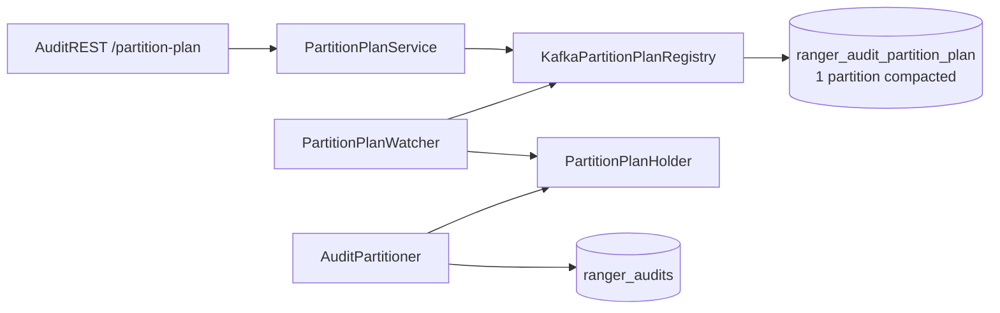

<!--
Licensed to the Apache Software Foundation (ASF) under one
or more contributor license agreements.  See the NOTICE file
distributed with this work for additional information
regarding copyright ownership.  The ASF licenses this file
to you under the Apache License, Version 2.0 (the
"License"); you may not use this file except in compliance
with the License.  You may obtain a copy of the License at

  http://www.apache.org/licenses/LICENSE-2.0

Unless required by applicable law or agreed to in writing,
software distributed under the License is distributed on an
"AS IS" BASIS, WITHOUT WARRANTIES OR CONDITIONS OF ANY
KIND, either express or implied.  See the License for the
specific language governing permissions and limitations
under the License.
-->

# Dynamic Kafka partition plan — feature README

Runtime dynamic plugin-to-partition routing for **audit-ingestor**. Operators can promote plugins from a shared buffer pool or grow tail partitions through REST while ingestor keeps running.

**Feature flag (default off):** `ranger.audit.ingestor.kafka.partition.plan.dynamic.enabled=false`

---

## When to use this

| Use dynamic mode when… | Stay on static mode when… |
|------------------------|---------------------------|
| You run multiple ingestor replicas and need one shared routing plan | Single ingestor, rare config changes, restart is acceptable |
| You onboard new plugins without reshuffling existing partition assignments | You are fine editing XML and restarting ingestor |
| You scale hot plugins by appending tail partitions only | Partition layout is fixed at install time |

Static behavior is documented in [README-KAFKA-PLUGIN-PARTITIONING.md](README-KAFKA-PLUGIN-PARTITIONING.md).

---

## Architecture (30-second view)



1. **Registry topic** `ranger_audit_partition_plan` stores the latest `PartitionPlan` JSON (key = audit topic name, e.g. `ranger_audits`).
2. **Watcher** refreshes the in-memory plan on each ingestor pod.
3. **Partitioner** reads `PartitionPlanHolder` on every produce (no Kafka I/O on hot path).
4. **REST** mutates the plan (grow audit topic first, then write registry, then read-back verify).

The registry topic always has **exactly one partition** — enough because traffic is rare admin updates and compaction keeps one value per key.

---

## Enable dynamic mode

Add to `ranger-audit-ingestor-site.xml` (or uncomment the block already in the sample file):

```xml
<property>
  <name>ranger.audit.ingestor.kafka.partition.plan.dynamic.enabled</name>
  <value>true</value>
</property>
<property>
  <name>ranger.audit.ingestor.kafka.partition.plan.topic</name>
  <value>ranger_audit_partition_plan</value>
</property>
<property>
  <name>ranger.audit.ingestor.kafka.partition.plan.refresh.interval.ms</name>
  <value>30000</value>
</property>
<property>
  <name>ranger.audit.ingestor.kafka.partition.plan.consumer.poll.timeout.ms</name>
  <value>500</value>
</property>
```

On first startup with an empty registry, the **first ingestor pod** publishes an **initial bootstrap plan** derived from the same XML properties used by static mode (`kafka.configured.plugins`, partition counts, buffer). Later pods only consume Kafka.

---

## Partition plan JSON

```json
{
  "topic": "ranger_audits",
  "version": 1,
  "topicPartitionCount": 15,
  "updatedAt": "2026-06-09T12:00:00Z",
  "updatedBy": "bootstrap",
  "plugins": {
    "hdfs":        { "partitions": [0, 1, 2] },
    "hiveServer2": { "partitions": [3, 4, 5] }
  },
  "buffer": { "partitions": [6, 7, 8, 9, 10, 11, 12, 13, 14] }
}
```

- **`services`** — per-repo allowlist for `POST /api/audit/access` (`allowedUsers` short names).
- **`version`** — increments on every successful REST mutation; clients send `expectedVersion` for optimistic locking.
- **`topicPartitionCount`** — must match Kafka partition count for `ranger_audits`.
- **`buffer`** — sticky hash target for plugins not yet promoted.

---

## REST API

Base: `https://<ingestor-host>:<port>/api/audit`

| Method | Path | Purpose |
|--------|------|---------|
| `GET` | `/partition-plan` | Read in-memory plan on this pod |
| `PUT` | `/partition-plan` | Replace full plan (advanced) |
| `POST` | `/partition-plan/promote` | Promote plugin from buffer to dedicated partitions |
| `POST` | `/partition-plan/onboard-repo` | Upsert `services[repo]` + promote plugin (single version) |
| `POST` | `/partition-plan/scale` | Add tail partitions to an existing plugin |

Example promote:

```bash
curl -s -X POST "https://ingestor:7182/api/audit/partition-plan/promote" \
  -H "Content-Type: application/json" \
  -d '{"pluginId":"trino","partitionCount":3,"expectedVersion":1}'
```

| Response | Meaning |
|----------|---------|
| `200` | Plan updated; body is new plan JSON |
| `409` | `expectedVersion` stale — re-`GET` and retry |
| `503` | Dynamic mode disabled or plan/Kafka not ready |

Full request schemas: [README-KAFKA-PARTITION-PLAN-REGISTRY-REST.md](README-KAFKA-PARTITION-PLAN-REGISTRY-REST.md).

---

## Routing rules (`AuditPartitioner`)

| Case | Behavior |
|------|----------|
| Plugin in `plan.plugins` | Round-robin across that plugin's partition id list (`nextRoundRobinIndex`) |
| Plugin not in plan | Sticky hash into `buffer.partitions` |
| Plan not loaded | Error log + topic-wide hash fallback |
| Topic smaller than plan during grow | `boundPartitionToTopic` clamps planned id to live metadata |

Message **key** = plugin id (`hdfs`, `hiveServer2`, …).

---

## Java package layout

```
audit-ingestor/.../producer/kafka/partition/
├── model/          PartitionPlan, PluginPartitionAssignment, REST DTOs
├── exception/      PartitionPlanException, PartitionPlanConflictException
├── constants/      PartitionPlanConstants
├── PartitionPlanHolder.java
├── PartitionPlanWatcher.java
├── KafkaPartitionPlanRegistry.java
├── PartitionPlanBootstrap.java
├── PartitionPlanAllocator.java
├── PartitionPlanValidator.java
├── PartitionPlanService.java
└── KafkaAuditTopicPartitionGrower.java
```

`audit-common`: `AuditMessageQueueUtils.createPartitionPlanTopicIfNotExists()` creates the registry topic (1 partition, compacted).

---

## Build and test

### Unit tests and quality gates

```bash
cd ranger
export MAVEN_OPTS="-Xmx4g"
mvn verify -pl audit-server/audit-common,audit-server/audit-ingestor -Drat.skip=true
```

| Gate | Expected |
|------|----------|
| Unit tests | 46 passed (`audit-common` 4 + `audit-ingestor` 42) |
| Checkstyle | 0 violations |
| PMD | 0 rule violations |

Key test classes: `AuditPartitionerDynamicTest`, `PartitionPlanAllocatorTest`, `PartitionPlanValidatorTest`, `PartitionPlanServiceMutationTest`, `PartitionPlanBootstrapTest`.

### Manual testing (Docker Tier 3)

Validated on the Tier 3 Docker lab (Kerberos, Kafka, Solr, HDFS plugin, ingestor). **31 E2E checks — all passed.**

```bash
cd dev-support/ranger-docker
./scripts/audit/wait-for-audit-health.sh --tier 3
./scripts/audit/verify-partition-plan-e2e-all.sh
```

| Scenario | What was verified |
|----------|-------------------|
| Static mode (`dynamic.enabled=false`) | Health **200**; `GET /partition-plan` → **503**; HDFS audits OK |
| Greenfield dynamic on | Plan topic **1 partition** compacted; bootstrap **v1**; 13 plugins / 48 partitions |
| REST promote / scale | **200** + version bump; **409** on stale version; **400** on double-promote |
| Multi-pod (:7081 + :7082) | Replica converges within ~35s after promote on primary |
| Brownfield pre-seed | Pre-loaded Kafka plan not overwritten by XML bootstrap |
| Kafka down at startup | Ingestor unhealthy with dynamic on; recovers in static mode |

Narrative report: [README-KAFKA-PARTITION-PLAN-E2E-VALIDATION.md](README-KAFKA-PARTITION-PLAN-E2E-VALIDATION.md). Scenario catalog: [README-KAFKA-PARTITION-PLAN-E2E-TEST-PLAN.md](README-KAFKA-PARTITION-PLAN-E2E-TEST-PLAN.md).

PR copy-paste template: [dev-support/RANGER-KAFKA-DYNAMIC-PARTITION-PLAN-PR-TEMPLATE.md](../dev-support/RANGER-KAFKA-DYNAMIC-PARTITION-PLAN-PR-TEMPLATE.md).

---

## Operations

| Task | Doc |
|------|-----|
| Day-2 promote / scale procedures | [README-KAFKA-PARTITION-PLAN-OPS-RUNBOOK.md](README-KAFKA-PARTITION-PLAN-OPS-RUNBOOK.md) |
| Cutover from static XML | [README-KAFKA-PARTITION-PLAN-BROWNFIELD-MIGRATION.md](README-KAFKA-PARTITION-PLAN-BROWNFIELD-MIGRATION.md) |
| E2E validation plan | [README-KAFKA-PARTITION-PLAN-E2E-TEST-PLAN.md](README-KAFKA-PARTITION-PLAN-E2E-TEST-PLAN.md) |

---

## Related documentation

| Document | Content |
|----------|---------|
| [README-KAFKA-DYNAMIC-PARTITIONING-GUIDE.md](README-KAFKA-DYNAMIC-PARTITIONING-GUIDE.md) | Plain-language guide for architects and reviewers |
| [README-KAFKA-PARTITION-PLAN-IMPLEMENTATION.md](README-KAFKA-PARTITION-PLAN-IMPLEMENTATION.md) | Phased implementation status |
| [README-KAFKA-PARTITION-PLAN-REGISTRY-REST.md](README-KAFKA-PARTITION-PLAN-REGISTRY-REST.md) | Registry design + REST contracts |
| [README-KAFKA-PLUGIN-PARTITIONING-DYNAMIC-DESIGN.md](README-KAFKA-PLUGIN-PARTITIONING-DYNAMIC-DESIGN.md) | Original design goals |
| [dev-support/RANGER-KAFKA-DYNAMIC-PARTITION-PLAN-PR-TEMPLATE.md](../dev-support/RANGER-KAFKA-DYNAMIC-PARTITION-PLAN-PR-TEMPLATE.md) | GitHub PR description template |

---

## Limitations (current)

- REST auth follows general ingestor authentication; **dedicated admin allow-list is deferred**.
- Plan registry topic partition count is fixed at **1** (by design).
- Kafka topic partition count cannot shrink; plan validator enforces append-only growth.
