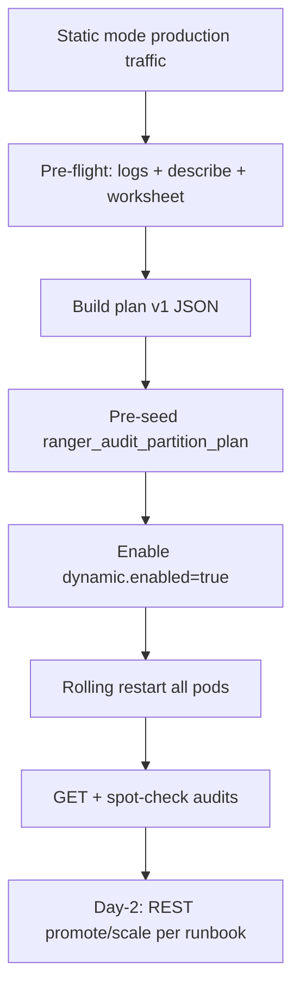

<!--
Licensed to the Apache Software Foundation (ASF) under one
or more contributor license agreements.  See the NOTICE file
distributed with this work for additional information
regarding copyright ownership.  The ASF licenses this file
to you under the Apache License, Version 2.0 (the
"License"); you may not use this file except in compliance
with the License.  You may obtain a copy of the License at

  http://www.apache.org/licenses/LICENSE-2.0

Unless required by applicable law or agreed to in writing,
software distributed under the License is distributed on an
"AS IS" BASIS, WITHOUT WARRANTIES OR CONDITIONS OF ANY
KIND, either express or implied.  See the License for the
specific language governing permissions and limitations
under the License.
-->

# Brownfield migration — static XML to dynamic partition plan

> **Consolidated design (start here for review):** [DESIGN-KAFKA-DYNAMIC-PARTITIONING.md](DESIGN-KAFKA-DYNAMIC-PARTITIONING.md) — see **§9 Brownfield migration** for simplified pre-flight, path decision diagram, and Q&A. This README is the full cutover worksheet and command examples.

Cutover guide for clusters **already running** legacy static routing (`kafka.partition.plan.dynamic.enabled=false` or unset) with a live `ranger_audits` topic and production traffic.

**Related docs:**

| Doc | Use when |
|-----|----------|
| [DESIGN-KAFKA-DYNAMIC-PARTITIONING.md](DESIGN-KAFKA-DYNAMIC-PARTITIONING.md) | Consolidated design — §9 brownfield (simplified) |
| [README-KAFKA-PARTITION-PLAN-OPS-RUNBOOK.md](README-KAFKA-PARTITION-PLAN-OPS-RUNBOOK.md) | Day-2 REST operations after cutover |
| [README-KAFKA-PLUGIN-PARTITIONING.md](README-KAFKA-PLUGIN-PARTITIONING.md) | How static XML layout works today |
| [README-KAFKA-PARTITION-PLAN-REGISTRY-REST.md](README-KAFKA-PARTITION-PLAN-REGISTRY-REST.md) | Plan JSON schema + REST semantics |
| [README-KAFKA-PARTITION-PLAN-IMPLEMENTATION.md](README-KAFKA-PARTITION-PLAN-IMPLEMENTATION.md) | Engineering phases |

---

## Goal

Enable dynamic mode **without changing** which Kafka partition each plugin uses on cutover day. After migration, runtime changes use REST (see [ops runbook](README-KAFKA-PARTITION-PLAN-OPS-RUNBOOK.md)); XML is bootstrap-only when the plan topic is empty.

---

## When auto-bootstrap is safe vs not

On first startup with `dynamic.enabled=true`, if `ranger_audit_partition_plan` has **no** message for your audit topic key, ingestor runs **Race B** bootstrap: it builds plan **v1** from current site XML (`PartitionPlanBootstrap` — same contiguous layout as static `AuditPartitioner` when only `configured.plugins`, per-plugin overrides, and `kafka.topic.partitions.buffer` drive allocation).

| Cluster profile | Recommended path |
|-----------------|------------------|
| XML matches production; `ranger_audits` partition count = XML-calculated sum; no `kafka.topic.partitions` override | **Path B** — auto-bootstrap on enable |
| Topic grown manually; overrides changed without XML update; `kafka.topic.partitions` set to a fixed total; any doubt about effective routing | **Path A** — pre-seed plan v1 in Kafka **before** rolling enable |
| Auto-bootstrap ran but GET shows wrong ranges | **Path C** — `PUT` correction immediately (before wide rollout) |

**Rule:** Treat **ingestor startup logs** and **`kafka-topics --describe`** as ground truth — not XML alone.

---

## Pre-flight audit (do this while still on static mode)

### 1. Capture effective routing from a running ingestor

At startup (static mode), ingestor logs an **AuditPartitioner Configuration** block with plugin ranges and buffer. Save this output from **each** replica (they should match).

```bash
# Example: grep recent ingestor log after restart
grep -A30 'AuditPartitioner Configuration' /var/log/ranger/audit-ingestor.log
```

Record:

- Each configured plugin → partition ID list (or start–end range)
- Buffer partition range
- Implied high-water partition ID (= `topicPartitionCount - 1`)

### 2. Confirm actual Kafka topic size

```bash
kafka-topics.sh --bootstrap-server <broker:9092> \
  --describe --topic ranger_audits
```

Note **PartitionCount**. It must equal `topicPartitionCount` in plan v1 (IDs `0 .. N-1`).

### 3. Compare XML-calculated sum vs reality

Relevant properties (prefix `ranger.audit.ingestor.`):

| Property | Role |
|----------|------|
| `kafka.configured.plugins` | Ordered plugin list |
| `kafka.topic.partitions.per.configured.plugin` | Default partitions per listed plugin |
| `kafka.plugin.partition.overrides.<pluginId>` | Per-plugin override |
| `kafka.topic.partitions.buffer` | Buffer size used by **bootstrap** |
| `kafka.topic.partitions` | **Static-only** fixed total — can change effective buffer |

**Bootstrap formula** (when no `kafka.topic.partitions` involvement):

```
topicPartitionCount = sum(per-plugin counts) + kafka.topic.partitions.buffer
```

**Static partitioner** when `kafka.topic.partitions` **is** set:

```
buffer = max(1, kafka.topic.partitions - sum(per-plugin counts))
```

If your cluster uses `kafka.topic.partitions` as a fixed cap, bootstrap from XML **will not** reproduce static routing unless you align or remove that property before cutover. Prefer **Path A** using log-exported ranges.

### 4. Drift checklist

| Check | Pass criteria |
|-------|---------------|
| Log ranges vs XML | Same partition IDs per plugin |
| `describe` partition count vs log | Equal |
| All ingestor replicas | Same layout in logs |
| Solr/HDFS dispatchers | Consuming all `ranger_audits` partitions (no custom partition filter) |
| Kafka ACLs | Ingestor can CREATE/WRITE plan topic + ALTER `ranger_audits` (same as today for topic growth) |

---

## Build plan v1 JSON

Plan v1 must:

- Set `"version": 1`
- Set `"topic": "ranger_audits"` (or your audit topic name)
- Set `"topicPartitionCount"` = actual Kafka partition count
- List **every** partition ID `0 .. N-1` exactly once across `plugins` + `buffer`
- Use contiguous plugin lists matching production (order in `plugins` map should follow `configured.plugins` order for human readability; routing uses explicit lists)

**Example** — `hdfs` + `hiveServer2`, 3 each, buffer 9, topic **15** partitions (matches `PartitionPlanBootstrapTest`):

```json
{
  "topic": "ranger_audits",
  "version": 1,
  "topicPartitionCount": 15,
  "updatedAt": "2026-06-09T12:00:00Z",
  "updatedBy": "brownfield-migration",
  "plugins": {
    "hdfs": { "partitions": [0, 1, 2] },
    "hiveServer2": { "partitions": [3, 4, 5] }
  },
  "buffer": { "partitions": [6, 7, 8, 9, 10, 11, 12, 13, 14] }
}
```

**Worksheet** (fill from logs):

| Plugin / pool | Partition IDs | Count |
|---------------|---------------|-------|
| hdfs | 0–2 | 3 |
| hiveServer2 | 3–5 | 3 |
| buffer | 6–14 | 9 |
| **Total** | **0–14** | **15** |

For hot layouts with overrides (e.g. hdfs=4, hiveServer2=6, trino=9, buffer=9 → 28 partitions), transcribe exact lists from logs — do not re-derive from stale XML.

---

## Migration paths

### Path A — Pre-seed Kafka (recommended for brownfield)

Use when production layout may differ from XML bootstrap.

| Step | Action |
|------|--------|
| 1 | Complete [pre-flight audit](#pre-flight-audit-do-this-while-still-on-static-mode) |
| 2 | Build v1 JSON (above) |
| 3 | Create plan topic if missing (or let first pod create it — 1 partition, compacted, `cleanup.policy=compact`) |
| 4 | Publish v1 **while dynamic mode is still off** via Kafka producer |

```bash
# Key MUST be the audit topic name (default: ranger_audits)
PLAN_JSON='{"topic":"ranger_audits","version":1,...}'

kafka-console-producer.sh --bootstrap-server <broker:9092> \
  --topic ranger_audit_partition_plan \
  --property parse.key=true \
  --property key.separator=: \
  <<< "ranger_audits:${PLAN_JSON}"
```

| 5 | Verify compacted value (optional) |

```bash
kafka-console-consumer.sh --bootstrap-server <broker:9092> \
  --topic ranger_audit_partition_plan \
  --from-beginning --max-messages 10 \
  --property print.key=true
```

| 6 | Set `ranger.audit.ingestor.kafka.partition.plan.dynamic.enabled=true` on **all** ingestor replicas |
| 7 | **Rolling restart** (one pod at a time). Each pod reads seeded v1 — **no** Race B bootstrap |
| 8 | [Verify cutover](#post-cutover-verification) |

**Why pre-seed while dynamic is off:** REST `PUT` requires `dynamic.enabled=true` and an existing plan in Kafka (`expectedVersion` must match current). Seeding via Kafka avoids a bootstrap race on multi-replica rollout.

---

### Path B — Auto-bootstrap on enable

Use only when pre-flight confirms XML layout == logs == `describe` partition count.

| Step | Action |
|------|--------|
| 1 | Ensure `ranger_audit_partition_plan` does **not** already contain a plan for your audit topic |
| 2 | Align XML: correct `configured.plugins`, overrides, `kafka.topic.partitions.buffer`; remove or reconcile `kafka.topic.partitions` if it distorts buffer |
| 3 | Enable `dynamic.enabled=true` + rolling restart |
| 4 | First pod to win Race B writes v1 from XML; peers read it |
| 5 | `GET /api/audit/partition-plan` on each pod — compare to saved static log ranges |
| 6 | If mismatch → stop rollout → [Path C](#path-c--correct-after-bootstrap) or rollback |

**Tip:** Scale to **one** ingestor replica for the first enable window to make bootstrap deterministic, verify `GET`, then scale back up.

---

### Path C — Correct after bootstrap

Use when dynamic is already on but v1 is wrong (or you enabled Path B and caught drift early).

| Step | Action |
|------|--------|
| 1 | `GET /api/audit/partition-plan` → note `version` (usually `1`) |
| 2 | Build corrected full plan body with same plugin/buffer lists but `topicPartitionCount` matching Kafka |
| 3 | `PUT` with `expectedVersion` = current version |

```bash
curl -s -u admin:password -X PUT \
  -H 'Content-Type: application/json' \
  "https://audit-ingestor:7182/api/audit/partition-plan" \
  -d '{
    "expectedVersion": 1,
    "topicPartitionCount": 28,
    "plugins": {
      "hdfs": { "partitions": [0, 1, 2, 3] },
      "hiveServer2": { "partitions": [4, 5, 6, 7, 8, 9] },
      "trino": { "partitions": [10, 11, 12, 13, 14, 15, 16, 17, 18] }
    },
    "buffer": { "partitions": [19, 20, 21, 22, 23, 24, 25, 26, 27] }
  }' | jq .
```

**Constraints:** `PUT` must satisfy append-only rules relative to current plan. Replacing v1 entirely is allowed when correcting a fresh bootstrap — keep lists identical to production intent. Handler grows `ranger_audits` if `topicPartitionCount` increases.

Pause further replica restarts until all pods show the corrected version (≤ refresh interval, default 30s).

---

## Post-cutover verification

| # | Check | How |
|---|-------|-----|
| 1 | Same plan version on all pods | `GET /api/audit/partition-plan` from each ingestor URL |
| 2 | Plan matches pre-cutover logs | Compare plugin/buffer lists to saved static log block |
| 3 | `topicPartitionCount` matches Kafka | `kafka-topics --describe` |
| 4 | Routing unchanged | Produce test audit per major plugin; confirm partition in ingestor debug/metrics |
| 5 | Dispatchers healthy | Solr/HDFS consumer lag normal; rebalance only if partition count grew |
| 6 | Watcher active | Log line: partition plan version loaded / refreshed |

```bash
# Compare versions across pods
for host in ingestor-1 ingestor-2 ingestor-3; do
  echo -n "$host: "
  curl -s -u admin:password "https://${host}:7182/api/audit/partition-plan" | jq -r .version
done
```

---

## Rollback to static mode

| Step | Action |
|------|--------|
| 1 | **Before disabling:** update site XML so static layout would reproduce **current** effective routing (plugins, overrides, buffer or `kafka.topic.partitions` as you used historically) |
| 2 | Set `kafka.partition.plan.dynamic.enabled=false` |
| 3 | Rolling restart all ingestor pods |
| 4 | Confirm startup logs show static AuditPartitioner ranges matching pre-migration logs |
| 5 | Plan topic in Kafka is harmless leftover; not read when disabled |

**Risk:** If XML does not match the plan you ran under dynamic mode, rollback reshuffles plugin traffic to different partitions — usually acceptable for audits but causes temporary dispatcher skew. Export plan JSON via `GET` before rollback and align XML to it.

---

## Post-migration XML hygiene

After successful cutover:

- Keep `configured.plugins` and overrides as **documentation** of the initial layout (used only if plan topic is wiped and bootstrap runs again).
- Do **not** expect XML edits to change live routing while dynamic is on.
- Optional: add a comment in site XML pointing to [ops runbook](README-KAFKA-PARTITION-PLAN-OPS-RUNBOOK.md) for promote/scale.
- Record plan `version` and export JSON in your change ticket.

---

## Common failure scenarios

| Symptom | Likely cause | Fix |
|---------|--------------|-----|
| Plugin audits land on wrong partition after enable | Bootstrap ≠ production | Path C `PUT` or rollback + Path A pre-seed |
| `topicPartitionCount` < Kafka `PartitionCount` | Plan JSON too small | Increase in `PUT`; IDs must cover all used partitions |
| `topicPartitionCount` > Kafka count | Topic not grown | REST handler grows on mutate; or grow topic manually before seed |
| Pods show different versions | Rolling restart mid-`PUT` | Wait 30s; `GET` each pod; retry mutation with fresh `expectedVersion` |
| Ingestor startup fails | Kafka/ACL unreachable with dynamic on | Fix connectivity; keep dynamic off until Kafka healthy |
| `PUT` returns 400 | Overlapping/missing partition IDs | Rebuild JSON — every ID 0..N-1 exactly once |
| `PUT` returns 409 | Stale `expectedVersion` | `GET` and retry ([runbook](README-KAFKA-PARTITION-PLAN-OPS-RUNBOOK.md#handle-http-409-version-conflict)) |

---

## End-to-end timeline (Path A — typical brownfield)



---

## Quick decision tree

```
Is XML + describe + ingestor log layout identical?
├── YES → Path B (auto-bootstrap), verify GET after first pod
└── NO  → Path A (pre-seed Kafka), then enable + rolling restart

After enable, does GET match saved static logs?
├── YES → Done
└── NO  → Path C PUT correct (pause rollout) or rollback
```

---

## Related implementation notes

- Bootstrap code: `PartitionPlanBootstrap.createInitialPlan*` — must match static contiguous allocation when only standard properties apply.
- Race B: `PartitionPlanBootstrapSupport.bootstrapPlanIfEmpty` — skipped when plan topic already has a value for the audit topic key.
- REST mutations require `dynamic.enabled=true`; initial seed for brownfield is via Kafka producer or bootstrap, not `PUT` on an empty registry.
