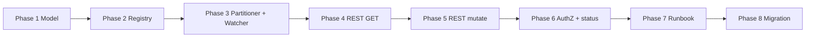
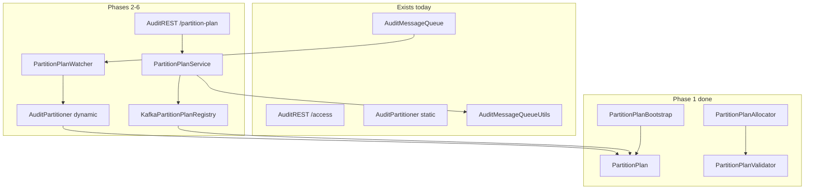

<!--
Licensed to the Apache Software Foundation (ASF) under one
or more contributor license agreements.  See the NOTICE file
distributed with this work for additional information
regarding copyright ownership.  The ASF licenses this file
to you under the Apache License, Version 2.0 (the
"License"); you may not use this file except in compliance
with the License.  You may obtain a copy of the License at
  http://www.apache.org/licenses/LICENSE-2.0
Unless required by applicable law or agreed to in writing,
software distributed under the License is distributed on an
"AS IS" BASIS, WITHOUT WARRANTIES OR CONDITIONS OF ANY
KIND, either express or implied.  See the License for the
specific language governing permissions and limitations
under the License.
-->

# Dynamic partition plan — phased implementation guide

> **Consolidated design (start here for review):** [DESIGN-KAFKA-DYNAMIC-PARTITIONING.md](DESIGN-KAFKA-DYNAMIC-PARTITIONING.md) — architecture, flows, diagrams, and Q&A (no code-level detail). This README is the phased engineering implementation plan.

This document is the **engineering implementation plan** for runtime dynamic plugin onboarding and partition scaling in `audit-ingestor`. It turns the design docs into reviewable phases, file-level deliverables, and test expectations.

**Design (read first):**

| Doc | Role |
|-----|------|
| [DESIGN-KAFKA-DYNAMIC-PARTITIONING.md](DESIGN-KAFKA-DYNAMIC-PARTITIONING.md) | **Consolidated** architecture + flows + Q&A |
| [README-KAFKA-DYNAMIC-PARTITIONING-GUIDE.md](README-KAFKA-DYNAMIC-PARTITIONING-GUIDE.md) | Plain-language overview |
| [README-KAFKA-PLUGIN-PARTITIONING-DYNAMIC-DESIGN.md](README-KAFKA-PLUGIN-PARTITIONING-DYNAMIC-DESIGN.md) | Goals, architecture, checklist |
| [README-KAFKA-PARTITION-PLAN-REGISTRY-REST.md](README-KAFKA-PARTITION-PLAN-REGISTRY-REST.md) | Kafka registry + REST API (detailed) |
| [README-KAFKA-PLUGIN-PARTITIONING.md](README-KAFKA-PLUGIN-PARTITIONING.md) | Current static behavior (baseline) |
| [README-KAFKA-PARTITION-PLAN-OPS-RUNBOOK.md](README-KAFKA-PARTITION-PLAN-OPS-RUNBOOK.md) | Operator runbook (Phase 7) |
| [README-KAFKA-PARTITION-PLAN-BROWNFIELD-MIGRATION.md](README-KAFKA-PARTITION-PLAN-BROWNFIELD-MIGRATION.md) | Brownfield cutover (Phase 8) |
| [README-KAFKA-PARTITION-PLAN-E2E-TEST-PLAN.md](README-KAFKA-PARTITION-PLAN-E2E-TEST-PLAN.md) | E2E test plan + Docker script |

**Feature flag (all phases):** `ranger.audit.ingestor.kafka.partition.plan.dynamic.enabled` — default **`false`** (legacy XML at startup unchanged).

---

## Summary

| Phase | Deliverable | Status |
|-------|-------------|--------|
| **1** | Core model + allocator + bootstrap + unit tests | **Done** |
| **2** | Kafka registry + `createPartitionPlanTopicIfNotExists` | **Done** (unit tests; Kafka E2E in Phase 3+) |
| **3** | Plan-aware `AuditPartitioner` + `PartitionPlanWatcher` | **Done** (unit tests; Docker E2E deferred) |
| **4** | REST `GET /api/audit/partition-plan` | **Done** (unit tests) |
| **5** | REST `PUT` / promote / scale + AdminClient | **Done** (unit tests) |
| **6** | AuthZ + `/status` plan metadata | **Deferred** (auth via `AuditDelegationTokenFilter` today; allow-list + `/status` block later) |
| **7** | Ops runbook + sample XML | **Done** |
| **8** | Brownfield migration procedure | **Done** |



**Suggested PR split:** one PR per phase (or combine 4+5+6 after 3). Phases 1–2 can merge without enabling dynamic mode in production configs.

---

## Phase 1 — Core model + allocator

**Goal:** Immutable plan model, append-only allocation rules, XML→v1 bootstrap (same layout as static `AuditPartitioner`), and unit tests. No Kafka, no REST, no runtime wiring yet.

### New package

`audit-ingestor/src/main/java/org/apache/ranger/audit/producer/kafka/partition/`

| Class | Responsibility |
|-------|----------------|
| `PartitionPlan` | JSON model: `topic`, `version`, `topicPartitionCount`, `plugins`, `buffer`, `updatedAt`, `updatedBy` |
| `PluginPartitionAssignment` | `{ "partitions": [0,1,2] }` wrapper |
| `PartitionPlanConstants` | `INITIAL_PLAN_VERSION`, `BOOTSTRAP_UPDATED_BY` |
| `PartitionPlanBootstrapConfig` | Bootstrap inputs (audit topic, plugins, overrides) |
| `PartitionPlanException` | Invalid plan / allocation failures |
| `PartitionPlanValidator` | Every partition assigned once; append-only transition checks |
| `PartitionPlanAllocator` | `promotePlugin`, `scalePlugin`, `replacePlan` (append-only tail growth) |
| `PartitionPlanBootstrap` | `createInitialPlan*` from XML / producer config (contiguous ranges → explicit lists) |

### Tests

`audit-ingestor/src/test/java/org/apache/ranger/audit/producer/kafka/partition/`

| Test class | Covers |
|------------|--------|
| `PartitionPlanBootstrapTest` | Initial plan matches static partitioner layout; overrides; `createInitialPlanFromProducerConfig` |
| `PartitionPlanAllocatorTest` | Promote from buffer; grow topic when buffer exhausted; scale tail-only; error cases |
| `PartitionPlanValidatorTest` | Duplicates, Kafka count mismatch, append-only reject reshuffle / accept tail growth |

### Allocation rules (locked for later phases)

- **Promote:** take partition IDs from the **front** of `buffer.partitions`; if insufficient, append new tail IDs and bump `topicPartitionCount`.
- **Scale:** append new tail IDs to the plugin’s existing list only; never reorder or remove existing IDs.
- **Replace (PUT):** `validateAppendOnly(current, proposed)`; server assigns `version = current + 1`.

### Verify locally

```bash
cd /path/to/ranger
mvn install -pl audit-server/audit-ingestor -am -DskipTests -Drat.skip=true
mvn test -pl audit-server/audit-ingestor \
  -Dtest=PartitionPlanBootstrapTest,PartitionPlanAllocatorTest,PartitionPlanValidatorTest \
  -Drat.skip=true
```

### Out of scope (Phase 1)

- `AuditPartitioner` changes
- REST endpoints

---

## Phase 2 — Kafka registry + plan topic create

**Goal:** Durable read/write of `PartitionPlan` JSON to compacted topic `ranger_audit_partition_plan`; idempotent topic creation (Race A).

### New / extended code

| Component | Location | Notes |
|-----------|----------|-------|
| `PartitionPlanRegistry` | `audit-ingestor/.../partition/` | `readPlan`, `writePlan`, `getPlanTopicName` |
| `KafkaPartitionPlanRegistry` | same | Kafka producer/consumer on compacted plan topic |
| `PartitionPlanJson` | same | JSON serde via `MiscUtil.getMapper()` |
| `PartitionPlanKafkaConfig` | same | Resolve topic name, flags, producer/consumer props |
| `createPartitionPlanTopicIfNotExists()` | `audit-common/.../AuditMessageQueueUtils.java` | 1 partition, `cleanup.policy=compact`; **already-exists = success** |
| `buildAdminClientConfig()` | same | Shared AdminClient bootstrap (audits + plan topics) |

### Reuse (do not rewrite)

- `AuditMessageQueueUtils.createAuditsTopicIfNotExists()` — AdminClient bootstrap, JAAS, retries
- `AuditMessageQueueUtils.updateExistingTopicPartitions()` — pattern for Phase 5 partition growth
- `kafka-clients` **3.9.1** — `AdminClient` already on ingestor classpath

### Constants (`audit-common` / `AuditServerConstants`)

| Property | Default |
|----------|---------|
| `kafka.partition.plan.topic` | `ranger_audit_partition_plan` |
| `kafka.partition.plan.refresh.interval.ms` | `30000` |
| `kafka.partition.plan.dynamic.enabled` | `false` |

### Tests

| Test class | Covers |
|------------|--------|
| `PartitionPlanJsonTest` | JSON round-trip; reject invalid JSON |
| `PartitionPlanKafkaConfigTest` | Topic name, dynamic flag, refresh interval defaults |
| `AuditMessageQueueUtilsTest` | `buildAdminClientConfig` |

Kafka registry read/write integration tests deferred to Phase 3 Docker E2E (no Testcontainers in repo today).

### Verify locally

```bash
mvn test -pl audit-server/audit-common,audit-server/audit-ingestor \
  -Dtest=AuditMessageQueueUtilsTest,PartitionPlanJsonTest,PartitionPlanKafkaConfigTest,PartitionPlanBootstrapTest,PartitionPlanAllocatorTest,PartitionPlanValidatorTest \
  -Drat.skip=true
```

### Kafka ACLs (document for ops)

- Ingestor principal: **WRITE** on `ranger_audit_partition_plan`
- Existing: **ALTER** / create-partitions on `ranger_audits` (already used at startup)

### Compacted topic: append, retention, performance (design note)

**Full design write-up:** [README-KAFKA-PARTITION-PLAN-REGISTRY-REST.md → Compacted topic semantics](README-KAFKA-PARTITION-PLAN-REGISTRY-REST.md#compacted-topic-semantics-append-retention-and-performance)

Summary for reviewers:

| Question | Answer |
|----------|--------|
| Does `writePlan` update one record? | **No** — each write **appends** a new record (same key, new offset). |
| How is it a “update”? | `cleanup.policy=compact` keeps **latest value per key**; old versions are compacted away. |
| Phase 2 `readPlan` | Scans partition 0 from start; **last matching key wins** (safe before compaction runs). |
| Impact on audit throughput? | **None** — plugin POST uses in-memory plan only. |
| Record growth concern? | **Low** — writes are rare; typical deployment has **one key**; ~1 record retained after compaction. |
| Phase 3 watcher | **Incremental** consume after initial load — do **not** full-scan every 30s. |

---

## Phase 3 — Plan-aware partitioner + watcher

**Goal:** Runtime routing from in-memory plan; background sync from Kafka; first-pod XML bootstrap (Race B). **No restart** when plan changes.

### Modified code

| File | Change |
|------|--------|
| `AuditPartitioner.java` | When `dynamic.enabled=false`: keep today’s static ranges. When `true`: reads `PartitionPlanHolder`; hot path has no Kafka I/O |
| `PartitionPlanHolder` | Shared singleton: `AtomicReference<PartitionPlan>` + version metadata |
| `PartitionPlanWatcher` | Startup: registry bootstrap (Race B) → install plan → incremental consumer poll every `refresh.interval.ms` |
| `PartitionPlanBootstrapSupport` | Race B: read → build v1 → re-read → write → mandatory read-back |
| `AuditMessageQueue.java` | `startPartitionPlanWatcherIfEnabled()` before producer create; stop on shutdown |

### Bootstrap Race B (mandatory)

1. Read plan → empty  
2. Build v1 from XML (`PartitionPlanBootstrap`)  
3. Re-read — if peer published, adopt theirs  
4. Produce local v1  
5. Mandatory read-back — install Kafka value, not local object only  

### Routing (dynamic mode)

1. Lookup `agentId` in `plan.plugins` → round-robin within list  
2. Else → hash into `plan.buffer.partitions`  
3. Validate partition IDs against `cluster.partitionsForTopic(topic)` before applying plan swap  

### Tests

| Type | Cases |
|------|-------|
| Unit | `AuditPartitionerDynamicTest` — plan routing; legacy flag off unchanged; concurrent swap |
| Unit | `PartitionPlanBootstrapSupportTest` — Race B: existing plan, publish v1, adopt peer |
| Integration | Two parallel bootstraps → same v1 on both pods (Docker tier3 E2E — deferred) |
| Failure | Plan topic unreadable at runtime → keep last known good plan (watcher logs warn, continues) |

### Misconfiguration

`dynamic.enabled=true` + Kafka unreachable at startup → **fail startup** (no silent fallback to XML).

---

## Phase 4 — REST GET

**Goal:** Admin read of current plan (in-memory; optional force read from Kafka for debug).

### Endpoints

| Method | Path | Behavior |
|--------|------|----------|
| `GET` | `/api/audit/partition-plan` | Return current in-memory plan |

### Code

| File | Change |
|------|--------|
| `AuditREST.java` | New `@GET` method(s) |
| New `PartitionPlanService` | Delegates to `PartitionPlanHolder` / registry |

When `dynamic.enabled=false`: return **404** or **503 Feature disabled**; do not register mutating routes.

### Tests

| Test class | Covers |
|------------|--------|
| `PartitionPlanServiceTest` | Flag off/on; in-memory GET; not loaded |

**Status:** `PartitionPlanService` + `AuditREST.getPartitionPlan()` implemented.

---

## Phase 5 — REST PATCH / plugins / services + AdminClient

**Goal:** Control plane mutations with optimistic concurrency; grow `ranger_audits` **before** publishing plan that references new partition IDs.

### Endpoints

| Method | Path | Body (summary) |
|--------|------|----------------|
| `PATCH` | `/api/audit/partition-plan` | Partial plan + `expectedVersion` |
| `POST` | `/api/audit/partition-plan/plugins` | `pluginId`, `partitionCount`, `expectedVersion` |
| `PATCH` | `/api/audit/partition-plan/plugins/{pluginId}` | `additionalPartitions`, `expectedVersion` |
| `POST` | `/api/audit/partition-plan/services` | `serviceName`, `pluginId`, `allowedUsers`, `partitionCount`, `expectedVersion` |

### Handler order (do not reorder)

1. AuthZ (Phase 6 — deferred; authentication only today)  
2. Load plan vN from Kafka  
3. `expectedVersion != N` → **409** + current plan body  
4. `PartitionPlanAllocator` / `replacePlan`  
5. If needed → `AdminClient.createPartitions(ranger_audits)`  
6. Re-read plan — still vN? else **409**  
7. Produce vN+1 to plan topic  
8. Read-back verify → **200** or **409**  

### Code

| File | Change |
|------|--------|
| `PartitionPlanService` | Orchestrates GET/PATCH/plugins/services mutations |
| `AuditMessageQueueUtils` | Reuse `updateExistingTopicPartitions` for audit topic growth |

### Tests

| Test class | Covers |
|------------|--------|
| `PartitionPlanServiceMutationTest` | Promote, scale, PATCH replace; stale `expectedVersion` → conflict; peer publish before write; topic grow failure |

**Status:** `PartitionPlanService` mutations + `AuditREST` PATCH/POST endpoints; `AuditMessageQueueUtils.ensureTopicPartitionCount()`.

---

## Phase 6 — AuthZ + `/status`

**Phase 6 — AuthZ:** **Done** — `kafka.partition.plan.allowed.users` enforced on partition-plan REST when configured.

### AuthZ (proposed property)

```xml
<property>
  <name>ranger.audit.ingestor.kafka.partition.plan.allowed.users</name>
  <value>admin,ops</value>
</property>
```

- Pattern: same as `/access` (`isAllowedServiceUser` style), but **separate** allow-list (plugin users must not call partition-plan).  
- `security-applicationContext.xml`: `/api/audit/partition-plan/**` requires authentication.  
- `AuditDelegationTokenFilter`: health/status stay permitAll; partition-plan does not.

### `/status` extensions

```json
{
  "partitionPlan": {
    "dynamicEnabled": true,
    "version": 5,
    "topicPartitionCount": 28,
    "lastUpdated": "2026-06-02T12:00:00Z",
    "watcherStatus": "OK"
  }
}
```

### Tests

- Unauthenticated → 401  
- Authenticated, not in allow-list → 403  
- Plugin service user → 403 on partition-plan, still OK on `/access`  

---

## Phase 7 — Ops runbook + sample XML

**Goal:** Document operator workflow when `dynamic.enabled=true`.

**Status:** Done — [README-KAFKA-PARTITION-PLAN-OPS-RUNBOOK.md](README-KAFKA-PARTITION-PLAN-OPS-RUNBOOK.md)

### Deliverables

| Item | Location |
|------|----------|
| Ops runbook | [README-KAFKA-PARTITION-PLAN-OPS-RUNBOOK.md](README-KAFKA-PARTITION-PLAN-OPS-RUNBOOK.md) — enablement, REST examples, 409 retry, dispatchers, troubleshooting |
| Sample XML | `audit-ingestor/src/main/resources/conf/ranger-audit-ingestor-site.xml` — `partition.plan.dynamic.enabled=false` (active); optional topic/refresh commented |

### Runbook highlights

- Runtime changes via **REST only**, not pod-local XML edits  
- After enable: first pod seeds v1 from XML if plan topic empty  
- On **409**: GET plan, retry with new `expectedVersion`  
- Solr/HDFS dispatchers: no config change; rebalance when `ranger_audits` partition count grows  

---

## Phase 8 — Brownfield migration

**Status:** **Done** — [README-KAFKA-PARTITION-PLAN-BROWNFIELD-MIGRATION.md](README-KAFKA-PARTITION-PLAN-BROWNFIELD-MIGRATION.md)

**Goal:** Safe cutover for clusters already running static XML + existing `ranger_audits` partition count.

**Deliverable:** Operator migration guide with three paths (pre-seed Kafka, auto-bootstrap, post-bootstrap `PUT` correction), pre-flight drift checklist (`kafka.topic.partitions` vs buffer), verification and rollback.

**Summary:**

1. Capture effective routing from ingestor startup logs + `kafka-topics --describe`.  
2. Prefer **pre-seed** plan v1 in `ranger_audit_partition_plan` when XML may not match production.  
3. Enable `dynamic.enabled=true` + rolling restart.  
4. Verify `GET /partition-plan` on all pods; spot-check plugin routing.

---

## Explicitly out of scope

| Area | Reason |
|------|--------|
| Solr/HDFS dispatcher code | Consume all `ranger_audits` partitions; rebalance only |
| `AuditRecoveryManager` | Per-pod spool/retry unchanged |
| Postgres / ZooKeeper registry | Design chooses Kafka compacted topic |
| Decrease partition count | Kafka does not support shrink |
| Pod-local XML writes for runtime updates | Multi-replica unsafe |

---

## Testing matrix (all phases)

| Layer | What to run |
|-------|-------------|
| **Unit** | Allocator, validator, bootstrap, partitioner (mock plan), service (mock registry) |
| **Integration** | Testcontainers Kafka: registry, Race A/B, REST flow |
| **Manual / Docker E2E** | [README-KAFKA-PARTITION-PLAN-E2E-TEST-PLAN.md](README-KAFKA-PARTITION-PLAN-E2E-TEST-PLAN.md) — `dev-support/ranger-docker/scripts/audit/verify-partition-plan-e2e.sh` on Tier 3 |
| **Regression** | `dynamic.enabled` absent/false → identical to [README-KAFKA-PLUGIN-PARTITIONING.md](README-KAFKA-PLUGIN-PARTITIONING.md) |
| **Security** | Partition-plan AuthZ vs plugin `/access` users |

---

## Open decisions (resolve before Phase 5+)

| # | Topic | Recommendation |
|---|--------|----------------|
| 1 | Admin allow-list property name | `kafka.partition.plan.allowed.users` |
| 2 | Watcher: consumer vs poll | Consumer for faster convergence; interval as backstop |
| 3 | First PR with mutating REST | Phase 4 GET alone, or 4+5 together |
| 4 | Brownfield import tool | Optional CLI: XML + `describeTopics` → PUT body |
| 5 | Testcontainers in `audit-ingestor` CI | Align with parent POM / module policy |

---

## Code map (target end state)



---

## Related sizing note

Partition count planning is independent of this feature. For audit payload sizing (e.g. **~2 KB average uncompressed JSON** for heavy workloads, **~1.2 KB after LZ4**), see [README-KAFKA-DISPATCHERS.md](README-KAFKA-DISPATCHERS.md) § disk sizing.
