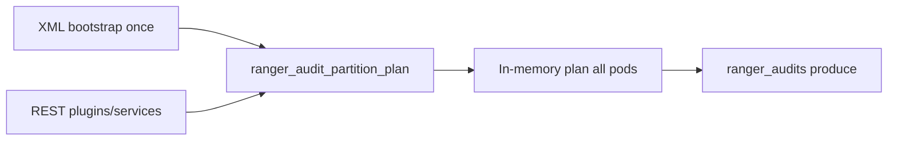

<!--
Licensed to the Apache Software Foundation (ASF) under one
or more contributor license agreements.  See the NOTICE file
distributed with this work for additional information
regarding copyright ownership.  The ASF licenses this file
to you under the Apache License, Version 2.0 (the
"License"); you may not use this file except in compliance
with the License.  You may obtain a copy of the License at

  http://www.apache.org/licenses/LICENSE-2.0

Unless required by applicable law or agreed to in writing,
software distributed under the License is distributed on an
"AS IS" BASIS, WITHOUT WARRANTIES OR CONDITIONS OF ANY
KIND, either express or implied.  See the License for the
specific language governing permissions and limitations
under the License.
-->

# Dynamic partition plan — operations runbook

> **Consolidated design (start here for review):** [DESIGN-KAFKA-DYNAMIC-PARTITIONING.md](DESIGN-KAFKA-DYNAMIC-PARTITIONING.md) — architecture, flows, and Q&A. This README is the day-2 operator runbook (REST examples, troubleshooting, checklists).

Operator guide for **`ranger.audit.ingestor.kafka.partition.plan.dynamic.enabled=true`**.

**Related docs:**

| Doc | Use when |
|-----|----------|
| [DESIGN-KAFKA-DYNAMIC-PARTITIONING.md](DESIGN-KAFKA-DYNAMIC-PARTITIONING.md) | Consolidated design — architecture, flows, Q&A |
| [README-KAFKA-DYNAMIC-PARTITIONING-GUIDE.md](README-KAFKA-DYNAMIC-PARTITIONING-GUIDE.md) | Shorter conceptual overview |
| [README-KAFKA-PARTITION-PLAN-REGISTRY-REST.md](README-KAFKA-PARTITION-PLAN-REGISTRY-REST.md) | REST API + Kafka registry design |
| [README-KAFKA-PARTITION-PLAN-IMPLEMENTATION.md](README-KAFKA-PARTITION-PLAN-IMPLEMENTATION.md) | Engineering phases |
| [README-KAFKA-PARTITION-PLAN-BROWNFIELD-MIGRATION.md](README-KAFKA-PARTITION-PLAN-BROWNFIELD-MIGRATION.md) | Cutover from static XML (brownfield) |
| [README-KAFKA-PARTITION-PLAN-E2E-TEST-PLAN.md](README-KAFKA-PARTITION-PLAN-E2E-TEST-PLAN.md) | E2E validation (Docker script) |
| [README-KAFKA-PLUGIN-PARTITIONING.md](README-KAFKA-PLUGIN-PARTITIONING.md) | Legacy static mode (default today) |
| [README-KAFKA-DISPATCHERS.md](README-KAFKA-DISPATCHERS.md) | Solr/HDFS consumers |

---

## Golden rules

1. **Runtime routing changes → REST only.** Do not edit `configured.plugins` / overrides in XML expecting live effect when dynamic mode is on. XML seeds **bootstrap v1 only** when the plan topic is empty.
2. **No ingestor restart** for promote/scale — watcher refreshes in-memory plan on every pod (~30s default).
3. **Grow `ranger_audits` before** publishing a plan that references new partition IDs (REST handler does this automatically).
4. **Never shrink** Kafka partition count — not supported.
5. **Solr/HDFS dispatchers** — no config change; they consume all `ranger_audits` partitions and rebalance when partition count grows.

---

## Prerequisites

| Requirement | Notes |
|-------------|--------|
| Kafka reachable from all ingestor pods | Startup **fails** if `dynamic.enabled=true` and Kafka/plan topic is unreachable |
| Ingestor principal ACLs | **WRITE** on `ranger_audit_partition_plan`; **ALTER** / create-partitions on `ranger_audits` (same as today) |
| Plugin XML layout correct | Used once for bootstrap v1 if plan topic has no message |
| Brownfield clusters | Follow [brownfield migration guide](README-KAFKA-PARTITION-PLAN-BROWNFIELD-MIGRATION.md) — pre-seed plan v1 when XML may not match production |

### Kafka topics

| Topic | Purpose | Created by |
|-------|---------|------------|
| `ranger_audits` | Audit events | Existing `createAuditsTopicIfNotExists` |
| `ranger_audit_partition_plan` | Compacted plan registry (1 partition) | First ingestor pod (`createPartitionPlanTopicIfNotExists`) |

---

## Sample XML (defaults off)

Shipped in `audit-ingestor/src/main/resources/conf/ranger-audit-ingestor-site.xml` as a **commented block**. Uncomment only when ready to enable dynamic mode.

```xml
<!-- Dynamic partition plan (Kafka compacted registry). Default: disabled = legacy XML routing. -->
<property>
  <name>ranger.audit.ingestor.kafka.partition.plan.dynamic.enabled</name>
  <value>false</value>
  <description>
    false or absent = legacy XML AuditPartitioner at startup (today's behavior).
    true = Kafka registry + REST + PartitionPlanWatcher. Runtime changes via REST only.
  </description>
</property>
<!-- Optional when dynamic=true (built-in defaults shown): -->
<!--
<property>
  <name>ranger.audit.ingestor.kafka.partition.plan.topic</name>
  <value>ranger_audit_partition_plan</value>
</property>
<property>
  <name>ranger.audit.ingestor.kafka.partition.plan.refresh.interval.ms</name>
  <value>30000</value>
</property>
-->
```

**Leave `dynamic.enabled=false`** until plan topic exists and ops are trained on REST workflow.

---

## Enable dynamic mode (greenfield)

| Step | Action |
|------|--------|
| 1 | Verify `configured.plugins`, overrides, and buffer in XML match desired **initial** layout |
| 2 | Set `kafka.partition.plan.dynamic.enabled` to `true` on **all** ingestor replicas (rolling restart once) |
| 3 | First pod: creates `ranger_audit_partition_plan` if missing, runs **Race B** bootstrap (XML → v1) if topic empty |
| 4 | Later pods: read existing plan from Kafka — **ignore XML** for routing |
| 5 | `GET /api/audit/partition-plan` — confirm same `version` on each pod after ~30s |
| 6 | Spot-check: produce test audit per plugin; confirm partition routing in ingestor logs |



---

## REST API quick reference

Base path: `/api/audit/partition-plan` (requires authentication per `security-applicationContext.xml`). Admin-only allow-list (Phase 6) is **not** implemented yet — restrict who receives ingestor credentials at the network/ops layer until then.

| Method | Path | Purpose |
|--------|------|---------|
| `GET` | `/api/audit/partition-plan` | Current in-memory plan |
| `PATCH` | `/api/audit/partition-plan` | Partial update (`expectedVersion` required; send only changed fields) |
| `POST` | `/api/audit/partition-plan/plugins` | Move plugin from buffer → dedicated partitions |
| `POST` | `/api/audit/partition-plan/services` | Upsert allowlist + promote plugin |
| `PATCH` | `/api/audit/partition-plan/plugins/{pluginId}` | Append tail partitions to existing plugin |

**E2E:** from `dev-support/ranger-docker`: `./scripts/audit/verify-partition-plan-e2e.sh --dynamic --with-audit-smoke`

When `dynamic.enabled=false`: partition-plan endpoints return **503** (feature disabled).

### Inspect current plan

```bash
curl -s -u admin:password \
  "https://audit-ingestor:7182/api/audit/partition-plan" | jq .
```

### Promote a new plugin (example: trino, 3 partitions)

```bash
curl -s -u admin:password -X POST \
  -H 'Content-Type: application/json' \
  "https://audit-ingestor:7182/api/audit/partition-plan/plugins" \
  -d '{
    "pluginId": "trino",
    "partitionCount": 3,
    "expectedVersion": 1
  }' | jq .
```

### Scale a hot plugin (example: hiveServer2, +2 partitions)

```bash
curl -s -u admin:password -X POST \
  -H 'Content-Type: application/json' \
  "https://audit-ingestor:7182/api/audit/partition-plan/plugins/hiveServer2" \
  -d '{
    "pluginId": "hiveServer2",
    "additionalPartitions": 2,
    "expectedVersion": 2
  }' | jq .
```

Server order: load plan vN → validate `expectedVersion` → allocate → grow `ranger_audits` if needed → re-read → write vN+1 → read-back verify.

---

## Handle HTTP 409 (version conflict)

Two operators or automation jobs updated the plan concurrently. **Do not retry blindly with the same `expectedVersion`.**

| Step | Action |
|------|--------|
| 1 | `GET /api/audit/partition-plan` (or use **409 response body** — contains current plan JSON) |
| 2 | Note new `version` and partition lists |
| 3 | Recompute your change against **current** plan (append-only rules still apply) |
| 4 | Retry with updated `expectedVersion` |

```bash
# After 409, refresh version then retry promote
VERSION=$(curl -s -u admin:password \
  "https://audit-ingestor:7182/api/audit/partition-plan" | jq -r .version)

curl -s -u admin:password -X POST \
  -H 'Content-Type: application/json' \
  "https://audit-ingestor:7182/api/audit/partition-plan/plugins" \
  -d "{\"pluginId\":\"trino\",\"partitionCount\":3,\"expectedVersion\":${VERSION}}" | jq .
```

---

## Common operations

### Onboard a new plugin without restart

1. `GET` plan → note `version` and buffer size  
2. `POST .../plugins` with `pluginId`, `partitionCount`, `expectedVersion`  
3. Wait ≤ `refresh.interval.ms` (default 30s) for all pods  
4. Optional: `GET` on each pod to confirm same `version`  
5. No dispatcher or plugin config change required

### Give more partitions to an existing plugin

1. `PATCH .../plugins/{pluginId}` with `additionalPartitions`, `expectedVersion`  
2. Handler grows `ranger_audits` **before** publishing plan  
3. Dispatchers rebalance automatically on next consumer group rebalance

### Verify routing after change

- Ingestor log: `AuditPartitioner Configuration` block shows plan `version` and ranges at producer startup  
- Kafka: `kafka-console-consumer` on `ranger_audit_partition_plan` (key = `ranger_audits`) — latest value per key  
- Audits: compare event rate per partition in dispatcher metrics/logs

---

## Solr / HDFS dispatchers

| Question | Answer |
|----------|--------|
| Reconfigure dispatchers when plan changes? | **No** |
| What happens when `ranger_audits` grows? | Consumer groups rebalance; more parallelism up to partition count |
| Plugin-based traffic shift? | Hot plugins mapped to more partitions → more load on corresponding dispatcher workers |
| Tuning | See [README-KAFKA-DISPATCHERS.md](README-KAFKA-DISPATCHERS.md) (`CooperativeStickyAssignor`, `max.poll.interval.ms`, etc.) |

---

## Recovery / spool

`AuditRecoveryManager` unchanged. Retries resend with same `agentId` key; partition may differ if plan changed since original send — acceptable for audit pipelines.

---

## Troubleshooting

| Symptom | Likely cause | Action |
|---------|--------------|--------|
| Ingestor fails startup after enabling dynamic | Kafka down or ACL denied on plan topic | Fix connectivity/ACLs; check logs for `PartitionPlanWatcher` / `createPartitionPlanTopicIfNotExists` |
| `GET` returns 503 feature disabled | `dynamic.enabled=false` or unset | Enable property + rolling restart |
| Pods show different plan `version` | Watcher lag or Kafka read failure | Check watcher logs; compare `GET` across pods; verify plan topic with `kafka-console-consumer` |
| `PATCH`/`POST` returns 400 | Append-only violation or invalid plan | Compare proposed lists with current; no reshuffle of existing plugin IDs |
| `POST .../plugins` returns 503 grow topic | AdminClient cannot increase `ranger_audits` | Check ALTER ACL; broker limits |
| XML edit had no effect | Dynamic mode on — XML is bootstrap-only | Use REST |
| Dispatcher lag after scale | Rebalance in progress | Normal; tune poll interval / consumers if sustained |

---

## Disable dynamic mode (rollback)

| Step | Action |
|------|--------|
| 1 | Set `kafka.partition.plan.dynamic.enabled=false` |
| 2 | Rolling restart all ingestor pods |
| 3 | Routing returns to **static XML** at startup (legacy behavior) |
| 4 | Plan topic remains in Kafka (harmless); not read when disabled |

For brownfield rollback on live traffic, follow [brownfield migration rollback](README-KAFKA-PARTITION-PLAN-BROWNFIELD-MIGRATION.md#rollback-to-static-mode) — ensure XML matches effective routing before disabling.

---

## Checklist before production enablement

- [ ] XML bootstrap layout reviewed (`configured.plugins`, overrides, buffer)  
- [ ] Kafka ACLs verified for plan topic + audit topic ALTER  
- [ ] Ops trained on REST promote/scale and **409 retry**  
- [ ] Runbook link shared with on-call  
- [ ] Brownfield: [migration guide](README-KAFKA-PARTITION-PLAN-BROWNFIELD-MIGRATION.md) completed if not greenfield  
- [ ] Dispatcher capacity reviewed if scaling hot plugins  
