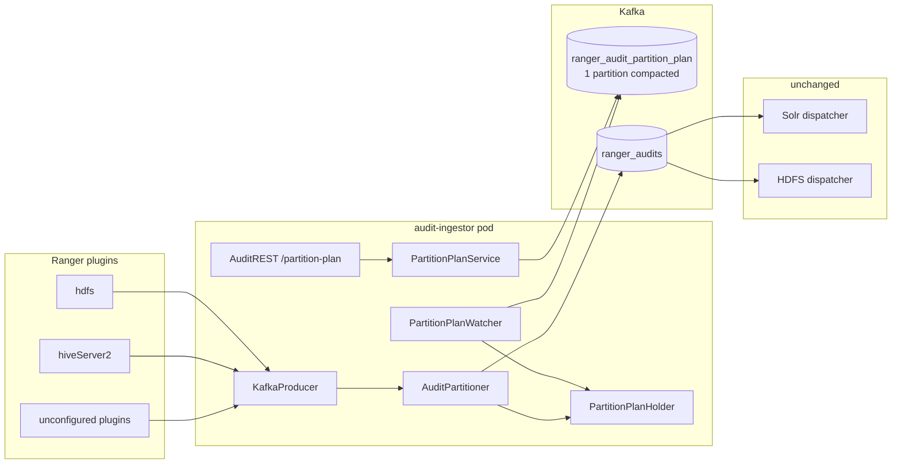
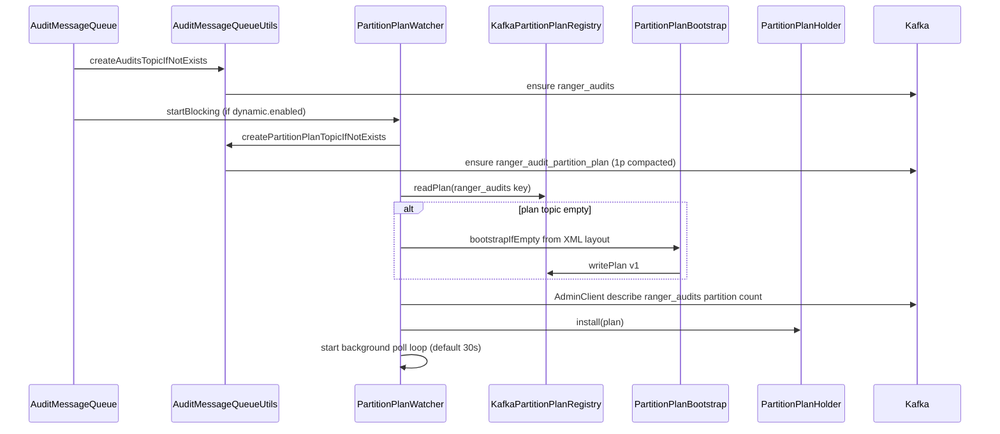
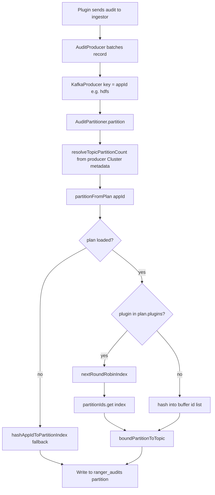
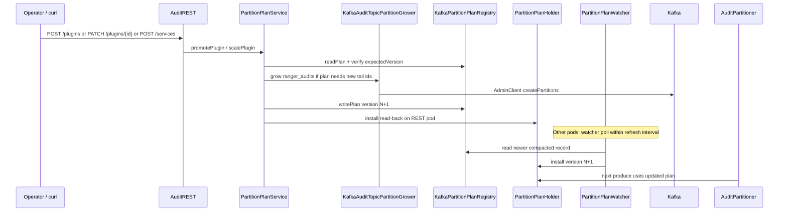
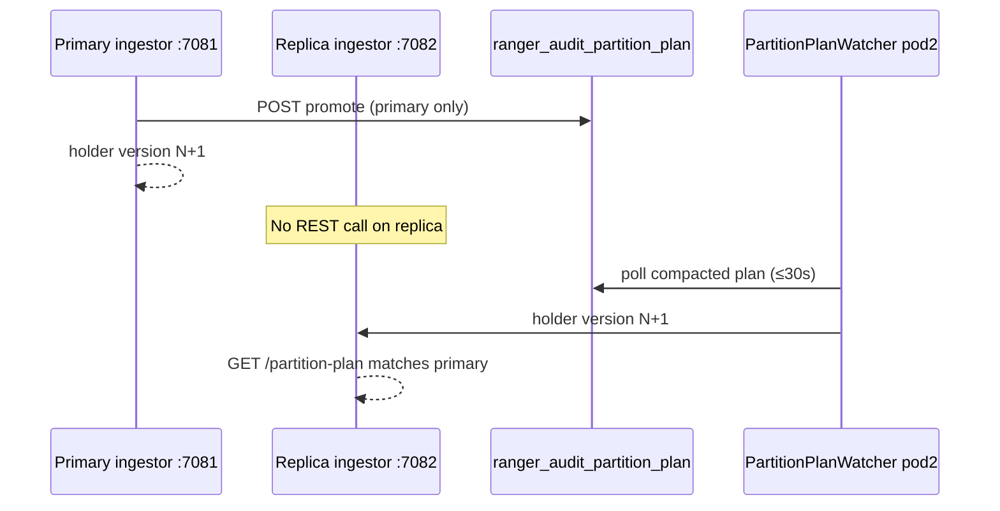
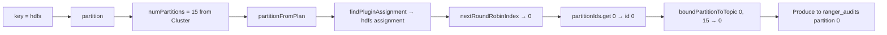
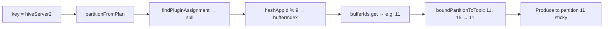
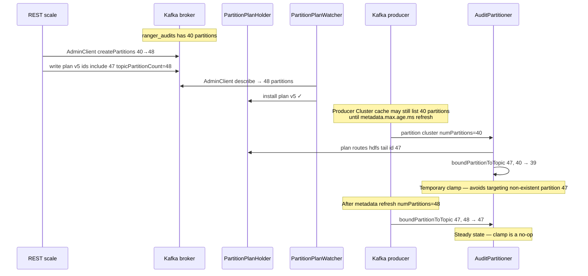
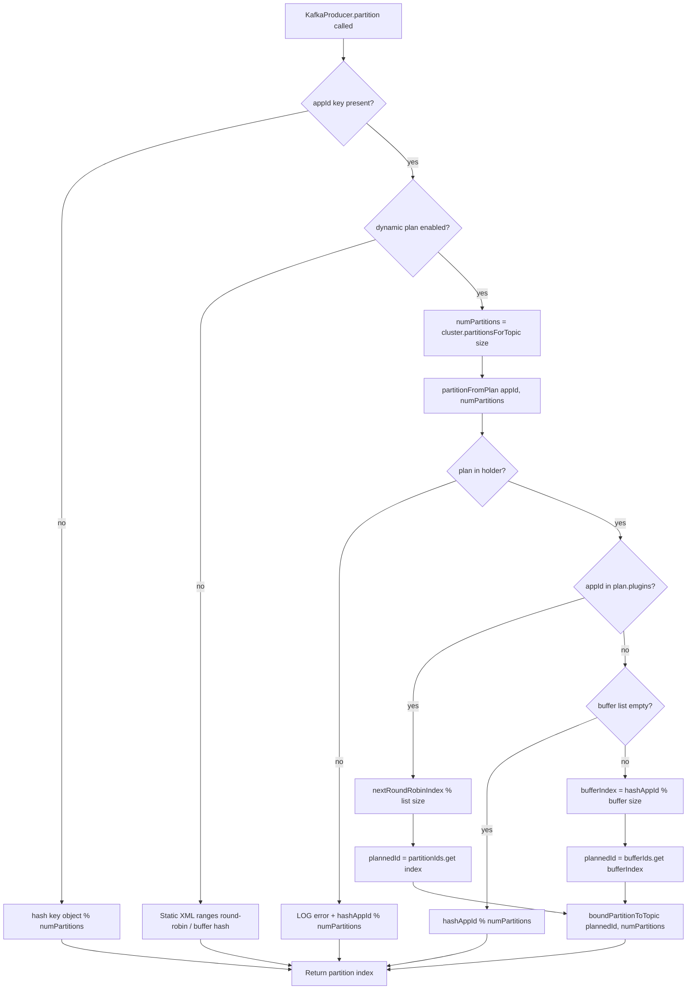

# Pull request template — Dynamic Kafka partition plan (audit-ingestor)

Copy the sections below into your GitHub PR description. Replace `RANGER-XXXX` with the JIRA issue number.

**Suggested title:** `RANGER-XXXX: Dynamic Kafka partition plan for audit-ingestor (registry, REST, plan-aware partitioner)`

---

## Summary

This PR adds **optional** runtime dynamic plugin-to-partition routing for Ranger audit-ingestor. When enabled, ingestor pods share a versioned **partition plan** stored in a Kafka **compacted** topic (`ranger_audit_partition_plan`, **1 partition**), refresh it in memory via a background watcher, and route audit records through a plan-aware `AuditPartitioner`. Operators can promote plugins from the buffer pool or scale tail partitions through REST **without restarting ingestor**.

**Default behavior is unchanged:** `ranger.audit.ingestor.kafka.partition.plan.dynamic.enabled` defaults to **`false`** (legacy XML `AuditPartitioner` layout at startup).

---

## Problem

| Today (static) | Pain |
|----------------|------|
| Plugin → partition mapping is computed once from XML at startup | Adding a hot plugin or growing partitions requires config edits + ingestor restart |
| Unconfigured plugins hash into a trailing buffer range | Promoting a plugin can reshuffle ranges for later plugins |
| No shared registry across ingestor replicas | ConfigMap drift risk in multi-pod deployments |

## Solution

| Component | Role |
|-----------|------|
| `ranger_audit_partition_plan` | Compacted Kafka registry (key = audit topic name, value = plan JSON) |
| `PartitionPlanWatcher` | Polls registry; installs plan in `PartitionPlanHolder` |
| `AuditPartitioner` | Dynamic mode: round-robin for configured plugins; sticky hash for buffer |
| `PartitionPlanService` + `AuditREST` | `GET` / `PUT` / promote / scale with optimistic locking (`expectedVersion`) |
| `KafkaAuditTopicPartitionGrower` | Grows `ranger_audits` before plan references new tail partition ids |
| `PartitionPlanBootstrap` | First pod seeds initial plan from XML when registry is empty |

---

## End-to-end flow

### Architecture (steady state)



### 1. Startup (once per ingestor pod)



### 2. Produce path (per audit record — no Kafka I/O in partitioner)



**Routing rules:**

| Case | Algorithm |
|------|-----------|
| Configured plugin | Round-robin across explicit partition ids in plan (`nextRoundRobinIndex` → `partitionIds.get`) |
| Buffer plugin | Sticky hash: `hashAppId % bufferIds.size()` → buffer partition id |
| Plan null / empty buffer | Topic-wide hash fallback |

**`boundPartitionToTopic`:** clamps planned id to producer metadata size when metadata lags behind plan after REST scale (e.g. plan lists partition 47, cluster metadata still shows 40).

### 3. Plan update (admin REST — no ingestor restart)



### 4. Multi-pod convergence (POS-D1)



### 5. Routing walkthrough — concrete example

**Sample plan** (simplified lab layout):

```json
{
  "topic": "ranger_audits",
  "version": 1,
  "topicPartitionCount": 15,
  "plugins": {
    "hdfs": { "partitions": [0, 1, 2] }
  },
  "buffer": { "partitions": [6, 7, 8, 9, 10, 11, 12, 13, 14] }
}
```

Kafka topic `ranger_audits` has **15** partitions live (`numPartitions = 15` from producer metadata). Message **key** = plugin id (`appId`).

| appId | Path | How partition is chosen | Result |
|-------|------|-------------------------|--------|
| `hdfs` (1st msg) | Known plugin → round-robin | `nextRoundRobinIndex("hdfs", 3)` → **0** → `partitionIds.get(0)` → **0** → `boundPartitionToTopic(0, 15)` | **Partition 0** |
| `hdfs` (2nd msg) | Known plugin → round-robin | Counter advances → index **1** → `partitionIds.get(1)` → **1** | **Partition 1** |
| `hdfs` (3rd msg) | Known plugin → round-robin | Index **2** → partition **2** | **Partition 2** |
| `hdfs` (4th msg) | Known plugin → round-robin | Index **0** again (cycles) | **Partition 0** |
| `hiveServer2` | Not in `plan.plugins` → buffer | `bufferIndex = hash("hiveServer2") % 9` → e.g. index **5** → `bufferIds.get(5)` → **11** | **Partition 11** (sticky — same appId always maps here) |
| `hdfs` (plan null) | Degraded fallback | `PartitionPlanHolder` empty → `hashAppIdToPartitionIndex("hdfs", 15)` | e.g. **Partition 7** (topic-wide hash, logged at error) |

**Why `roundRobinIndex` is not returned directly:** `nextRoundRobinIndex` returns a **slot** (0, 1, 2) into the plugin's id list, not the Kafka partition number. After scale, a plugin might have ids `[3, 4, 5, 15, 16]` — slot 0 → partition **3**, not 0. Code path: `partitionIds.get(roundRobinIndex)` then `boundPartitionToTopic`.

**Step-by-step for `hdfs` 1st message:**



**Step-by-step for `hiveServer2` (buffer):**



### 6. Producer metadata vs plan — how mismatch happens

The plan and the producer do **not** read partition count from the same source at produce time:

| Source | When updated | Used by |
|--------|--------------|---------|
| `PartitionPlan.topicPartitionCount` + explicit partition ids | REST scale / watcher install | `partitionFromPlan` → which id to target |
| `Cluster.partitionsForTopic` on produce callback | Producer metadata refresh (can lag) | `resolveTopicPartitionCount` → `numPartitions` for clamp + fallbacks |
| AdminClient `describeTopics` | Watcher install / REST grow | Validates plan at install time only |

**Timeline after admin scales topic 40 → 48:**



| Time | Broker reality | Plan in holder | Producer metadata (`numPartitions`) | Route to planned id 47 |
|------|----------------|----------------|-------------------------------------|-------------------------|
| T0 | 40 partitions | v4, max id 39 | 40 | N/A |
| T1 | Grow initiated 40→48 | — | 40 | — |
| T2 | 48 partitions exist | v5, id 47 assigned | **still 40** (stale cache) | `boundPartitionToTopic(47,40)` → **39** |
| T3 | 48 partitions | v5 | **48** (refreshed) | `boundPartitionToTopic(47,48)` → **47** |

**Why not use `plan.getTopicPartitionCount()` on the produce path?** The Kafka producer must return a partition index valid for the `Cluster` snapshot attached to that `send()`. Targeting partition 47 when the client believes the topic has 40 partitions can fail the produce even if brokers already have 48.

**Why this is acceptable:** The mismatch window is short (seconds to minutes, until metadata refresh). Audits still land on a valid partition; once metadata catches up, routing uses the correct planned ids. Solr/HDFS dispatchers are unchanged.

**Code references:**

- Live count on produce: `resolveTopicPartitionCount(cluster, topic)` in `AuditPartitioner`
- Clamp: `boundPartitionToTopic(plannedId, numPartitions)`
- Grow-before-plan-write: `PartitionPlanService.publishMutation` → `growAuditTopicIfNeeded`

### 7. Full routing decision flow (with fallbacks)



| Node | Meaning |
|------|---------|
| `numPartitions` | From **producer** `Cluster`, not from plan JSON |
| `nextRoundRobinIndex` | Per-appId counter; cycles 0..listSize-1 |
| `partitionIds.get(index)` | Maps slot → **actual** Kafka partition id |
| `boundPartitionToTopic` | `min(max(0, plannedId), numPartitions - 1)` |
| Fallback hashes | Same appId → same partition (sticky) within fallback mode |

---

## Code changes

### `audit-common`

| File | Change |
|------|--------|
| `AuditServerConstants.java` | `kafka.partition.plan.*` properties; `PARTITION_PLAN_TOPIC_PARTITION_COUNT = 1` |
| `AuditMessageQueueUtils.java` | `createPartitionPlanTopicIfNotExists()` — always **1 partition**, `cleanup.policy=compact`; validates existing topic partition count |
| `AuditMessageQueueUtilsTest.java` | `buildAdminClientConfig` test |

### `audit-ingestor` — partition package

New package: `org.apache.ranger.audit.producer.kafka.partition`

| Subpackage / class | Role |
|--------------------|------|
| `model/` | `PartitionPlan`, `PluginPartitionAssignment`, REST request DTOs |
| `exception/` | `PartitionPlanException`, `PartitionPlanConflictException` |
| `constants/` | `PartitionPlanConstants` |
| `PartitionPlanHolder` | In-memory plan snapshot (read on produce path) |
| `PartitionPlanWatcher` | Background refresh from compacted topic |
| `KafkaPartitionPlanRegistry` | Read/write plan JSON to Kafka |
| `PartitionPlanBootstrap` | XML → initial plan when registry empty |
| `PartitionPlanAllocator` | Append-only promote / scale / replace |
| `PartitionPlanValidator` | Every partition assigned once; append-only transitions |
| `PartitionPlanService` | REST mutations + topic grow + read-back verify |
| `KafkaAuditTopicPartitionGrower` | AdminClient partition grow for audit topic |

### `audit-ingestor` — wiring

| File | Change |
|------|--------|
| `AuditPartitioner.java` | Dynamic branch: `partitionFromPlan`, `nextRoundRobinIndex`, `boundPartitionToTopic` |
| `AuditMessageQueue.java` | Ensure plan topic; start watcher; bootstrap when registry empty |
| `AuditREST.java` | `GET/PATCH /api/audit/partition-plan`, `POST .../plugins`, `PATCH .../plugins/{pluginId}`, `POST .../services` |
| `AuditServerConfig.java` | Spring bean for `PartitionPlanService` |
| `ranger-audit-ingestor-site.xml` | Commented dynamic plan property block (default off) |

### Unit tests (46 total across audit-common + audit-ingestor)

| Test class | Covers |
|------------|--------|
| `AuditPartitionerDynamicTest` | Plan-based round-robin + buffer hash |
| `PartitionPlanBootstrapTest` | Initial plan matches static layout |
| `PartitionPlanAllocatorTest` | Promote, scale, append-only tail growth |
| `PartitionPlanValidatorTest` | Duplicate ids, count mismatch, illegal reshuffle |
| `PartitionPlanServiceTest` | Service preconditions |
| `PartitionPlanServiceMutationTest` | PUT / promote / scale with version conflicts |
| `PartitionPlanKafkaConfigTest` | Property resolution |
| `PartitionPlanJsonTest` | JSON serde (`model/`) |

---

## Configuration

| Property | Default | Description |
|----------|---------|-------------|
| `ranger.audit.ingestor.kafka.partition.plan.dynamic.enabled` | `false` | Master feature flag |
| `ranger.audit.ingestor.kafka.partition.plan.topic` | `ranger_audit_partition_plan` | Compacted registry topic |
| `ranger.audit.ingestor.kafka.partition.plan.refresh.interval.ms` | `30000` | Watcher sleep between refresh cycles |
| `ranger.audit.ingestor.kafka.partition.plan.consumer.poll.timeout.ms` | `500` | Consumer poll when draining plan topic |

Existing static properties (`kafka.configured.plugins`, `kafka.topic.partitions`, per-plugin overrides, buffer count) are still used for **initial bootstrap** when the registry is empty.

---

## REST API

Base path: `/api/audit` (same auth as other ingestor APIs).

| Method | Path | Body | Notes |
|--------|------|------|-------|
| `GET` | `/partition-plan` | — | In-memory plan on this pod |
| `PATCH` | `/partition-plan` | `PartitionPlanReplacement` | Partial update; `expectedVersion` required |
| `POST` | `/partition-plan/plugins` | `PromotePlugin` | Move plugin from buffer to dedicated partitions |
| `PATCH` | `/partition-plan/plugins/{pluginId}` | `PluginScaleRequest` | Append tail partitions (`additionalPartitions` + `expectedVersion` only) |
| `POST` | `/partition-plan/services` | `OnboardService` | Upsert allowlist + promote plugin in one version |

| HTTP status | When |
|-------------|------|
| `200` | Success |
| `400` | Invalid plan / validation failure |
| `409` | Version conflict (`PartitionPlanConflictException`) |
| `503` | Dynamic mode disabled, or plan not loaded / Kafka unavailable |

---

## Routing behavior (dynamic mode)

| Plugin type | Algorithm |
|-------------|-----------|
| Listed in `plan.plugins` | Per-`appId` round-robin across explicit partition id list |
| Not in plan (buffer) | Sticky hash: `appId.hashCode() % bufferIds.size()` |
| Plan not loaded | Degraded topic-wide hash fallback (logged at error) |

Planned partition ids are bounded to live topic metadata via `boundPartitionToTopic()` during topic grow rollout.

---

## Backward compatibility

- Feature flag **off** by default — no new Kafka topic, no watcher, no REST side effects.
- Static `AuditPartitioner` code path unchanged when flag is false.
- Solr/HDFS dispatchers unchanged (consume `ranger_audits` as before).

---

## Deferred (follow-up PRs)

- **Phase 6:** Dedicated admin allow-list for partition-plan REST (today: any authenticated principal).
- **`/status`:** Expose plan version / watcher health.
- **Docker Tier 3 E2E:** Multi-pod plan convergence validation (scripts under `dev-support/ranger-docker/scripts/audit/`).

---

## How was this patch tested?

### Unit tests and quality gates

```bash
cd /path/to/ranger
export MAVEN_OPTS="-Xmx4g"
mvn verify -pl audit-server/audit-common,audit-server/audit-ingestor -Drat.skip=true
```

| Gate | Result |
|------|--------|
| Unit tests | **46 passed** (0 failures, 0 errors) — `audit-common` (4) + `audit-ingestor` (42) |
| Checkstyle | **0 violations** — both modules |
| PMD | **0 rule violations** (local ASM warnings on some JDKs; build still passes) |

| Test class | Coverage |
|------------|----------|
| `AuditPartitionerDynamicTest` | Plan-based round-robin + buffer hash routing |
| `PartitionPlanBootstrapTest` | Initial plan matches static `AuditPartitioner` layout |
| `PartitionPlanAllocatorTest` | Promote, scale, append-only tail growth |
| `PartitionPlanValidatorTest` | Duplicate ids, count mismatch, illegal reshuffle |
| `PartitionPlanServiceMutationTest` | PATCH / promote / scale; **409** on stale `expectedVersion` |
| `PartitionPlanKafkaConfigTest` | Property resolution |
| `PartitionPlanJsonTest` | JSON serde |
| `AuditMessageQueueUtilsTest` | Admin client config helper |

Fast iteration (skip style plugins):

```bash
mvn test -pl audit-server/audit-ingestor \
  -Dtest='AuditPartitionerDynamicTest,PartitionPlan*Test,**/partition/model/*Test' \
  -Dcheckstyle.skip=true -Dpmd.skip=true -Drat.skip=true
```

---

### Manual testing — Docker Tier 3 partition plan E2E

**Environment:** Docker Compose Tier 3 lab (Kerberos, ZooKeeper, Kafka, Solr, HDFS dispatcher, Hadoop/HDFS plugin, Ranger Admin, audit ingestor). Optional second ingestor replica on **:7082** for multi-pod checks.

**Automated E2E scripts** (from `dev-support/ranger-docker/`):

```bash
chmod +x scripts/audit/verify-partition-plan-*.sh
./scripts/audit/wait-for-audit-health.sh --tier 3

# Core REST + static/dynamic toggle
./scripts/audit/verify-partition-plan-e2e.sh --static-only
./scripts/audit/verify-partition-plan-e2e.sh --dynamic --restore-static

# Full suite (recommended)
./scripts/audit/verify-partition-plan-e2e-all.sh

# Optional: audit pipeline smoke after REST mutations
./scripts/audit/verify-partition-plan-e2e-all.sh --with-audit-smoke
```

**Lab layout used:** 13 configured plugins × 3 partitions + 9 buffer = **48** partitions on `ranger_audits`. Plan sync interval **30s** (default).

Full narrative report: [README-KAFKA-PARTITION-PLAN-E2E-VALIDATION.md](../audit-server/README-KAFKA-PARTITION-PLAN-E2E-VALIDATION.md).

#### 1. Static mode regression (feature off)

| What we did | What we observed | Result |
|-------------|------------------|--------|
| `dynamic.enabled=false` (default); restart ingestor | Ingestor healthy; no `PartitionPlanWatcher` in logs | **Pass** |
| `GET /api/audit/partition-plan` | **503** — dynamic partition plan is not enabled | **Pass** |
| `GET /api/audit/health` | **200** | **Pass** |
| HDFS plugin audit (`hdfs dfs -ls /user/` as `testuser1`) | Solr `numFound` increased; Admin Access Audit tab showed new event | **Pass** |

#### 2. Greenfield dynamic enable (empty plan topic)

| What we did | What we observed | Result |
|-------------|------------------|--------|
| Set `ranger.audit.ingestor.kafka.partition.plan.dynamic.enabled=true`; restart ingestor | Ingestor starts; watcher reports plan ready | **Pass** |
| `kafka-topics --describe ranger_audit_partition_plan` | Topic exists; **PartitionCount: 1**; `cleanup.policy=compact` | **Pass** |
| `GET /api/audit/partition-plan` | JSON **version 1** (initial bootstrap plan); **13** plugins; `topicPartitionCount` **48** | **Pass** |
| Compare plan `topicPartitionCount` vs `kafka-topics --describe ranger_audits` | Counts **match** | **Pass** |
| Ingestor log | `Mode: dynamic (PartitionPlanHolder)`, plan version and plugin ranges logged | **Pass** |
| HDFS audits after enable | Tier 3 audit pipeline still healthy | **Pass** |

#### 3. REST mutations without ingestor restart

| What we did | What we observed | Result |
|-------------|------------------|--------|
| `POST /api/audit/partition-plan/plugins` — buffer plugin (e.g. `storm`), `partitionCount: 2`, correct `expectedVersion` | **200**; version incremented; `storm` in `plugins` | **Pass** |
| Same promote with stale `expectedVersion: 1` | **409 Conflict** | **Pass** |
| `POST .../plugins` for `hdfs` (already configured) | **400 Bad Request** | **Pass** |
| `PATCH /api/audit/partition-plan/plugins/storm` — `additionalPartitions: 1` | **200**; tail partition appended; `ranger_audits` grown if needed | **Pass** |
| `GET /partition-plan` again (no restart) | Same version and layout as last mutation | **Pass** |

Example promote (lab — adjust host, auth, and `expectedVersion`):

```bash
curl -sk -X POST "https://ranger-audit-ingestor.rangernw:7182/api/audit/partition-plan/plugins" \
  -H "Content-Type: application/json" \
  --negotiate -u : \
  -d '{"pluginId":"storm","partitionCount":2,"expectedVersion":1}'
```

#### 4. Multi-pod plan convergence

| What we did | What we observed | Result |
|-------------|------------------|--------|
| Start second ingestor on **:7082** (`verify-partition-plan-multipod-e2e.sh`) | Replica healthy; watcher ready | **Pass** |
| `GET /partition-plan` on **:7081** and **:7082** | **Same version** at start | **Pass** |
| Promote buffer plugin on **primary only** | Primary returns new version | **Pass** |
| Wait ≤ **35s** (one watcher cycle); `GET` on replica | Replica shows **same new version** without REST call on replica | **Pass** |

#### 5. Brownfield pre-seed (cutover)

| What we did | What we observed | Result |
|-------------|------------------|--------|
| Capture plan JSON; disable dynamic; delete plan topic | Static mode healthy | **Pass** |
| Pre-seed plan to Kafka with `updatedBy=brownfield-e2e-seed`, `version: 1` | Message on `ranger_audit_partition_plan` | **Pass** |
| Re-enable dynamic; restart ingestor | Plan **not** overwritten by XML bootstrap; `updatedBy` preserved | **Pass** |
| Rollback: `dynamic.enabled=false` | `GET /partition-plan` → **503**; `GET /health` → **200** | **Pass** |

Script: `./scripts/audit/verify-partition-plan-brownfield-e2e.sh --restore-static`

#### 6. Kafka down at startup (dynamic on)

| What we did | What we observed | Result |
|-------------|------------------|--------|
| Stop Kafka; restart ingestor with `dynamic.enabled=true` | Health **not** OK; logs show Kafka / plan watcher failure | **Pass** |
| Start Kafka; disable dynamic; restart ingestor | Health **200** in static mode | **Pass** |

Script: `./scripts/audit/verify-partition-plan-kafka-down-e2e.sh`

#### 7. Plan registry topic (1 partition)

| What we did | What we observed | Result |
|-------------|------------------|--------|
| First ingestor startup creates `ranger_audit_partition_plan` | **Exactly 1 partition**; compacted | **Pass** |
| Restart ingestor when topic already exists | No partition grow attempted; startup succeeds | **Pass** |

---

### Not manually tested in this PR

| Topic | Notes |
|-------|-------|
| Two pods cold-starting **simultaneously** on empty plan topic | Choreographed parallel rollout; covered in unit tests (`PartitionPlanBootstrapSupportTest`) |
| Dedicated **403** for non-admin principals on partition-plan API | Deferred — Phase 6 auth allow-list |
| Shrinking `ranger_audits` partition count | Not supported by Kafka |
| Production RF=3 / multi-broker failure injection | Tier 3 single-broker lab only |
| Hive / Trino plugin audit path after every promote | Optional; HDFS Tier 3 path validated separately |

**E2E summary:** **31** automated/manual partition-plan checks in Tier 3 lab — **all passed**. See [README-KAFKA-PARTITION-PLAN-E2E-VALIDATION.md](../audit-server/README-KAFKA-PARTITION-PLAN-E2E-VALIDATION.md).

---

## Documentation

| Doc | Audience |
|-----|----------|
| [README-KAFKA-DYNAMIC-PARTITION-PLAN.md](../audit-server/README-KAFKA-DYNAMIC-PARTITION-PLAN.md) | **Start here** — feature overview + quick start |
| [README-KAFKA-DYNAMIC-PARTITIONING-GUIDE.md](../audit-server/README-KAFKA-DYNAMIC-PARTITIONING-GUIDE.md) | Plain-language architecture for reviewers |
| [README-KAFKA-PARTITION-PLAN-REGISTRY-REST.md](../audit-server/README-KAFKA-PARTITION-PLAN-REGISTRY-REST.md) | Registry + REST detail |
| [README-KAFKA-PARTITION-PLAN-OPS-RUNBOOK.md](../audit-server/README-KAFKA-PARTITION-PLAN-OPS-RUNBOOK.md) | Operator procedures |
| [README-KAFKA-PARTITION-PLAN-BROWNFIELD-MIGRATION.md](../audit-server/README-KAFKA-PARTITION-PLAN-BROWNFIELD-MIGRATION.md) | Cutover from static XML |

---

## Checklist

- [ ] JIRA `RANGER-XXXX` linked
- [ ] Feature flag defaults to `false`
- [ ] No unrelated formatting / drive-by refactors
- [ ] `mvn verify` on `audit-common` + `audit-ingestor` passes locally (46 tests, checkstyle, PMD)
- [ ] Tier 3 partition-plan E2E executed (`verify-partition-plan-e2e-all.sh` or equivalent manual steps above)
- [ ] Plan topic verified as **1 partition**, compacted
- [ ] README and PR template included (or linked) for reviewers
