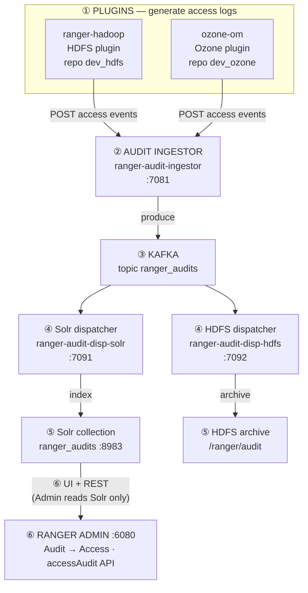

# Audit E2E — single-script Docker setup

**One script** brings up the Ranger audit pipeline in Docker and proves audits reach **Ranger Admin → Audit → Access**.

**Base images** come from [apache/ranger-tools](https://github.com/apache/ranger-tools) (`apache/ranger-base`). This harness lives in the **apache/ranger** source tree next to `audit-server/` Java code — not in the ranger-tools GitHub repo.

```bash
cd dev-support/ranger-docker
export RANGER_DB_TYPE=postgres
chmod +x setup-audit-e2e.sh
./setup-audit-e2e.sh
```

Or from the Ranger repo root: `./audit_in_docker`

**Default scope:** HDFS + Ozone + Hive + HBase + Kafka plugin (+ Kafka as audit bus)

**Packaging fixes (auditserver REST client):** [../README-AUDITSERVER-PLUGIN-PACKAGING-E2E.md](../README-AUDITSERVER-PLUGIN-PACKAGING-E2E.md) — Kafka (#1020 Jackson/Jersey dupes), Hive (#5646), HBase (#5644 — **no** Kafka-style Jackson removal).

**Kafka plugin → ingestor authentication & authorization:** [../README-KAFKA-PLUGIN-AUDIT-AUTH-FLOW.md](../README-KAFKA-PLUGIN-AUDIT-AUTH-FLOW.md) — SPNEGO, allowlist, 401 vs 403, KDC roles.

**Full stack E2E (all plugins + infra):**

```bash
cd dev-support/ranger-docker
export RANGER_DB_TYPE=postgres
./setup-audit-e2e.sh          # bring up Admin, DB, KDC, ZK, Solr, Kafka, ingestor, dispatchers, plugins
./scripts/audit/verify-audit-e2e-full.sh   # infra check + HDFS + Ozone + Hive + HBase + Kafka plugin → Solr
```

Or in one step after the stack is up: `./setup-audit-e2e.sh verify-full`

**Dynamic partition allocation** (onboard-repo REST, Kafka routing, auth_to_local) runs on the same Docker stack but is a separate script suite — see [../../audit-server/README-DYNAMIC-PARTITION-PLUGIN-E2E.md](../../audit-server/README-DYNAMIC-PARTITION-PLUGIN-E2E.md). After plugin pipelines pass, optionally append:

```bash
./scripts/audit/verify-audit-e2e-full.sh --with-dynamic-partition --with-auth-access
# or the full partition-plan suite:
./scripts/audit/verify-partition-plan-e2e-all.sh --skip-kafka-down --with-auth-access --with-plugin-onboard
```

### Full-stack components exercised

| Layer | Container / service | Role in E2E |
|-------|---------------------|-------------|
| Identity | `ranger-kdc` | Kerberos (SASL for Kafka, plugins, ingestor) |
| Metadata DB | `ranger-postgres` | Ranger Admin + policy store |
| Admin | `ranger` | Policy manager, Solr audit backend, Access tab API |
| Search | `ranger-solr` + `ranger-zk` | `ranger_audits` collection |
| Audit bus | `ranger-kafka` | Topic `ranger_audits` (not the Kafka *plugin* repo) |
| Ingestor | `ranger-audit-ingestor` | HTTP :7081 — plugins POST here |
| Dispatchers | `ranger-audit-dispatcher-solr`, `ranger-audit-dispatcher-hdfs` | Kafka → Solr / HDFS |
| HDFS plugin | `ranger-hadoop` | Repo `dev_hdfs` |
| Ozone plugin | `ozone-scm`, `ozone-datanode`, `ozone-om` | Repo `dev_ozone` |
| Hive plugin | `ranger-hive` | Repo `dev_hive` |
| HBase plugin | `ranger-hbase` | Repo `dev_hbase` |
| Kafka plugin | `ranger-kafka` (authorizer) | Repo `dev_kafka` |
| Knox plugin | `ranger-knox` (+ `ranger-hadoop` backend) | Repo `dev_knox` — [RANGER-KNOX-PLUGIN-AUDIT-E2E.md](../RANGER-KNOX-PLUGIN-AUDIT-E2E.md) |
| KMS plugin | `ranger-kms` (+ Admin for exclude clear) | Repo `dev_kms` — [RANGER-KMS-PLUGIN-AUDIT-E2E.md](../RANGER-KMS-PLUGIN-AUDIT-E2E.md) |

Repair helpers when a leg fails mid-run:

```bash
./setup-audit-e2e.sh repair-hdfs
./setup-audit-e2e.sh repair-ozone
./setup-audit-e2e.sh repair-hive
./setup-audit-e2e.sh repair-hbase   # deploy fat tarball + audit ingestor URL
./setup-audit-e2e.sh repair-kafka    # deploy plugin + safe broker restart (ZK /brokers/ids/0)
./setup-audit-e2e.sh repair-knox     # audit ingestor URL + dev_knox allowlist (optional compose)
./setup-audit-e2e.sh repair-kms      # plugin-impl JARs + audit XML + dev_kms allowlist + KMS restart
./scripts/kafka/ensure-kafka-audit-bus-acls.sh   # required when RangerKafkaAuthorizer is on (dispatchers consume ranger_audits)
./scripts/kafka/restart-kafka-broker-docker.sh   # after any docker restart of ranger-kafka
```

**Plugin coverage across the full compose stack:** [README-AUDIT-E2E-PLUGIN-MATRIX.md](README-AUDIT-E2E-PLUGIN-MATRIX.md) — which services are on the auditserver path, what the harness proves, and packaging notes (HBase, Knox, Trino gap).

**Packaging (Kafka / Hive / HBase):** [../README-AUDITSERVER-PLUGIN-PACKAGING-E2E.md](../README-AUDITSERVER-PLUGIN-PACKAGING-E2E.md)

This is a **developer integration harness**, not a production installer.

## What one command does (end to end)

With no arguments, `./setup-audit-e2e.sh` (same as `./setup-audit-e2e.sh up`) runs the **full flow**:

```text
Maven build (if needed) → dist/ tarballs → docker compose build → deploy → config → E2E test
```

| Step | What happens |
|------|----------------|
| **1. Build / tarballs** | If `dist/` is missing or stub-sized (~12 KB), runs Maven for admin, audit-ingestor/dispatcher, hdfs-plugin, ozone-plugin; downloads Hadoop/Kafka/Ozone archives; patches Ozone audit JARs |
| **2. Docker images** | `docker compose -f docker-compose.ranger-audit-e2e.yml up -d --build` |
| **3. Deployment** | Starts the stack (default: Admin, DB, KDC, ZK, Solr, Kafka, Hadoop, ingestor, dispatchers, Ozone) |
| **4. Runtime config** | Plugin audit XML, Admin Solr backend, Ozone policies, ingestor allowed users, etc. |
| **5. Health checks** | Waits for Admin, ingestor, dispatchers, Solr, Hadoop/Ozone |
| **6. E2E testing** | `generate-access-logs` — HDFS + Ozone plugin ops → ingestor → Kafka → dispatcher → Solr → Admin `accessAudit` API (6-hop trace) |

On success, open **http://localhost:6080 → Audit → Access**.

### Prerequisites (not installed by the script)

- Docker (~8 GB RAM)
- Maven + JDK on the host (unless you use `--docker-build`)
- `export RANGER_DB_TYPE=postgres`
- Run from `dev-support/ranger-docker`

### Flags that change the default flow

| Flag | Effect |
|------|--------|
| `--hdfs-only` | No Ozone; HDFS E2E only |
| `--ozone-only` | No Hadoop / HDFS dispatcher; Ozone E2E only |
| `--no-build` | Skips Maven — requires fat tarballs already in `dist/` |
| `--docker-build` | Full Ranger build in Docker instead of host Maven |
| `--no-verify` | Deploy + config only; **no** access-log / smoke test |

### If something fails

```bash
./setup-audit-e2e.sh diagnose
./setup-audit-e2e.sh fix
```

---

## Pipeline



| Hop | Component | Port / target | Admin UI? |
|-----|-----------|---------------|-----------|
| ① | HDFS plugin (`ranger-hadoop`) | repo `dev_hdfs` | — |
| ① | Ozone plugin (`ozone-om`) | repo `dev_ozone` | — |
| ② | Audit ingestor | `:7081` | — |
| ③ | Kafka | `ranger_audits` | — |
| ④ | Solr dispatcher | `:7091` | — |
| ④ | HDFS dispatcher | `:7092` | — |
| ⑤ | Solr collection | `:8983` | **source for UI** |
| ⑤ | HDFS archive | `/ranger/audit` | no |
| ⑥ | Ranger Admin | `:6080` | **Audit → Access** |

| Leg | Path | Used by Admin UI? |
|-----|------|-------------------|
| **Main (verified by script)** | plugin → ingestor → Kafka → Solr dispatcher → Solr → Admin | **Yes** |
| Archive | plugin → ingestor → Kafka → HDFS dispatcher → `/ranger/audit` | No — storage only |

`setup-audit-e2e.sh` verifies all **six hops** on the Solr path (plugin through Admin API).

### Access log generation (6-hop trace)

`generate-access-logs` (also run by `up` / `verify` smoke) performs a real plugin operation and reports each stage:

| Hop | HDFS | Ozone |
|-----|------|-------|
| 1. Plugin | `hdfs dfs -ls` as testuser1 | `ozone sh volume create` |
| 2. Ingestor | `:7081` health + logs | same |
| 3. Kafka | `ranger_audits` offset (or SKIP if Kerberos) | same |
| 4. Dispatcher | Solr + HDFS dispatcher health + logs | Solr dispatcher |
| 5. Solr | `ranger_audits` doc count increase | `repo:dev_ozone` count |
| 6. Admin | `accessAudit` API + sample row | same |

```bash
./setup-audit-e2e.sh generate-access-logs
./setup-audit-e2e.sh generate-access-logs --hdfs-only
./setup-audit-e2e.sh generate-access-logs --ozone-only
./setup-audit-e2e.sh trigger-hdfs-audit
./setup-audit-e2e.sh trigger-ozone-audit
```

On success, open **http://localhost:6080 → Audit → Access** to see the same events in the UI.

### Per-plugin auditserver verify (Kafka, Hive, HBase, Knox, KMS)

Prefer these **generic scripts** over `setup-audit-e2e.sh` subcommands in PR docs and CI:

| Plugin | Packaging check | Runtime smoke | Full E2E (→ Solr) |
|--------|-----------------|---------------|-------------------|
| Kafka | `verify-plugin-auditserver-jars.sh --kafka-only --check-assembly` | `verify-kafka-plugin-audit-e2e.sh` | `verify-kafka-plugin-audit-e2e.sh --full-e2e` |
| Hive | (enable-time dup strip) | `verify-hive-plugin-audit-e2e.sh` | `setup-audit-e2e.sh trigger-hive-audit` |
| HBase | `verify-plugin-auditserver-jars.sh --hbase-only --check-assembly` | `verify-hbase-plugin-audit-e2e.sh` | `verify-hbase-plugin-audit-e2e.sh --full-e2e` |
| Knox | — (no packaging JAR fix) | `verify-knox-plugin-audit-e2e.sh` | `verify-knox-plugin-audit-e2e.sh --full-e2e` — [doc](../RANGER-KNOX-PLUGIN-AUDIT-E2E.md) |
| KMS | `plugin-kms.xml` + `ensure-kms-plugin-audit-jars.sh` | `verify-kms-plugin-audit-e2e.sh` | `verify-kms-plugin-audit-e2e.sh --full-e2e` — [doc](../RANGER-KMS-PLUGIN-AUDIT-E2E.md) |

Packaging rules: [../README-AUDITSERVER-PLUGIN-PACKAGING-E2E.md](../README-AUDITSERVER-PLUGIN-PACKAGING-E2E.md)

---

## Prerequisites

- Full Apache Ranger checkout with `dev-support/ranger-docker/`
- Docker (~8 GB RAM)
- Maven + JDK (for local builds when tarballs are missing)
- `chmod +x setup-audit-e2e.sh scripts/**/*.sh`

Optional env (defaults in `.env`):

```bash
export RANGER_DB_TYPE=postgres
export KERBEROS_ENABLED=true
export RANGER_VERSION=3.0.0-SNAPSHOT
```

---

## Quick start

| Goal | Command |
|------|---------|
| **HDFS + Ozone** (default) | `./setup-audit-e2e.sh` |
| **HDFS only** | `./setup-audit-e2e.sh up --hdfs-only` |
| **Ozone only** (no Hadoop) | `./setup-audit-e2e.sh up --ozone-only` |
| Up without smoke | `./setup-audit-e2e.sh up --no-verify` |
| Tear down | `./setup-audit-e2e.sh down` |

From repo root: `./audit_in_docker` (wrapper to the same script).

---

## Actions

| Action | Description |
|--------|-------------|
| `up` | Full setup (default when no action given) |
| `down` | Stop and remove stack |
| `verify` | Health wait + smoke for current scope |
| `restart` | Compose up + runtime config |
| `config` | Runtime config only |
| `status` | Running containers + endpoints |
| `diagnose` | Read-only report (exit 1 if issues) |
| `fix` | Full auto-repair — see [Fix, repair, and diagnose](#fix-repair-and-diagnose) |
| `repair-hdfs` | HDFS plugin + Admin Solr path only |
| `repair-ozone` | Ozone plugin + policies + ingestor users only |
| `generate-access-logs` | Generate HDFS + Ozone access logs; trace all 6 pipeline hops |
| `trigger-hdfs-audit` | HDFS access log only (6-hop trace) |
| `trigger-ozone-audit` | Ozone access log only (6-hop trace) |

### Scope flags

| Flag | Services started | Smoke tests |
|------|------------------|-------------|
| *(default)* | Admin, Kafka, Solr, ingestor, dispatchers, **Hadoop + Ozone** | HDFS + Ozone |
| `--hdfs-only` | No Ozone containers | HDFS only |
| `--ozone-only` | No Hadoop / HDFS dispatcher | Ozone only |

### Other options

| Option | Effect |
|--------|--------|
| `--no-build` | Fail if `dist/` tarballs missing |
| `--docker-build` | Full Ranger build in Docker |
| `--no-verify` | Skip smoke after `up` / `fix` |
| `--no-recreate-ozone` | Skip Ozone container recreate during config |
| `--timeout SECS` | Health wait timeout (default 600) |

---

## Endpoints

| Service | URL |
|---------|-----|
| Ranger Admin | http://localhost:6080 (`admin` / `rangerR0cks!`) |
| Audit → Access | Same UI (Solr backend) |
| Ingestor | http://localhost:7081/api/audit/health |
| Solr dispatcher | http://localhost:7091/api/health/ping |
| HDFS dispatcher | http://localhost:7092/api/health/ping |
| Solr | http://localhost:8983/solr/ranger_audits |
| Ozone OM | http://localhost:9874 |

Manual verify:

```bash
curl -sf http://localhost:7081/api/audit/health && echo " ingestor OK"
curl -sf http://localhost:7091/api/health/ping && echo " solr-dispatcher OK"
curl -s 'http://localhost:8983/solr/ranger_audits/select?q=*:*&rows=0&wt=json'
```

---

## Fix, repair, and diagnose

When the stack is up but audits are missing — or services are unhealthy — use these actions in order.

```
  Something wrong?  (no audits · unhealthy services · smoke failed)
                              │
                              ▼
                    ┌─────────────────┐
                    │    diagnose     │  read-only, no changes
                    └────────┬────────┘
                             │
         ┌───────────────────┼───────────────────┐
         │                   │                   │
         ▼                   ▼                   ▼
  containers down      HDFS hop failed     Ozone hop failed
  ingestor/disp        Admin tab empty     403 · volume denied
  unhealthy            Solr has data       auditserver JAR
  both paths broken
         │                   │                   │
         ▼                   ▼                   ▼
    ┌─────────┐        ┌─────────────┐    ┌─────────────┐
    │   fix   │        │ repair-hdfs │    │ repair-ozone│
    │  full   │        │ HDFS + Admin│    │ Ozone plugin│
    │ repair  │        │ Solr path   │    │ path        │
    └────┬────┘        └──────┬──────┘    └──────┬──────┘
         │                   │                   │
         └───────────────────┼───────────────────┘
                             ▼
                    ┌─────────────────┐
                    │ verify  or      │
                    │ generate-access │
                    │ -logs           │
                    └─────────────────┘
```

### What each action does

| Action | Changes system? | What it does |
|--------|-----------------|--------------|
| **`diagnose`** | No | Lists running containers, HTTP health (Admin, ingestor, dispatchers, Solr), and whether HDFS/Ozone `ranger-*-audit.xml` has `auditserver=true`. Exits `1` if issues found. |
| **`fix`** | Yes | **Full repair** for current scope — see steps below. Ends with `generate-access-logs` smoke unless `--no-verify`. |
| **`repair-hdfs`** | Yes | **HDFS + Admin path only** — see steps below. Does not touch Ozone. |
| **`repair-ozone`** | Yes | **Ozone path only** — see steps below. Does not touch Hadoop/HDFS dispatcher. |

### `fix` — step by step

| Step | Action |
|------|--------|
| 1 | Run `diagnose` and print issues |
| 2 | `docker compose up` for scope (ensure stack running); start KDC if stopped |
| 3 | If ingestor or Solr dispatcher unhealthy → **rebuild + recreate** ingestor and dispatchers |
| 4 | **`apply_runtime_config`** — HDFS and/or Ozone plugin XML, Admin Solr backend, Ozone policies, ingestor allowed users |
| 5 | If health still fails → full compose restart + config again |
| 6 | Run `diagnose` again |
| 7 | Run **`generate-access-logs`** (6-hop trace) unless `--no-verify` |

```bash
./setup-audit-e2e.sh fix
./setup-audit-e2e.sh fix --hdfs-only
./setup-audit-e2e.sh fix --no-verify    # repair without smoke
```

### `repair-hdfs` — step by step

Fixes hops **① HDFS plugin → ② ingestor → … → ⑥ Admin** when Solr has docs but Admin does not, or HDFS audits never reach the ingestor.

| Step | Script / action | Fixes |
|------|-----------------|-------|
| 1 | `ensure-hdfs-plugin-audit-config.sh` | `ranger-hdfs-audit.xml` → `auditserver=true`, URL `http://ranger-audit-ingestor:7081` |
| 2 | `ensure-admin-audit-solr.sh` | Admin `ranger.audit.source.type=solr`, Solr URLs, Jetty client JARs |
| 3 | `docker restart ranger-hadoop` | Reload HDFS plugin config |
| 4 | Rebuild + recreate ingestor + dispatchers | Unhealthy audit-server containers |

```bash
./setup-audit-e2e.sh repair-hdfs
./setup-audit-e2e.sh trigger-hdfs-audit
```

### `repair-ozone` — step by step

Fixes hops **① Ozone plugin → ② ingestor → … → ⑥ Admin** for Tier 4 Ozone audits.

| Step | Script / action | Fixes |
|------|-----------------|-------|
| 1 | `prepare_ozone_plugin_dist` | Extract plugin tarball, audit JARs, `jersey-server` in plugin tree |
| 2 | `ensure-ozone-kdc-keytabs.sh` | Ozone KDC principals / keytabs |
| 3 | `ensure-dev-ozone-service-config.sh` | Admin policy download for `om` service user |
| 4 | `ensure-dev-ozone-om-policy.sh` | CLI user `om` can create volumes (smoke) |
| 5 | `ensure-ranger-admin-plugin-download-access.sh` | Unauthenticated policy download (dev Docker) |
| 6 | `ensure-audit-ingestor-ozone.sh` | Ingestor allows `ozone,om` principals |
| 7 | `apply-ozone-plugin-audit-config.sh` | `ranger-ozone-audit.xml` → auditserver, policy URL |
| 8 | Recreate `scm` / `datanode` / `om` (unless `--no-recreate-ozone`) | Apply Kerberos + plugin after config |
| 9 | `docker restart ozone-om` | Reload Ozone authorizer |
| 10 | Re-apply `ensure-audit-ingestor-ozone.sh` | Ingestor config after Ozone recreate |

```bash
./setup-audit-e2e.sh repair-ozone
./setup-audit-e2e.sh trigger-ozone-audit
```

### Quick commands

```bash
./setup-audit-e2e.sh diagnose
./setup-audit-e2e.sh fix
```

### By symptom

| Symptom | Repair |
|---------|--------|
| Containers up, no audits in Admin | `./setup-audit-e2e.sh fix` |
| HDFS ops, no Solr docs | `./setup-audit-e2e.sh repair-hdfs` |
| Ozone ops, no Solr docs | `./setup-audit-e2e.sh repair-ozone` |
| Admin tab empty, Solr has data | `repair-hdfs` (patches Admin Solr backend) |
| Ingestor 403 for Ozone | `repair-ozone` (ingestor `dev_ozone` allowed users) |
| Ozone volume/bucket denied | `repair-ozone` (OM policy + service config) |
| `providerName=auditserver` on OM | `repair-ozone` (audit JARs in plugin tree) |
| Ingestor/dispatcher unhealthy | `./setup-audit-e2e.sh fix` (redeploys audit services) |
| Missing/stub tarballs | Re-run without `--no-build`, or `--docker-build` |

### Scoped repair workflow

```bash
# HDFS path only
./setup-audit-e2e.sh repair-hdfs
./setup-audit-e2e.sh trigger-hdfs-audit
./setup-audit-e2e.sh verify --hdfs-only

# Ozone path only
./setup-audit-e2e.sh repair-ozone
./setup-audit-e2e.sh trigger-ozone-audit
./setup-audit-e2e.sh verify --ozone-only
```

### Logs

```bash
docker logs ranger-audit-ingestor --tail 100
docker logs ranger-audit-dispatcher-solr --tail 100
docker logs ranger-hadoop --tail 100
docker logs ozone-om --tail 100
docker logs ranger --tail 100
```
